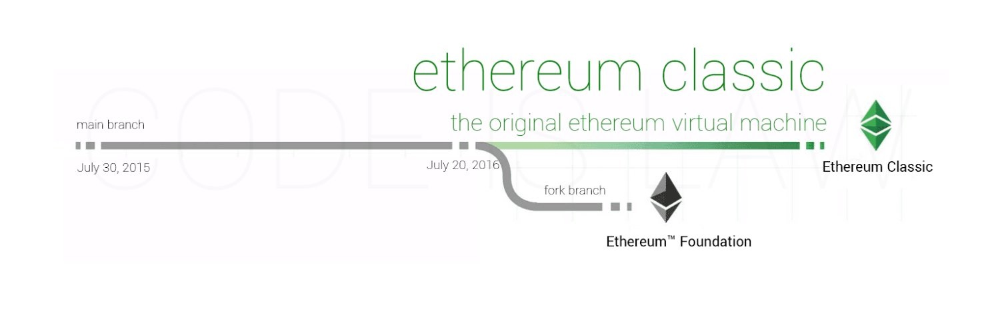

# Long Term Funding for Ethereum Classic's Development Ecosystem Launches

An outfit of anonymous open source developers and cryptocurrency network participants are organizing under the pseudonym "Ethereum Classic DAO" with lofty goals of establishing long term support for the development ecosystem around Ethereum Classic, the original Ethereum Virtual Machine launched in 2015. The name of this organization appears to be a bit tongue-in-cheek given that the Ethereum Classic network was abandoned by its founding development group, Ethereum Foundation, in 2016 during the "DAO Bailout" hardfork. A contentious event, where the Ethereum Foundation forked from the original network's ledger and adjusted account balances to bail out participants in a third-party smart contract product called "The DAO".

## [Ethereum Classic History](https://ethereumclassic.org/knowledge/history)

## Long Term Funding Solution for Development on ETC

A move to erect a funding mechanism was signalled on GitCoin expressing the goal of future-proofing the network's development ecosystem. This news comes at an opportune time as Ethereum Classic's more popular, sister chain moves to Proof-of-Stake consensus. The result of this move is an abundance of computer equipment available to provide hashrate to secure Ethereum Classic, the main branch of the EVM ecosystem.

## Ethereum Classic DAO & DeFi Stack - LTS Solution

>LTS Funding Pool:
>
>The LTS funding pool is oriented in a way which will grow to become self-sustaining via the mechanics of the positive feedback loop. As funds are collected from one protocol, another protocol will be developed that amplifies the protocol stack. In turn, the fund will grow at a higher rate enabling more protocols to turn online at a quicker rate. At some point, the fund will begin to grow at a rate the is completely self sustaining to the needs of the network. Therefore the immediate needs of the network will be addressed. This will begin the fund down a new path where it is accumulating excess funds. This will transition the funds priorities from organizing the "needs" of the network to addressing the "wants" of the network as the outlook of development moves to a more future driven approach. As this point, it is our intention to start to explore ways in which we can start addressing decentralized ways to allocate portions of the funding pool. We are not sure what will work, but our intention is to allocate small portions of the funding pool to specific tasks and attempt different governance methods. Through this low risk approach, we expect to see governance methods completely fail and others show promise. Governance in a decentralized way is one of the biggest challenges in the blockchain space, so we will stay open minded and continue to try to setup multiple methods. All of these will be with the intention of decentralizing the funding process through MANY channels of distribution and methods. We believe this approach reduces risk to the overall fund and builds redundancies in the funding channels. We understand this aspect of the project is very lofty and look forward to open involvement from the ETC community as we explore this goal.

[gitcoin.co/grants/412/ethereum-classic-dao-defi-stack](https://gitcoin.co/grants/412/ethereum-classic-dao-defi-stack)

>How:
>
>We plan to use the EthereumClassic.com domain as the homepage for interacting with the most useful EVM protocols launched on Ethereum Classic. A requirement for any protocol or product referenced on EthereumClassic.com will be that a portion of their fees will be allocated to this future-proofing development fund. As an example, in the swapping product, 30 bps is collected from each swap. a portion of those 30 bps will be allocated to the development fund. This enables users to support development on Ethereum Classic by simply using the network's protocol stack. Meaning ETC and tokens deployed on the Ethereum Classic network will inherent this added value through the increased use cases developed by these protocols. Think: Lending/Borrowing markets, Liquidity Pools, Farming, Speculation Markets and such for any asset deployed on top of Ethereum Classic.
>
>We intend to organize an open Ethereum Classic mining pool where miners can allocate their hashrate to this pool. A portion of the funds collected on this pool will go to supporting client maintenance and improved functionality and features. This allows miners to voluntarily participate in supporting the network and future proofs the essential software required to secure the network. This signals long term funding resources for client maintainers to plan their personal compensation around. This also removes the current middle men directing the client maintainers with 1099's or w2's. Rather we look forward to open client maintenance and an opportunity for a robust talent pool of client maintainers. This builds redundancies in a very pivotal area of the network's security. We expect client maintainers, miners, and mining pools will begin to have conversations about optimizing the clients, fixing any bugs, and adding feature sets that will improve the overall mining experience on Ethereum Classic as it moves from "downstream" development of ETH's clients to the primary "upstream" for the proof of work EVM ecosystem. Ethereum Classic has a long term commitment to Proof of Work and a healthy injection of open resources here is vital to the long-term health of the network.

