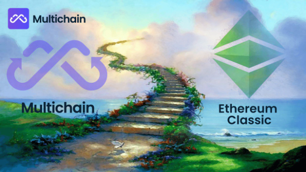

# Multichain Brings Interoperability to Ethereum Classic

Through development efforts on [ETC Swap](https://etcswap.org) by [Ethereum Classic DAO](https://ethereumclassicdao.org), it is with great joy to announce that the Ethereum Classic network has a reputable bridge solution in [Multichain](https://multichain.org), the leader in cross-chain routing protocols. This Multichain integration with the Ethereum Classic network adds a well-known and heavily audited interoperability solution with greater than $5+ Billion in total value locked in its cross-chain routing protocol throughout 50+ chains. This Multichain integration provides a smooth transition from other chains to Ethereum Classic, which enables developers to natively support Ethereum Classic and its token ecosystem in their applications.

Guide: [How to use Multichain Router (Crosschain)](https://youtu.be/G8vN2c2Mhc4)
 
 ## No Fees on Cross-Chain Transactions
 
For the benefit of the Ethereum Classic community, [Multichain](https://multichain.org) offers no fees on cross-chain transactions to the Ethereum Classic network from the Ethereum and BNB chains. Most cross-chain transactions complete in under 200 seconds through Multichain's easy to use interface. In the near future, Multichain will continue to connect blockchains to Ethereum Classic to increase interoperability with the greater blockchain ecosystem.

 
 
 ## ETC Swap Supports Multichain Assets
 
 [ETC Swap](https://swap.ethereumclassic.com) supports markets for these Multichain bridged assets. Please note, bridged assets through [Multichain](https://bridge.multichain.org/#/router) are listed with the "any" prefix to the asset's ticker symbol. This is done to clearly signify that the traded asset is bridged through the Multichain cross-chain router and not natively issued on the Ethereum Classic chain by the token's development team. We expect major stablecoins like Tether and USD Coin to natively issue these assets on Ethereum Classic in the future as the network's hashrate continues to rise. So this "any" prefix is added to avoid confusion with the inevitability of natively issued stablecoins on Ethereum Classic.
 
 Guide: [Using MetaMask with Ethereum Classic](https://ethereumclassic.org/guides/metamask)
 
 ### BNB Chain (BNB)
 
 Bridged Assets through [Multichain](https://bridge.multichain.org/#/router): BNB, BUSD
 *Note: these assets will be listed with the "any" prefix.*
 
 ### Ethereum Classic chain (ETC)
 
 Native Assets: ETC, WETC
 
 ### Ethereum™ Foundation chain (ETH)
 
 Bridged Assets through [Multichain](https://bridge.multichain.org/#/router): DAI, ETH, USDC, USDT, WBTC
 *Note: these assets will be listed with the "any" prefix.*

## Earn Rewards in ETC Swap Liquidity Pools

So what does this all mean for Ethereum Classic participants?

* Well, [ETC Swap](https://etcswap.org) offers liquidity providers 0.25% of trades executed on its decentralized exchange protocol.
* Ethereum Classic users are financially incentivized to help the network by transferring liquidity over to the Ethereum Classic network for no fee through the Multichain cross-chain routing protocol.
* This transferred liquidity through [Multichain](https://bridge.multichain.org/#/router) can then be deposited into the decentralized liquidity pools via [ETC Swap](https://swap.ethereumclassic.com)'s user interface; or its decentralized [IPFS user interface](https://ipfs.io/ipfs/QmSCGpteEcfCDXcQunMyxbaAkBWB5edMFAWnzYXMCqaCKf).
* Ethereum Classic users then earn real-time rewards on trades executed in the liquidity pools via payment of Liquidity Pool Tokens which are redeemable through these decentralized [ETC Swap](https://swap.ethereumclassic.com) markets.
* All of this is done without trusting any third-party as Multichain and ETC Swap are non-custodial protocols with extensive security audits and open-source on-chain contracts

## Why is this beneficial to Ethereum Classic?

* This [Multichain](https://bridge.multichain.org/#/router) integration benefits the Ethereum Classic ecosystem by building on-chain liquidity pools of meaningful assets on the [ETC Swap](https://etcswap.org) decentralized exchange protocol.
* These on-chain liquidity pools enable Ethereum Classic users to safely acquire digital assets without intermediaries and, in doing so, increases transaction activity on the ETC network.
* This increase in transaction activity generates a fee market makes securing Ethereum Classic with mining equipment more profitable than it is today with mere block rewards.
* This increase in mining profitability results in increased security for the Ethereum Classic network which signals to developers that Ethereum Classic is a secure layer one blockchain to integrate into their projects.
* This results in a vibrant cryptocurrency ecosystem on top of Ethereum Classic. A robust development ecosystem should result in a rapid increase of value built and stored on the Ethereum Classic network. The largest proof of work smart contract platform in the blockchain space.

Join the decentralized and open [ETC community](https://ethereumclassic.org/discord) in building the Web3 future on Ethereum Classic, the Original Ethereum Vision.

