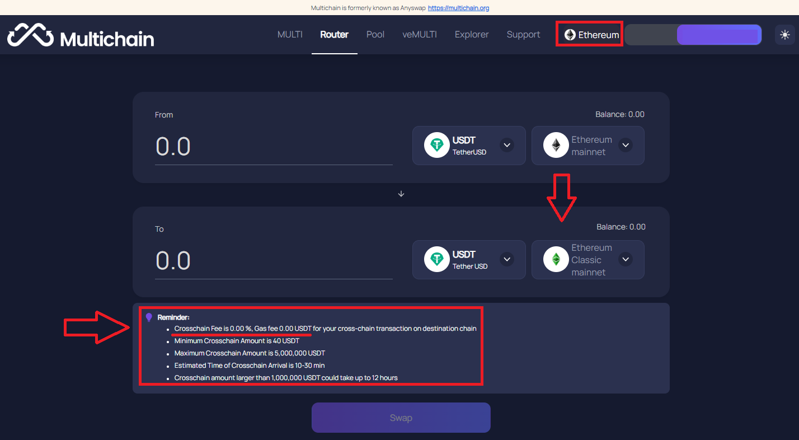
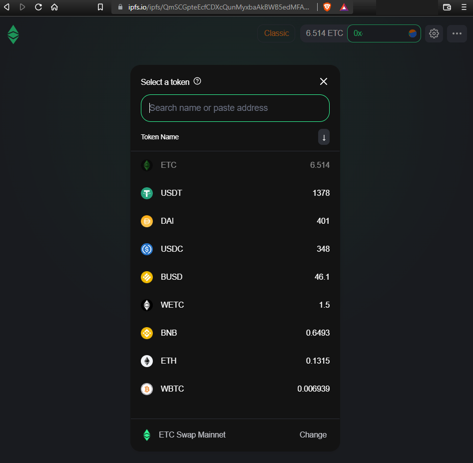

# Multichain Brings Interoperability to Ethereum Classic

Through development efforts on [ETC Swap](https://etcswap.org) by [Ethereum Classic DAO](https://ethereumclassicdao.org), it is with great joy to announce that the Ethereum Classic network has a reputable interoperability solution in [Multichain](https://multichain.org), the leader in cross-chain routing protocols. Multichain's integration with the Ethereum Classic network adds a well-known and heavily audited bridging solution for Ethereum Classic to the greater cryptoverse. Multichain has greater than $5+ Billion in total value locked (TVL) in its cross-chain routing protocol throughout 50+ chains. This Multichain integration provides a smooth transition for meaningful assets to migrate from other chains to Ethereum Classic. The [ETC Swap](https://etcswap.org) protocol removes the requirement of centralized services to exchange meaningful assets with Ethereum Classic's native token Ether (ETC). All of this reinforces the Ethereum Classic networks principles of decentralization and building unstoppable applications.

Guide: [How to use Multichain Router (Crosschain)](https://youtu.be/G8vN2c2Mhc4)
 
## No Fees on Cross-Chain Transactions
 
For the benefit of the Ethereum Classic community, [Multichain](https://multichain.org) offers no fees on cross-chain transactions to the Ethereum Classic network from the Ethereum and Binance Smart Chains. Most cross-chain transactions complete in under 200 seconds through Multichain's easy to use interface. In the near future, Multichain will continue to connect blockchains to Ethereum Classic to increase interoperability with the greater blockchain ecosystem.

 
## ETC Swap Supports Multichain Assets
 
[ETC Swap](https://swap.ethereumclassic.com) supports the 28 markets for these Multichain-Pegged assets. Please note, bridged assets through [Multichain](https://bridge.multichain.org/#/router) are listed with the assets traditional ticker symbol but will include "Mulitchain-Peg USDC" in the alt description. This is done to clearly signify that the traded asset is bridged through the Multichain cross-chain router and not natively issued on the Ethereum Classic chain by the token's development team. We expect major stablecoins like Tether USD and USD Coin to natively issue these assets on Ethereum Classic in the future as the network's hashrate continues to rise.
 
Guide: [Using MetaMask with Ethereum Classic](https://ethereumclassic.org/guides/metamask)
 
### ChainID 56: Binance Smart Chain (BNB)
 
Bridged Assets through [Multichain](https://bridge.multichain.org/#/router): BNB, BUSD
 
*Note: these assets are listed with "Multichain-Peg" in their alt descriptions.*
 
### ChainID 61: Ethereum Classic chain (ETC)
 
Native Assets: ETC, WETC
 
*Note: Canonical [Wrapped ETC](https://wrappedether.org) is supported in [ETC Swap](https://etcswap.org) and all [EthereumClassic.com](https://ethereumclassic.com) protocols.*
 
### ChainID 1: Ethereum™ Foundation chain (ETH)
 
Bridged Assets through [Multichain](https://bridge.multichain.org/#/router): DAI, ETH, USDC, USDT, WBTC
 
*Note: these assets are listed with "Multichain-Peg" in their alt descriptions.*

## Earn Rewards in ETC Swap Liquidity Pools

So what does this all mean for Ethereum Classic participants?

* To open a path to self-sustainability, the code for [ETC Swap](https://etcswap.org) includes a small protocol reward mechanism of 0.05% and a liquidity provider reward of 0.25%. This feature, including the exact percentage amounts, is hardcoded into the core contracts which remain decentralized and non-upgradable.
* Ethereum Classic users are financially incentivized to help the network by transferring liquidity over to the Ethereum Classic network for no fee through the [Multichain](https://bridge.multichain.org/#/router) cross-chain routing protocol.
* This transferred liquidity through [Multichain](https://bridge.multichain.org/#/router) can then be deposited into the decentralized liquidity pools via the [ETC Swap](https://swap.ethereumclassic.com) user interface or its decentralized [IPFS user interface](https://ipfs.io/ipfs/QmSCGpteEcfCDXcQunMyxbaAkBWB5edMFAWnzYXMCqaCKf). By supplying tokens to [ETC Swap](https://swap.ethereumclassic.com) liquidity pools, users can earn rewards while enabling peer-to-peer trading.
* Ethereum Classic users then earn real-time rewards on trades executed in the liquidity pools via payment of Liquidity Pool Tokens which are redeemable through these decentralized, on-chain [ETC Swap](https://swap.ethereumclassic.com) markets. Anyone, anywhere, can supply tokens to liquidity pools, trade tokens, or even create and list their own tokens (using Ethereum Classic’s ERC-20 protocol).
* All of these transactions are executed by audited smart contracts without the need to trust third-party intermediaries, as Multichain and ETC Swap are non-custodial protocols with smart contracts verified on-chain and open-source for public and peer review.

## Why is this beneficial to Ethereum Classic?

* This [Multichain](https://bridge.multichain.org/#/router) integration connects the Ethereum Classic network to the greater blockchain space through a non-custodial protocol. This means Ethereum Classic and its ecosystem are no longer dependent on centralized exchange services to interact with other blockchain networks. The Ethereum Classic network finally has a large, reputable on-ramp for liquidity to freely move through without centralized friction points like accounts, custody risk, or unreasonable regulation requirements. 
* Additionally, this [Multichain](https://bridge.multichain.org/#/router) integration benefits the Ethereum Classic ecosystem by building on-chain liquidity pools of meaningful assets on the [ETC Swap](https://etcswap.org) decentralized exchange protocol.
* These on-chain liquidity pools enable Ethereum Classic users to safely acquire digital assets without intermediaries and, in doing so, increases transaction activity on the ETC network through peer-to-peer trading.
* This increase in transaction activity generates a fee market which makes securing Ethereum Classic with mining equipment more profitable.
* This increase in mining profitability results in increased security for the Ethereum Classic network which signals to developers that Ethereum Classic is a secure layer one blockchain that can operate as expected.
* This increased security results in a vibrant cryptocurrency ecosystem built on top of Ethereum Classic.
* A robust development ecosystem should result in a rapid increase of value built and stored on the Ethereum Classic network-- the largest proof of work smart contract platform in the blockchain space.

Join the decentralized and open [ETC community](https://ethereumclassic.org/discord) in building the Web3 future on Ethereum Classic, the Original Ethereum Vision.

