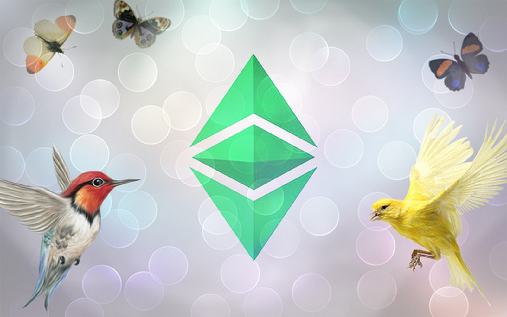

# Multichain Brings Interoperability to Ethereum Classic

By way of work done on [ETC Swap](https://etcswap.org) by [Ethereum Classic DAO](https://ethereumclassicdao.org), it is with our great joy to announce that the Ethereum Classic network has a reputable bridge solution in [Multichain](https://multichain.org), the leader in cross-chain routing protocols. This integration adds a reputable interoperability solution for the Ethereum Classic network with access to $5+ Billion in bridged asset liquidity through 50+ networks. This integration enables projects from other networks to natively support and migrate to Ethereum Classic, the original Ethereum network launched in 2015.
 
 ## No Fee Transactions
 
[Multichain](https://multichain.org) offers no fee transactions on liquidity migration to the Ethereum Classic network. Most cross-chain transactions complete in under 100 seconds through Multichain's easy to navigate user interface.

Guide: [How to use Multichain Router (Crosschain)](https://youtu.be/G8vN2c2Mhc4)

 
 
## Earn Liquidity Rewards on Bridged Assets

[ETC Swap](https://etcswap.org) natively features these bridged assets in its token list as identified by the "any" prefix to the asset ticker. The bridged assets are parmount to bootstrapping the on-chain liquidity markets of meaningful, flagship liquidity pools for Ethereum Classic. Liquidity providers earn rewards, so please consider supporting the swap product by adding liquidity to these young markets. Currently it costs a fraction of a penny to execute a swap on Ethereum Classic. Also, a portion of trading fees on [ETC Swap](https://swap.ethereumclassic.com) goes to future proofing development on Ethereum Classic via the [LTS Development Fund](https://ethereumclassicdao.org).

Guide: [Using MetaMask with Ethereum Classic](https://ethereumclassic.org/guides/metamask)

## Supported Assets

At the time of launch, the [ETC Swap](https://swap.ethereumclassic.com) Mainnet token list comprises of these native assets and [Multichain](https://multichain.org)'s bridged assets, noted by the "any" prefix to the asset's ticker:

### Binance Smart Chain network (BSC)

Bridged Assets: BNB, BUSD

### Ethereum Classic network (ETC)

Native Assets: ETC, WETC

### Ethereum™ Foundation network (ETH)

Bridged Assets: DAI, ETH, USDC, USDT, WBTC

