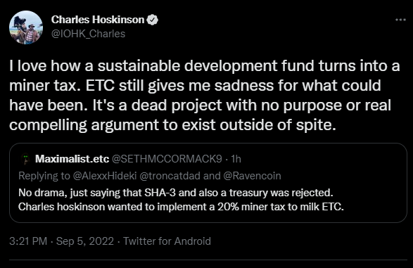
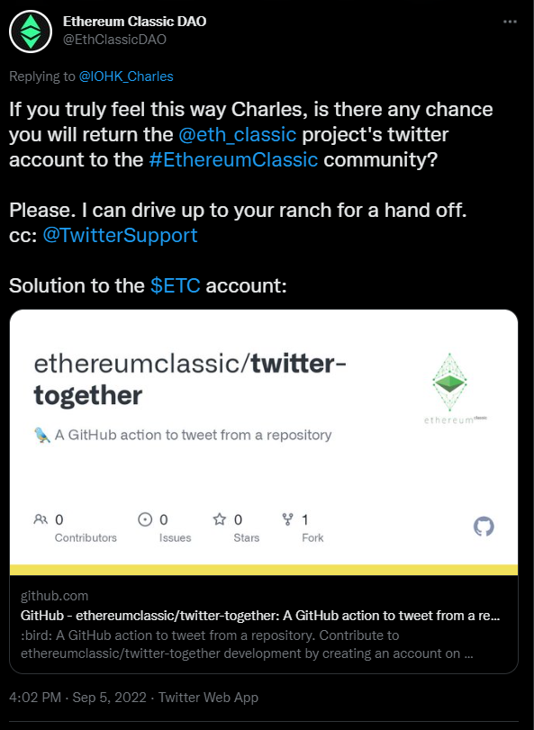
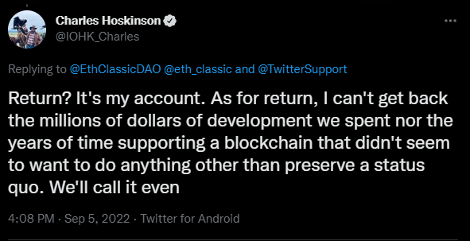

# Public Request to IOHK

## Please Return Ethereum Classic's Twitter Account

[https://twitter.com/IOHK_Charles/status/1566899375904890888](https://twitter.com/IOHK_Charles/status/1566899375904890888)

## Solution: Decentralized Control of Twitter Account

This is a public request to [Charles Hoskinson](https://twitter.com/IOHK_Charles) and [IOHK](https://twitter.com/InputOutputHK) to voluntarily return the [@eth_classic](https://twitter.com/eth_classic) twitter account to the Ethereum Classic community. We would like to manage Ethereum Classic's main twitter account out of the project's open-source repository using Github's Pull Request/Approval method. We currently use this method for managing the project's website [ethereumclassic.org](https://ethereumclassic.org) and it seems to serve the project well. In an effort to be proactive in resolving this issue, the Ethereum Classic community has setup a Twitter, Together! repository to manage the Ethereum Classic project's twitter account at [https://github.com/ethereumclassic/twitter-together](https://github.com/ethereumclassic/twitter-together).

> For Open Source or event maintainers that share a project twitter account, twitter-together is a GitHub Action that utilizes text files to publish tweets from a GitHub repository. Rather than tweeting directly, GitHub’s pull request review process encourages more collaboration, Twitter activity and editorial contributions by enabling everyone to submit tweet drafts to a project.

This public request to turn over the Ethereum Classic social asset to the community comes after many private requests to IOHK employees and directly to Charles Hoskinson. Due to your lack of belief in the project, we ask you to please kindly transfer the account to good stewards of the network. Ethereum Classic is an open project and we hope your faith in the project will be restored when you see all the progress that is currently happening on the network. Thank you for your past positive contributions. In advance, thank you for honoring the spirit of open-source projects by acting in good faith and returning the project's social assets to the community supporting the project.

[https://twitter.com/EthClassicDAO/status/1566909585163632640](https://twitter.com/EthClassicDAO/status/1566909585163632640)

## Twitter Support Resolution

In the likely event that [Charles Hoskinson](https://twitter.com/IOHK_Charles) and [IOHK](https://twitter.com/InputOutputHK) decide to withhold the Ethereum Classic project's twitter account from the community due to the [rejection of their ECIP-1098 Treasury proposal](https://ecips.ethereumclassic.org/ECIPs/ecip-1098) and [lack of belief in the project](https://twitter.com/IOHK_Charles/status/1566899375904890888), we ask that [Twitter Support](https://twitter.com/TwitterSupport) exercise their professional judgement on this issue. Please return the [@eth_classic](https://twitter.com/eth_classic) twitter account to the Ethereum Classic community. This action would be similar to the handling of the [@Bitcoin](https://twitter.com/bitcoin) twitter account during the BTC/BCH hardfork in 2017-2018. The [@Bitcoin](https://twitter.com/bitcoin) account was returned to good stewards in the BTC community to resolve the concerns of bad actors controlling an open source projects public twitter account.

Thank you.

[https://twitter.com/IOHK_Charles/status/1566911099630387205](https://twitter.com/IOHK_Charles/status/1566911099630387205)
