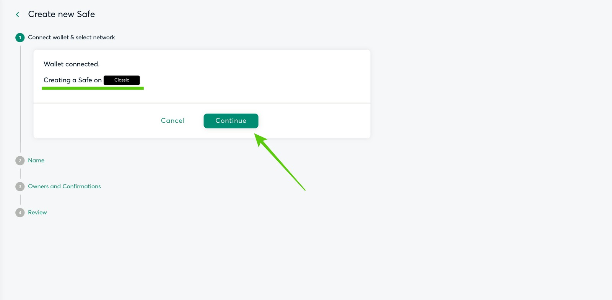

---
**You may watch this tutorial here:**

<iframe width="560" height="315" src="https://www.youtube.com/embed/OvMEwgYyvyc" title="YouTube video player" frameborder="0" allow="accelerometer; autoplay; clipboard-write; encrypted-media; gyroscope; picture-in-picture" allowfullscreen></iframe>

---

The Safe multisignature wallet has become a very popular app to create and deploy multisignature smart contracts that work as wallets in Ethereum and other Ethereum compatible blockchains.

The root of its success is that it is battle tested and flexible. 

Battle tested means it has been proven to be secure over a long time, and flexible means that users may at any time remove and replace signatory addresses as well as change the number of signatures required to send transactions.

In this article we will explain what are multisig wallets, what is the ETC Safe wallet, how it works, and how to create your first multisig wallet on ETC.

## 1. What Are Multisignature Wallets?

When individuals or organizations open joint or business accounts at traditional banks, sometimes, for security reasons, they set them to require two or more signatures to sign checks or authorize transfers and payments.

In the blockchain industry the standard model is that each address is controlled by one private key, so they are basically controlled by one individual who has that private key.

However, on Ethereum Classic and other smart contract blockchains it is possible to create smart contracts that behave like individual wallets, but that require more than one signature to send transactions.

## 2. What Is The Ethereum Classic Safe Multisignature Wallet?

The Safe wallet is a long standing app in Ethereum compatible blockchains that has developed a standard smart contract, which is battled tested for security and is very flexible, that has become a very popular solution for individuals and teams to create multisig wallets to manage their crypto assets.

The Ethereum Classic Safe multisignature wallet (ETC Safe) is an implementation of Safe on the ETC blockchain.

This implementation was done by ETC core developer Chris Ziogas who works for the ETC Cooperative. But, it is an open source project that may be used by anyone in the world.

You can find the ETC Safe wallet at:

[multisig.etccooperative.org](https://multisig.etccooperative.org)

## 3.  How Does it Work?

- The ETC Safe is a self custody and secure wallet that is very flexible because users may change the authorized addresses and number of signatures required to send transactions at any time.
- For now, the ETC Safe app is a web application, but will likely be implemented for mobile and desktop as well.
- To create and use ETC Safe multisig wallets, each participant needs to have their own personal ETC wallet.
- ETC Safe supports the native currency $ETC, ERC-20 tokens, and NFTs.
- ETC Safe connects to any dapps on Ethereum Classic.

## 4. App Sections

**Assets:** A section that shows the assets held in each Safe and their current valuation.
  
**Transactions:** A page with the transaction history per Safe.
	
**Address book:** The list of addresses that have been used to create and control Safes and the addresses where assets have been sent and received.
	
**Dapps:** A list of all dapps that are registered within ETC Safe. Dapp developers may contact the ETC core developer team to add their dapps to the registry.
	
**Settings:** A page where you can add or remove addresses from each Safe wallet and you can change the required number of signatures to send transactions in any Safe wallet.

## 5. How to Create Your First Multisignature Wallet on ETC

1. Go to [multisig.etccooperative.org](https://multisig.etccooperative.org) and press “+ Create new Safe”.

2. In the next screen, press “Connect” to connect your ETC wallet.

3. Select the ETC wallet app you use. In this case we selected MetaMask.

4. ETC Safe will confirm that you are connected to ETC. Press “Continue”.

5. In the next step, ETC Safe will ask to label the wallet being created. We called this one “New Multisig Wallet”, but you may enter the label which is most convenient to you. Then, press "Continue".

6. In the next screen you add the people and addresses who will control this wallet and what number of signatures are needed to send transactions. In this case, we added Alice, Bob, and Charlie and we selected 2-of-3 signatures to authorize transactions. When done, press "Continue".

7. In the next step, for security reasons, you need to carefully review the settings of your new Safe wallet. Once you confirm that everything is alright, press “Create”.

8. In the last step, you will be prompted to sign the transaction on your connected personal wallet to deploy your new Safe on ETC. When you sign, your new ETC Safe will be created!

---

**Thank you for reading this Ethereum Classic tutorial!**

To start using ETC Safe go to: [multisig.etccooperative.org](https://multisig.etccooperative.org)

To learn more about ETC go to:
[ethereumclassic.org](https://ethereumclassic.org)
