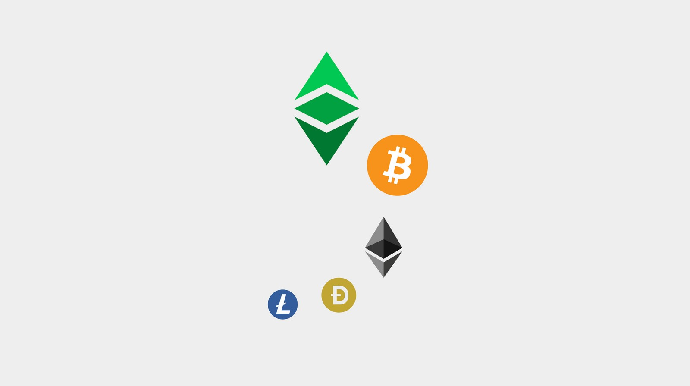
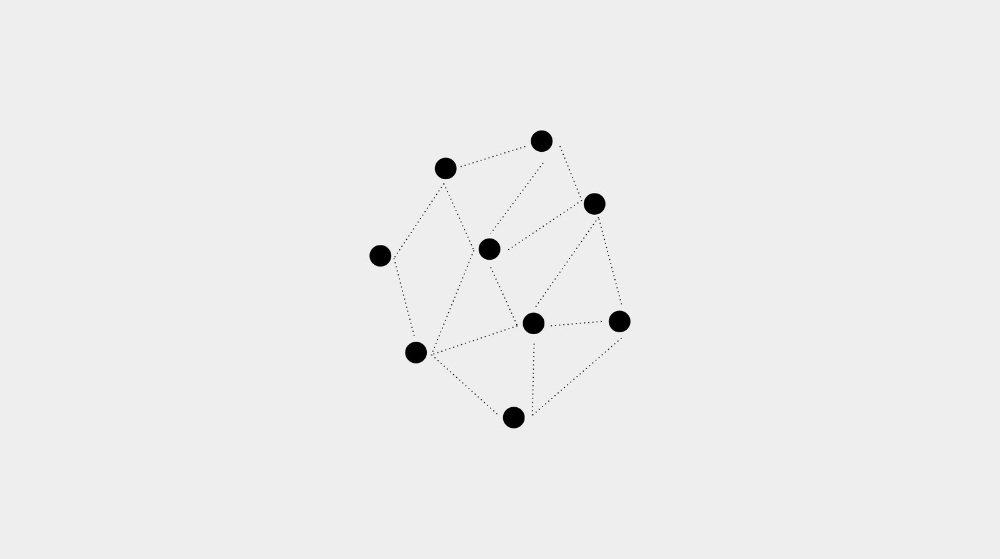
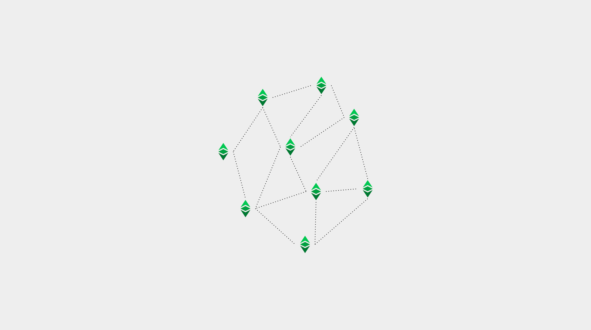
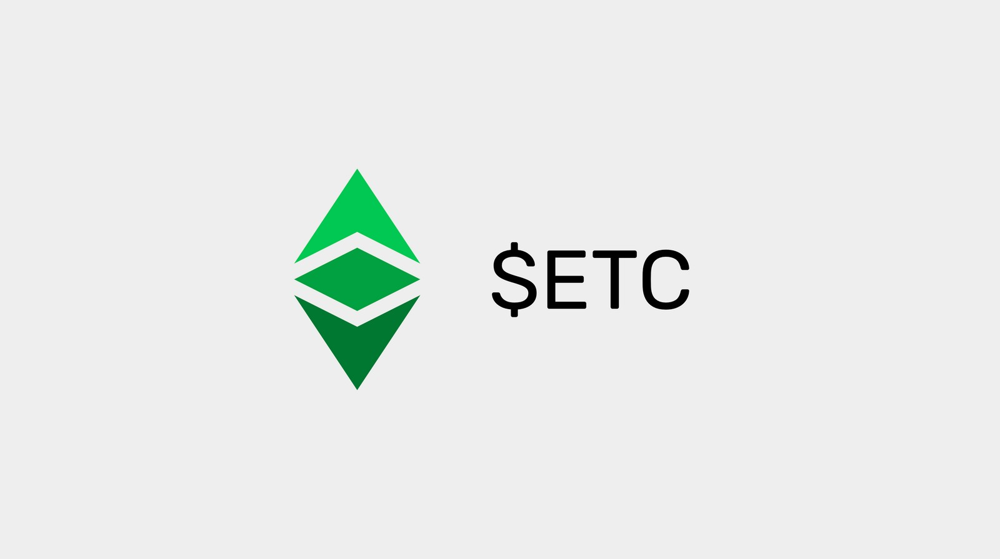
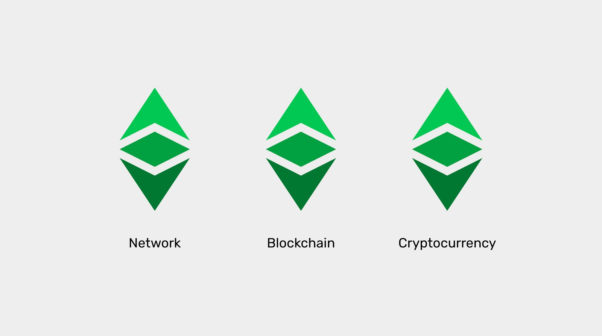

---
**You can listen to or watch this in video here:**

<iframe width="560" height="315" src="https://www.youtube.com/embed/6TQwkkbz4yA" title="YouTube video player" frameborder="0" allow="accelerometer; autoplay; clipboard-write; encrypted-media; gyroscope; picture-in-picture" allowfullscreen></iframe>

---

**This is the first part of a series that will explain the three software clients currently operating or being implemented on Ethereum Classic.** 

The series will consist of the following topics:

1. The Difference Between a Network, a Blockchain, and a Cryptocurrency 
2. The Difference Between Blockchain Software and Blockchain Protocol
3. Are There Software Clients and Servers in a Blockchain?
4. Ethereum Virtual Machine Blockchains and Ethereum Classic
5. Core Geth Explained
6. Hyperledger Besu Explained
7. Erigon Explained

---

## Blockchains, Networks, or Cryptocurrencies?

When people talk about Ethereum Classic or Bitcoin they usually call them either a network, a blockchain, or a cryptocurrency interchangeably.

Although these three terms are technically correct when describing these systems, there are stark differences between the concepts.

In this article, we will explain what is a network, what is a blockchain, and what is a cryptocurrency.

Learning these differences will help us understand what are, and how the different Ethereum Classic software clients work.

## What Is a Network?

A computer network is set of machines that work as a system of connected nodes that communicate to share resources.

For each machine or node to participate in the network, there is usually a software application (called node software client or just software client) that contains a set of rules, or protocol, that organizes and coordinates the method of communications.  

Computer networks usually manage some sort of database, which is the underlying information that the system is usually responsible for.

Networks may be private, such as the internal systems of a tech company, or public, such as the internet or a file sharing app.

When they are private, they are usually structured as hierarchical systems, where all machines have different roles and some have more important functions than others.

When they are public, they are usually structured as peer-to-peer networks where all participating nodes have similar roles and functions.

Private networks tend to run closed source software and public networks tend to run open source software so it may be readily available, reviewed, and shared by all participants.

## What Is a Blockchain?

Strictly speaking, a blockchain is the database that a computer network manages that has the information about the accounts, balances, and, in the case of ETC, the smart contracts of the system.

This means that the “blockchain” is not the network of machines, the nodes, nor the node software clients themselves. It is only the database.

The way it works is that people and businesses send transactions all the time to the network, the nodes receive them and re-transmit all the information to all other participating nodes, including the miners, and the miners group these in blocks, which they then stamp with a cryptographic hash, called a proof of work, and send them to the rest of the network, which verifies the blocks and includes them in the database.

Thus, new data is included in the database in blocks and this is why it is called a “chain of blocks” or “blockchain”.

The main characteristic of a blockchain database is that all the data is fully transmitted and fully replicated in all participating nodes. This is a key security feature of these types of networks.

As implied above, some machines are verifying nodes (they receive and transmit transactions and verify blocks sent by miners) and others are miners (they receive transactions and create blocks that they then send to verifying nodes for inclusion into the database).

## What Is a Cryptocurrency?

A cryptocurrency is a form of money that is managed inside a blockchain database.

The blockchain database is a ledger that contains information about the history of transactions, and the accounts and balances of the cryptocurrency.

The cryptocurrency units are tokens that are created to compensate for miners in proof of work blockchains, such as ETC, to pay them for their work when creating and stamping blocks cryptographically.

Cryptocurrencies are money because their tokens are scarce, durable, costly to create, portable, divisible, fungible, and transferable, so they may be used for payments and as a store of value.

The Ethereum Classic cryptocurrency is called ETC and its symbol in the market is $ETC.

## Ethereum Classic is a Network, a Blockchain, and a Cryptocurrency

**Ethereum Classic is a network** because it is a system of machines, nodes, and a shared database, called a blockchain. In particular, it is a public network and its software is open source so that anyone can audit and use it to participate in the system.

**Ethereum Classic is a blockchain** because its database contains a ledger with accounts and balances, where transactions are fully transmitted and form a fully replicated chain of blocks.

**Ethereum Classic is a cryptocurrency** because its ledger tracks a token called ETC that is scarce, durable, costly to create, portable, divisible, fungible, and transferable, so it may be used for payments and as a store of value.

---

**Thank you for reading this article!**

To learn more about ETC please go to: https://ethereumclassic.org
