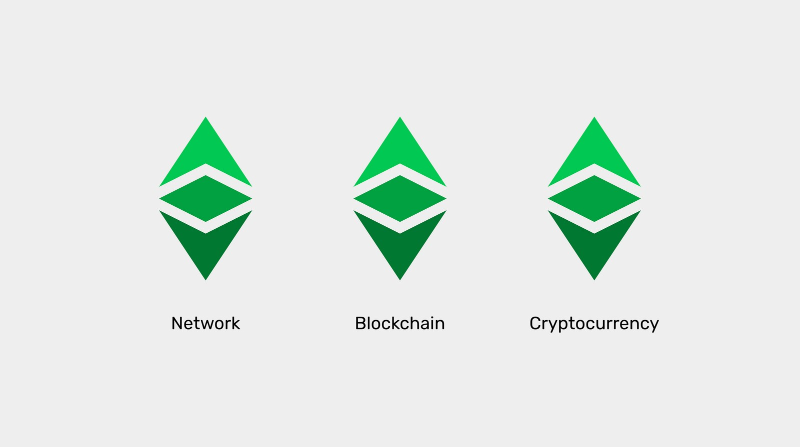

---
**欢迎由此收听或观看以下视频：**

<iframe width="560" height="315" src="https://www.youtube.com/embed/6TQwkkbz4yA" title="YouTube video player" frameborder="0" allow="accelerometer; autoplay; clipboard-write; encrypted-media; gyroscope; picture-in-picture" allowfullscreen></iframe>

---

**这是本系列的第一部分，将解释目前在以太坊经典上运行或实现的三种软件客户端。** 

该系列将包括以下主题:

1. 网络、区块链和加密货币之间的区别
2. 区块链软件与区块链协议的区别
3. 区块链中是否有软件客户端和服务器?
4. 以太坊虚拟机区块链和以太坊经典
5. Core Geth详解
6. 超级账本Hyperledger Besu详解
7. Erigon详解 

---

## 区块链，网络，和数字货币？

当人们谈论以太坊经典或比特币时，他们通常交替地称它们为网络、区块链或加密货币。

尽管在描述这些系统时，这三个术语在技术上是正确的，但概念之间存在着明显的差异。

在本文中，我们将解释什么是网络，什么是区块链，什么是加密货币。

了解这些差异将帮助我们理解不同的以太坊经典软件客户端是什么，以及如何运作。

## 什么是网络？

计算机网络是一组机器，它们作为连接节点的系统工作，通过通信共享资源。

对于参与网络的每台机器或节点，通常都有一个软件应用程序(称为节点软件客户端或简称软件客户端)，它包含一组规则或协议，用于组织和协调通信方法。

计算机网络通常管理某种类型的数据库，这是系统通常负责的底层信息。

网络可以是私有的，比如科技公司的内部系统;也可以是公共的，比如互联网或文件共享应用程序。

当网络是私有时，它们通常被构造成分层系统，其中所有的机器都有不同的角色，有些机器比其他机器具有更重要的功能。

当网络是公共时，它们通常结构为点对点网络，其中所有参与的节点都有类似的角色和功能。

私有网络倾向于运行封闭源代码的软件，而公共网络倾向于运行开放源代码的软件，因此所有参与者都可以很容易地获得、审查和共享这些软件。

## 什么是区块链？

严格地说，区块链是计算机网络管理的数据库，它有关于帐户、余额的信息，在ETC中，还有系统的智能合约。

这意味着“区块链”不是机器的网络、节点，也不是节点软件客户端本身。它只是数据库。

它的工作方式是，个人和企业一直向网络发送交易，节点接收它们并将所有信息重新传输给所有其他参与的节点，包括矿工。矿工将这些信息分组成区块，然后用一种称为工作证明的加密哈希标记这些区块，并将它们发送给网络的其他部分，后者验证这些块，并将它们包含在数据库中。

因此，新的数据以区块的形式包含在数据库中，这就是它被称为“区块链”的原因。

区块链数据库的主要特征是所有数据在所有参与节点中完全传输和完全复制。这是这些类型的网络的一个关键安全特性。

如上所述，一些机器正在验证节点(它们接收和传输交易，并验证矿工发送的区块)，而另一些机器是矿工(它们接收交易并创建区块，然后将这些块发送给验证节点，以便将其包含到数据库中)。

## 什么是加密货币？

加密货币是在区块链数据库中管理的一种货币形式。

区块链数据库是一个分类账，包含有关交易历史的信息，以及加密货币的账户和余额。

加密货币单位是为了在工作证明区块链(如ETC)中补偿矿工而创建的令牌，以支付他们在创建和加密区块时的工作。

加密货币之所以是货币，是因为它们的代币稀缺、耐用、创建成本高、可携带、可分割、可替代和可转移，因此它们可以用于支付和作为价值存储。

以太坊经典加密货币被称为ETC，其在市场中的符号是$ETC。

## 以太坊经典是网络、区块链和加密货币

以太坊经典是一个网络，因为它是一个由机器、节点和称为区块链的共享数据库组成的系统。特别是，它是一个公共网络，它的软件是开源的，因此任何人都可以审计并使用它参与系统。

以太坊经典是一个区块链，因为它的数据库包含一个带有账户和余额的分类账，在那里交易被完全传输并形成一个完全复制的区块链。

以太坊经典是一种加密货币，因为它的账本跟踪一种名为ETC的代币，这种代币稀有、耐用、创建成本高、可携带、可分割、可替代和可转移，所以它可以用于支付和作为价值存储。

---

**感谢您阅读本文！**

要了解有关 ETC 的更多信息，请访问：https://ethereumclassic.org
