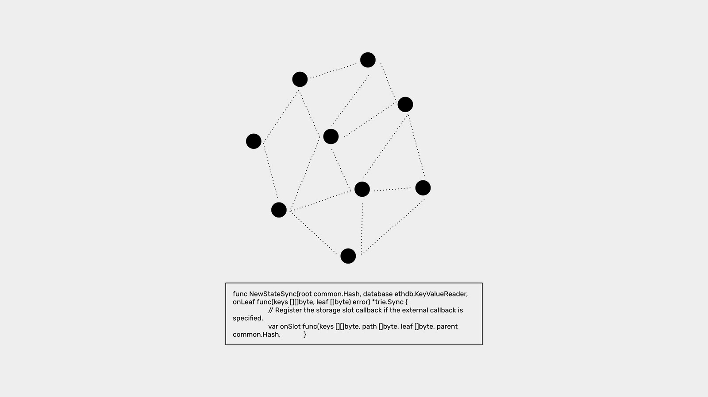
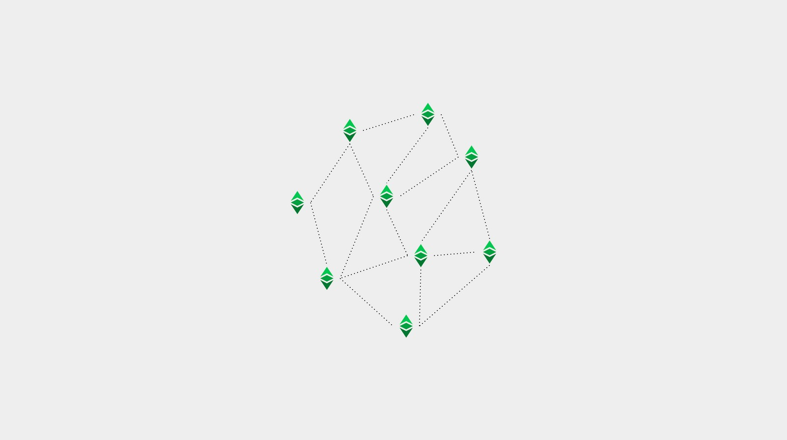

---
**You can listen to or watch this video here:**

<iframe width="560" height="315" src="https://www.youtube.com/embed/xLYGn_x3CSo" title="YouTube video player" frameborder="0" allow="accelerometer; autoplay; clipboard-write; encrypted-media; gyroscope; picture-in-picture" allowfullscreen></iframe>

---

**This is the second part of a series that will explain the three software clients currently operating or being implemented on Ethereum Classic.** 

The series will consist of the following topics:

1. The Difference Between a Network, a Blockchain, and a Cryptocurrency 
2. The Difference Between Blockchain Software and Blockchain Protocol
3. Are There Software Clients and Servers in a Blockchain?
4. Ethereum Virtual Machine Blockchains and Ethereum Classic
5. Core Geth Explained
6. Hyperledger Besu Explained
7. Erigon Explained

---

## Software vs Protocol

When people think of blockchains they think of computer networks and software applications that the machines in these systems must run to be able to participate. 

These are true descriptions or components of these systems, but in more abstract terms, blockchains have an even more fundamental layer which are the protocols agreed upon by all participants to be able to coordinate their actions.

In our previous article, we explained what are networks and blockchains. In this article we will explain the difference between blockchain software (also called node software clients or software clients) and blockchain protocols. 

Learning these differences will help us understand what are, and how the different Ethereum Classic software clients work.

## What Is a Protocol?

A protocol is a generally accepted procedure or set of rules to coordinate the communication and actions between people or machines. 

Protocols may be used for all sorts of interactions, for example for diplomatic relations, medical procedures, mobilization of armies, or communications between machines on the internet.

Computer protocols in particular are sets of rules for machines to communicate so they can share resources and manage information.

As computer protocols are sets of rules, they are usually understandable in non-technical terms because they are instructions such as “when a transaction arrives, retransmit it” or “when data is verified, add it, when not verified, delete it”.

They can also be expressed as “if-then-else” statements such as “if (transaction in), then (retransmit)” or “if (data verified), then (add), else (delete)”.

In summary, a computer protocol is a set of rules in abstraction so that, when implemented in machines, they may communicate and interact to manage some kind of underlying information system.

## What Is Software?

So, the question is, how are protocols or sets of rules integrated into machines so they can follow them?

The answer is software. 

Computers are combinations of hardware and software, and the software is the program with the set of instructions that tells the machines how to operate and what to do with each of their hardware components.

In the world there are many kinds of machines, that use several operating systems, that enable a large number of software applications, written in many software languages, that give instructions to their local computers.

The existence of generally agreed protocols in computer science means that many types of machines, with different operating systems, written in different software programmes, may be used to instruct the machines to follow common sets of rules to perfectly coordinate.

For example, a Dell computer, using the Windows operating system, may have an email app, that is written in the C++ software language, that may send an email message, using the SMTP internet protocol, that may be received by a Mac computer, using the macOS operating system, that may have an email app, that is written in the Objective-C software language, and nevertheless read it and process it perfectly well.

In the above example, the protocol used by all participating components was the SMTP internet protocol for email, and the software used were the operating systems and the email apps.

Even if all the machines, operating systems, and software apps, written in various software languages, were different, they could all coordinate and communicate because they used the same protocol.

This shows the distinction between protocols and software: Protocols are the abstract sets of rules that all participants must follow, and software is the implementation of such rules in the form of applications that give operating instructions to machines so that they may work, communicate, and interact.

## What Is a Blockchain Protocol?

A blockchain protocol is the abstract set of rules that is agreed upon by all participants for the communication and operation of a blockchain network or cryptocurrency such as Ethereum Classic.

In Ethereum Classic, the blockchain protocol has the following rules:

1. All participating machines are divided in verifying nodes and miners.
2. All verifying nodes must have an exact replicated copy of the database.
3. The replicated database contains a ledger with accounts, balances, a cryptocurrency, and software programs.
4. All replicated software programs must be written in the Solidity software language and follow the same exact set of operation codes.
5. All participating machines must have a replicated virtual machine called the Ethereum Virtual Machine (EVM) to execute all the operating code instructions in the replicated software programs.
6. All nodes may accept new transactions to move cryptocurrency from account to account or to execute replicated software programmes using the EVM.
7. These transactions must be retransmitted upon arrival and replicated in all nodes in the network, including miners.
8. When miners receive these transactions, they must group them in blocks of data and stamp them with a cryptographic hash using the proof of work algorithm and send them to the rest of the network.
9. When the rest of the nodes receive and verify the block, they must include it in the blockchain, and credit in the account of the miner who sent it a set amount of $ETC as a reward.

## What Is a Blockchain Software Client?

As explained before, a common protocol may be implemented in many different kinds of machines, running different operating systems, using different software applications, which may be written in different software languages.

As long as all these diverse components are following the same protocol or set of rules, then they can all be part of the same blockchain.

The type of software application that is used to accomplish this task of coordination is called a “blockchain software client” or more simply “software client”.

The software clients that are used in blockchain networks are analogous to the email apps that followed the SMTP email protocol in the example given before.

Blockchain software clients are installed in all participating machines of the same blockchain network. 

They may run in different kinds of machines, using different operating systems, be programmed in different software languages, but they must all give the same operating instructions, according to the blockchain protocol, to their local systems so that they can communicate and participate with all other machines in their intended network.

## The Blockchain Software Clients of Ethereum Classic

Ethereum Classic has a [core team](https://etccooperative.org/people) of three computers scientists, Isaac Ardis, Diego López León, and Chris Ziogas, who have implemented two software clients, [Core Geth](https://github.com/etclabscore/core-geth) and [Hyperledger Besu](https://github.com/hyperledger/besu/), which are fully operational, and are in the process of adapting, testing, and implementing a third client called [Erigon](https://github.com/ledgerwatch/erigon).

Regardless of the kinds of machines and operating systems on which they run, or the software languages in which they were written, these three software clients run the same exact protocol that is defined and commonly agreed for the ETC network.

However, whether these software applications are simply just clients is a necessary topic to explore. 

This will be the subject of our next article.

---

**Thank you for reading this article!**

To learn more about ETC please go to: https://ethereumclassic.org
