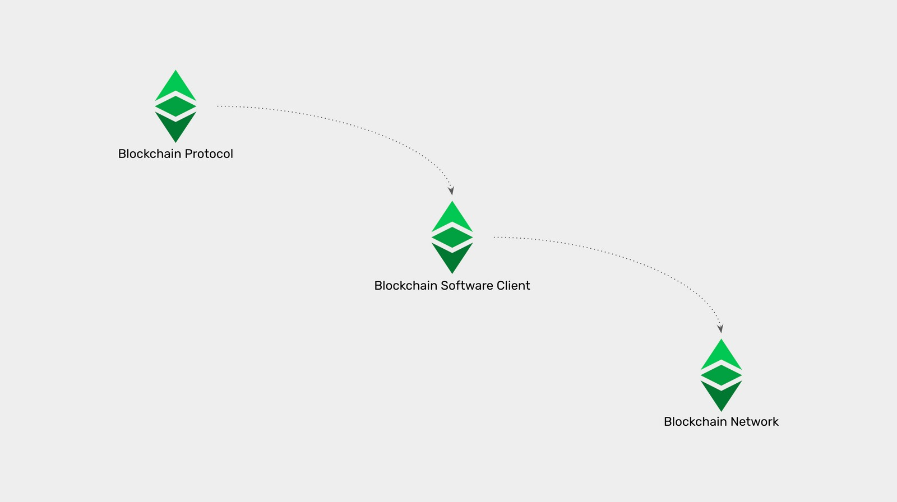
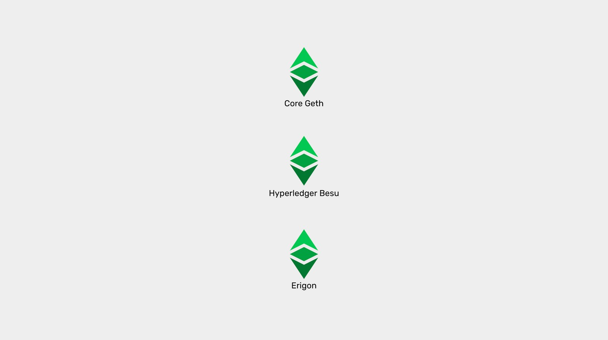

---
**欢迎由此收听或观看以下视频：**

<iframe width="560" height="315" src="https://www.youtube.com/embed/xLYGn_x3CSo" title="YouTube video player" frameborder="0" allow="accelerometer; autoplay; clipboard-write; encrypted-media; gyroscope; picture-in-picture" allowfullscreen></iframe>

---

**这是本系列的第二部分，将解释目前在以太坊经典上运行或实现的三种软件客户端。**

该系列将包括以下主题:

1. 网络、区块链和加密货币之间的区别
2. 区块链软件与区块链协议的区别
3. 区块链中是否有软件客户端和服务器?
4. 以太坊虚拟机区块链和以太坊经典
5. Core Geth详解
6. 超级账本Hyperledger Besu详解
7. Erigon详解

---

## 软件与协议

当人们想到区块链时，他们会想到计算机网络和软件应用程序，这些系统中必须有机器的运行才能参与其中。

这些都是对这些系统的真实描述或组成部分，但从更抽象的角度来说，区块链还有一个更基本的层面，即所有参与者为了协调他们的行动而商定的协议。

在我们之前的文章中，我们解释了什么是网络和区块链。在本文中，我们将解释区块链软件(也称为节点软件客户端或软件客户端)和区块链协议之间的区别。

了解这些差异将帮助我们理解不同的以太坊经典软件客户端是如何工作的。

## 什么是协议？

协议是一种被普遍接受的过程或规则集，用于协调人或机器之间的通信和操作。

协议可用于各种各样的交互，例如外交关系、医疗程序、军队动员或因特网上机器之间的通信。

特别是计算机协议，它是用于机器通信的一组规则，以便它们能够共享资源和管理信息。

由于计算机协议是一组规则，它们通常在非技术术语中是可以理解的，因为它们是诸如“当事务到达时，重新传输它”或“当数据经过验证时，添加它，当未验证时，删除它”等指令。

它们也可以表示为“if-then-else”语句，如“if(事务输入)，然后(重新传输)”或“if(数据验证)，然后(添加)，else(删除)”。

总而言之，计算机协议是一组抽象的规则，当在机器中实现时，它们可以通过通信和交互来管理某种底层信息系统。

## 什么是软件？

因此，问题是，如何将协议或规则集集成到机器中，以便它们能够遵循这些协议或规则集?

答案为软件。

计算机是硬件和软件的结合体，软件是带有一系列指令的程序，它告诉机器如何操作以及如何使用它们的每个硬件组件。

世界上有很多种机器，它们使用多种操作系统，使大量的软件应用程序得以运行，这些应用程序用多种软件语言编写，向它们的本地计算机发出指令。

计算机科学中普遍认可的协议的存在，意味着许多类型的机器，不同的操作系统，用不同的软件程序编写，可以用来指示机器遵循共同的规则集，以实现完美的协调。

例如，一台使用Windows操作系统的戴尔电脑，可能有一个用c++软件语言编写的电子邮件应用程序。它可以使用SMTP网络协议发送电子邮件消息；它可能被Mac电脑使用macOS操作系统接收；它可能有一个用Objective-C软件语言编写的电子邮件应用程序；它仍然可以很好地读取和处理它。

在上面的示例中，所有参与组件使用的协议是用于电子邮件的SMTP internet协议，使用的软件是操作系统和电子邮件应用程序。

即使所有的机器、操作系统和软件应用程序用不同的软件语言编写，它们都是不同的，但它们都可以协调和通信，因为它们使用相同的协议。

这说明了协议和软件之间的区别:协议是所有参与者必须遵守的抽象规则集，而软件是这些规则的实现，以应用程序的形式向机器发出操作指令，以便它们工作、通信和交互。

## 什么是区块链协议？

区块链协议是所有参与者为区块链网络或以太坊经典等加密货币的通信和操作商定的抽象规则集。

在以太坊经典中，区块链协议具有以下规则:

所有参与机器被划分以验证不同节点和矿工。

所有验证节点必须具有数据库的精确复制副本。

复制的数据库包含一个包含账户、余额、加密货币和软件程序的分类账。

所有复制的软件程序都必须用Solidity软件语言编写，并遵循完全相同的操作代码集。

所有参与机器都必须有一个被称为以太坊虚拟机(EVM)的复制虚拟机来执行复制软件程序中的所有操作代码指令。

所有节点都可以接受新的交易，将加密货币从一个账户转移到另一个账户，或使用EVM执行复制的软件程序。

这些事务到达后必须重新传输，并复制到网络中的所有节点，包括矿工。

当矿工接收到这些交易时，他们必须将它们分组到数据块中，并使用工作证明算法加用加密哈希，然后将它们发送到网络的其他部分。

当其他节点收到并验证该区块时，它们必须将其包含在区块链中，并在向其发送固定金额$ETC作为奖励的矿工的帐户中存入贷方。

## 什么是区块链软件客户端?

如前所述，一个公共协议可以在许多不同类型的机器上实现，这些机器运行不同的操作系统，使用不同的软件应用程序，这些软件应用程序可以用不同的软件语言编写。

只要所有这些不同的组件都遵循相同的协议或规则集，那么它们都可以成为相同区块链的一部分。

用来完成这一协调任务的软件应用程序类型被称为“区块链软件客户端”或更简单地称为“软件客户端”。

区块链网络中使用的软件客户端类似于前面示例中遵循SMTP电子邮件协议的电子邮件应用程序。

区块链软件客户端安装在同一个区块链网络的所有参与机器上。

它们可以在不同类型的机器上运行，使用不同的操作系统，用不同的软件语言进行编程，但它们必须根据区块链协议向它们的本地系统提供相同的操作指令，以便能够与它们的预期网络中的所有其他机器进行通信和参与。

## 以太坊经典的区块链软件客户端

以太坊经典有一个由三名计算机科学家组成的[核心团队](https://etccooperative.org/people)，Isaac Ardis, Diego López León和Chris Ziogas。他们实现了两个软件客户端，[Core Geth](https://github.com/etclabscore/core-geth)和[Hyperledger Besu](https://github.com/hyperledger/besu/)。这两个客户端已经完全可操作，并正在适应、测试和实现第三个客户端[Erigon](https://github.com/ledgerwatch/erigon)。

不管它们运行在哪种机器和操作系统上，或者它们是用哪种软件语言编写的，这三个软件客户机都拥有完全相同的协议，并运行在ETC网络定义并普遍同意协议上。

然而，这些软件应用程序是否仅仅是客户端是一个必要的探索主题。

这将是我们下一篇文章的主题。

---

**感谢您阅读本文！**

要了解有关 ETC 的更多信息，请访问：https://ethereumclassic.org
