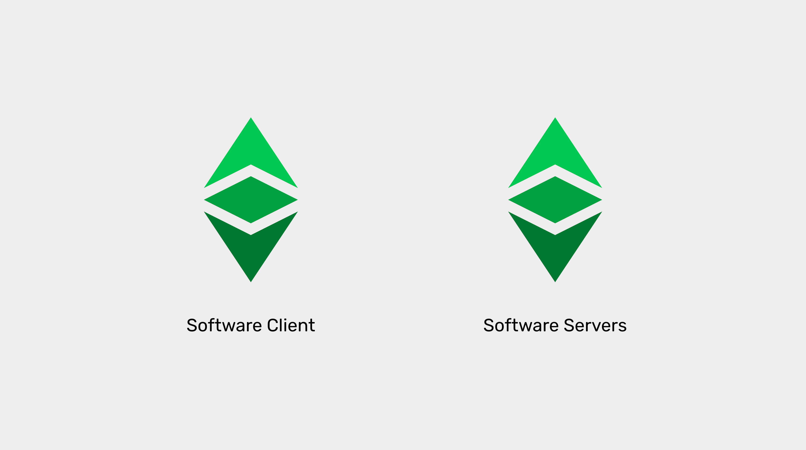
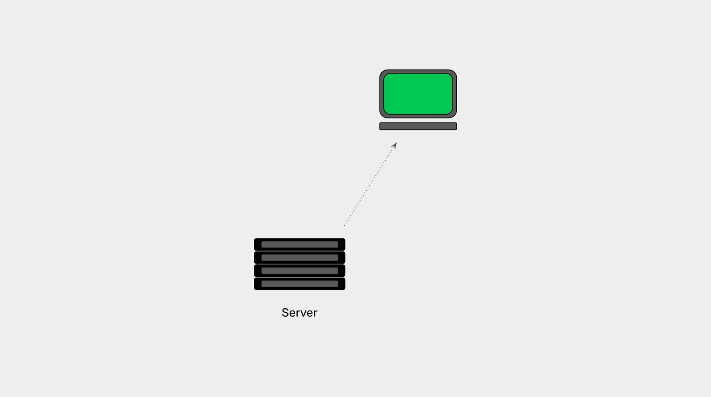
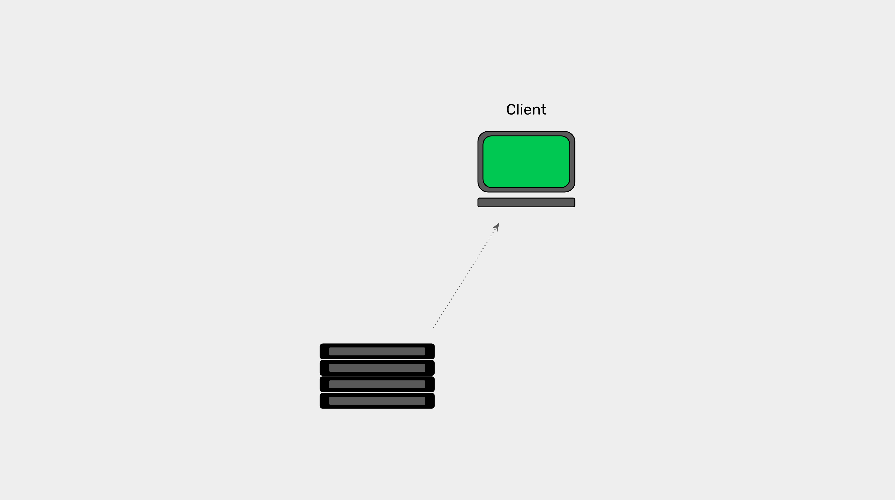
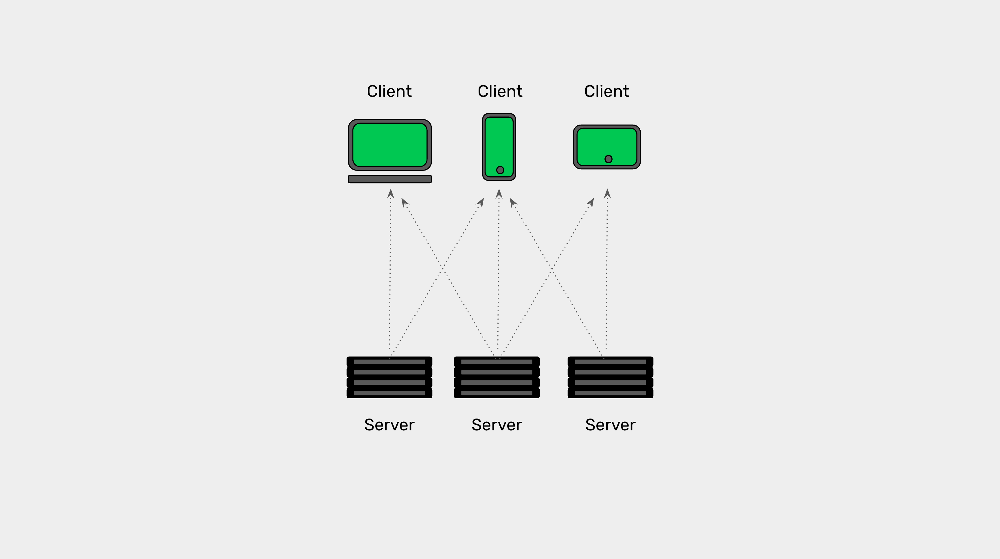
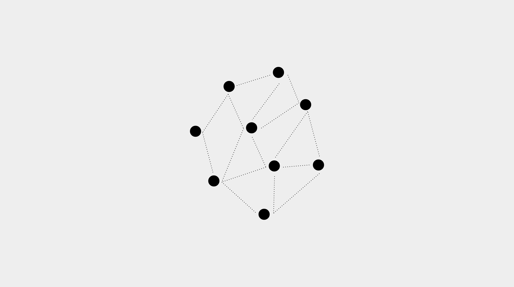
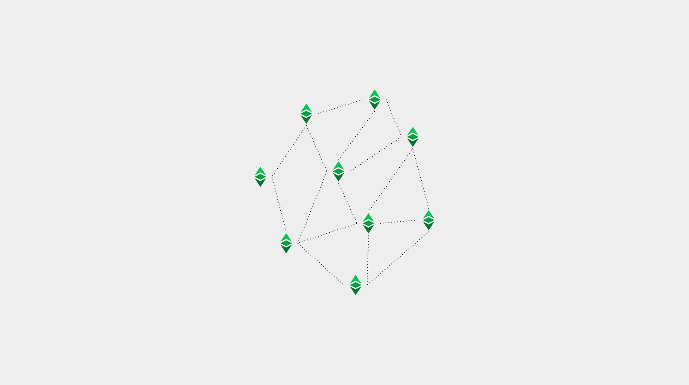
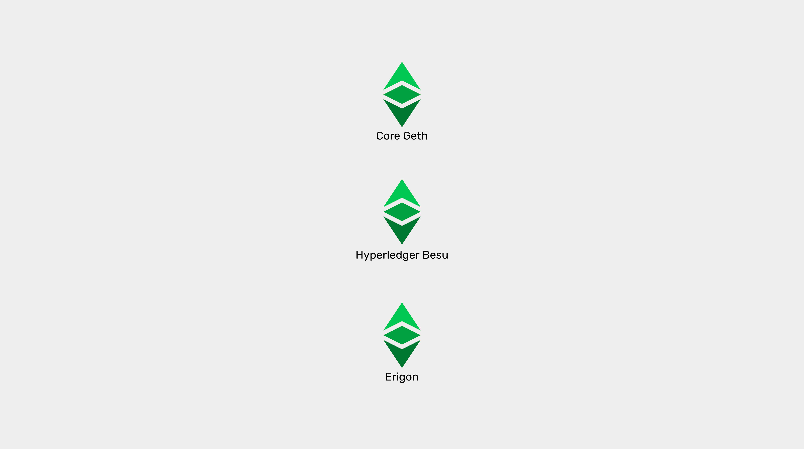

---
**You can listen to or watch this video here:**

<iframe width="560" height="315" src="https://www.youtube.com/embed/L5B7IeJgbM8" title="YouTube video player" frameborder="0" allow="accelerometer; autoplay; clipboard-write; encrypted-media; gyroscope; picture-in-picture" allowfullscreen></iframe>

---

**This is the third part of a series that will explain the three software clients currently operating or being implemented on Ethereum Classic.** 

The series will consist of the following topics:

1. The Difference Between a Network, a Blockchain, and a Cryptocurrency 
2. The Difference Between Blockchain Software and Blockchain Protocol
3. Are There Software Clients and Servers in a Blockchain?
4. Ethereum Virtual Machine Blockchains and Ethereum Classic
5. Core Geth Explained
6. Hyperledger Besu Explained
7. Erigon Explained

---

## Software Clients vs Software Servers

Blockchains consist of computer networks and software applications that the machines in these systems must run to be able to participate. 

The blockchain software applications are usually called “software clients”, however, there is more to the true roles and functions of these software nodes.

In our previous article, we explained what is the difference between blockchain software and blockchain protocol. In this article we will explain what are software clients and servers and how they may be redefined in the context of blockchain networks.

Learning these details will help us understand what are, and how the various Ethereum Classic software clients work.

## What Are Software Servers?

As the name indicates, servers provide information services to other applications or machines upon request. Usually they are structured and designed to provide large scale computing and data services.

These information services may be to execute programs and return the results, store and process large amounts of data, to manage communications, provide big data and machine learning models, or business analytics.

Examples are web servers, email servers, corporate mainframes applications, government data centers, and cloud services.

They are usually controlled by corporations or governments to provide their products and services to clients, users, or beneficiaries, or for internal operations and systems.

## What Are Software Clients?

Clients are the applications that use the information services of servers. Usually they are small scale computing and data storage systems and they are normally user facing programs.

Examples are web browsers, email apps, corporate terminals, government front office systems, business apps, and dashboards.

They are normally installed in end user computers, phones, or tablets so people may conduct their day to day activities.

## In What Settings do Clients and Servers Traditionally Interact?

Systems designs where there are defined client-server functions are a computing model organized to divide labour between machines and applications in order to make them more efficient and cheaper to operate.

Multiple clients use the services of centralized servers so that the bulk of the work and storage of data is done by a few more powerful machines and applications. 

Some examples may be airline terminals at airports and their company mainframes, websites and mobile apps and tech company data centers, and banking apps and bank servers, which process transactions and maintain accounts and balances.

The great disadvantage of the client-server model is that it is centralized.

## The Client-Server Model Is Dissolved in Peer-to-Peer Networks

In peer-to-peer networks, all machines and applications are meant to be equal to maximize decentralization, make sure there is redundancy, and minimize the downtime of the systems.

This makes this model significantly more secure, but at the expense of efficiency.

In peer-to-peer networks every machine and every node software application is both a server and a client. This is because the way they are organized is that all participants should be able to use the information of any other participant at any time, so they usually keep the data of the system distributed among all machines and applications.

The great advantage of the peer-to-peer model is that it is decentralized.

## Blockchains Follow the Peer-to-Peer Model

Blockchains are peer-to-peer networks that maintain a fully replicated database in every node that contains the accounts, balances, and smart contracts of the system.

This means that all the machines in a blockchain have both the role of client and server because they all depend on the other nodes for the following functions:

1. **Send and receive new transactions:** When new transactions are received all nodes re-transmit them to all other nodes.
2. **Send and receive new blocks:** When new blocks are received from miners all nodes re-transmit them to all other nodes.
3. **Send and receive the whole blockchain to new machines joining the network:** This is called “initial blockchain download”.

## The Software Clients/Servers of Ethereum Classic

Ethereum Classic has three “software clients” which are really “software client-servers” of which two are operational, [Core Geth](https://github.com/etclabscore/core-geth) and [Hyperledger Besu](https://github.com/hyperledger/besu/), and one is in the process of being implemented on ETC, which is called [Erigon](https://github.com/ledgerwatch/erigon).

Core Geth and Hyperledger Besu perform all the functions of the nodes in the blockchain, including storage of the blockchain, verification, and block mining, and Erigon focuses only on storage of the blockchain and verification, for now.

However, they all perform the three client-server functions of transaction and block re-transmission and full replication, and initial blockchain download, described above.

Another component that these client-servers have is the replicated Ethereum Virtual Machine or EVM. This will be the topic of our next article.

---

**Thank you for reading this article!**

To learn more about ETC please go to: https://ethereumclassic.org
