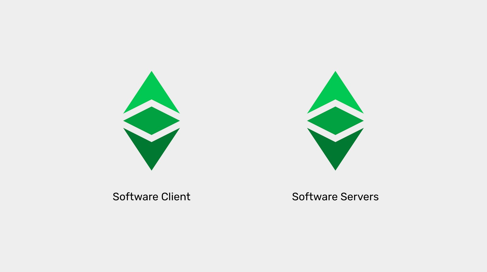
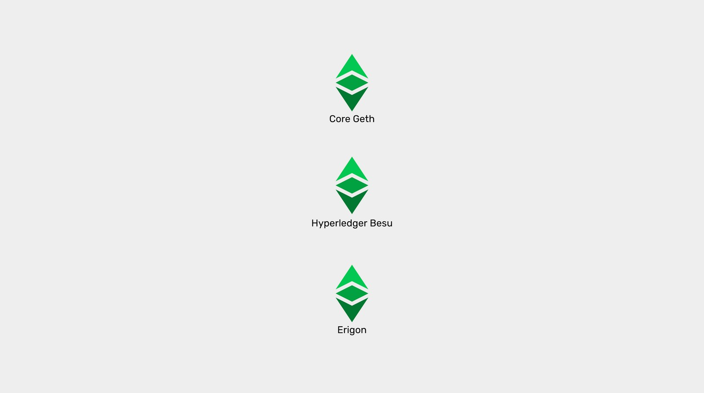

---
**欢迎由此收听或观看以下视频：**

<iframe width="560" height="315" src="https://www.youtube.com/embed/L5B7IeJgbM8" title="YouTube video player" frameborder="0" allow="accelerometer; autoplay; clipboard-write; encrypted-media; gyroscope; picture-in-picture" allowfullscreen></iframe>

---

**这是本系列的第一部分，将解释目前在以太坊经典上运行或实现的三种软件客户端。**

该系列将包括以下主题:

1. 网络、区块链和加密货币之间的区别
2. 区块链软件与区块链协议的区别
3. 区块链中是否有软件客户端和服务器?
4. 以太坊虚拟机区块链和以太坊经典
5. Core Geth详解
6. 超级账本Hyperledger Besu详解
7. Erigon详解

---

## 软件客户端与软件服务器

区块链由计算机网络和软件应用组成，这些系统中的机器必须运行才能参与其中。

区块链软件应用程序通常被称为“软件客户端”，然而，这些软件节点的真正角色和功能还有更多。

在上一篇文章中，我们解释了区块链软件和区块链协议之间的区别。在本文中，我们将解释什么是软件客户机和服务器，以及如何在区块链网络的上下文中重新定义它们。

了解这些细节将帮助我们理解各种以太坊经典软件客户端是什么，以及如何工作。

## 什么是软件服务器？

顾名思义，服务器根据请求向其他应用程序或机器提供信息服务。它们通常是结构化的，旨在提供大规模的计算和数据服务。

这些信息服务可能是执行程序并返回结果，存储和处理大量数据，管理通信，提供大数据和机器学习模型，或商业分析。

例如web服务器、电子邮件服务器、企业大型机应用程序、政府数据中心和云服务。

它们通常由公司或政府控制，以便向客户、用户或受益人提供产品和服务，或用于内部运营和系统。

## 什么是软件客户端？

客户端是使用服务器信息服务的应用程序。它们通常是小型计算和数据存储系统，通常是面向用户的程序。

例如web浏览器、电子邮件应用程序、企业终端、政府前台办公室系统、商业应用程序和仪表板。

它们通常安装在终端用户的电脑、手机或平板电脑中，以便人们可以进行日常活动。

## 客户端和服务器通常在哪些设置下进行交互?

定义了客户-服务器功能的系统设计是一种计算模型，组织起来在机器和应用程序之间进行分工，以使它们的操作更高效、更便宜。

多个客户机使用集中式服务器的服务，这样大量的工作和数据存储就由少数几个功能更强大的机器和应用程序完成。

一些例子可能是机场的航空终端和他们的公司大型机，网站和移动应用程序和科技公司的数据中心，以及银行应用程序和银行服务器，它们处理交易和维护账户和余额。

客户机-服务器模型的最大缺点是它是集中式的特性。

## 客户-服务器模型在对等网络中被消解

在对等网络中，所有机器和应用程序都应该是平等的，以最大限度地分散，确保冗余，并最大限度地减少系统的停机时间。

这使得该模型显著地更加安全，但以效率为代价。

在对等网络中，每台机器和每一个节点软件应用程序既是服务器又是客户端。这是因为它们的组织方式是，所有参与者都应该能够在任何时候使用任何其他参与者的信息，因此它们通常将系统的数据分布在所有机器和应用程序中。

对等网络中最大的优点就是其去中心化的特征。

## 区块链遵循对等网络模型

区块链是对等网络，在包含系统账户、余额和智能合约的每个节点中维护一个完全复制的数据库。

这意味着区块链中的所有机器同时具有客户机和服务器的角色，因为它们都依赖于其他节点来实现以下功能:

1. **发送和接收新事务:** 当接收到新事务时，所有节点将其重新发送给所有其他节点。

2. **发送和接收新区块:** 当从矿工接收到新区块时，所有节点将其重新发送给所有其他节点。

3. **向加入网络的新机器发送和接收整个区块链:** 为“初始区块链下载”。

## 以太坊经典的软件客户端-服务器

以太坊经典有三个“软件客户端”，它们是真正的“软件客户端-服务器”，其中两个是可操作的，[Core Geth](https://github.com/etclabscore/core-geth)和[Hyperledger Besu](https://github.com/hyperledger/besu/)，还有一个正在ETC上实现，称为[Erigon](https://github.com/ledgerwatch/erigon)。

Core Geth和Hyperledger Besu执行区块链中所有节点的功能，包括区块链的存储、验证和区块挖掘，而Erigon目前只关注区块链的存储和验证。

但是，它们都执行上述事务和区块重传输、完全复制和初始区块链下载这三个客户机-服务器功能。

这些客户机-服务器的另一个组件是复制的以太坊虚拟机或EVM。这将是我们下一篇文章的主题。

---

**感谢您阅读本文！**

要了解有关 ETC 的更多信息，请访问：https://ethereumclassic.org
