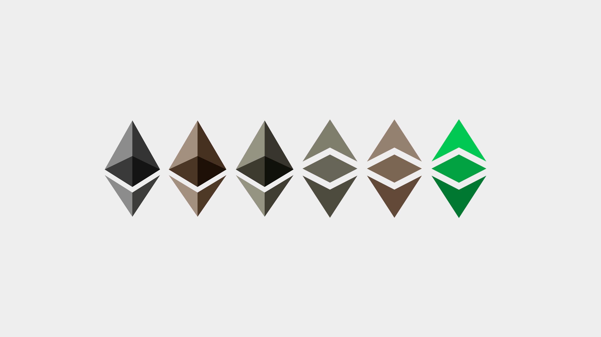
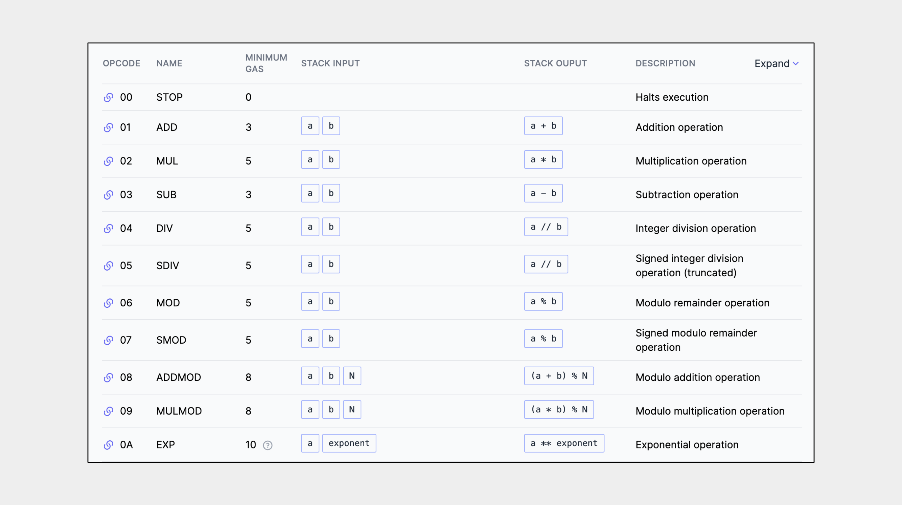
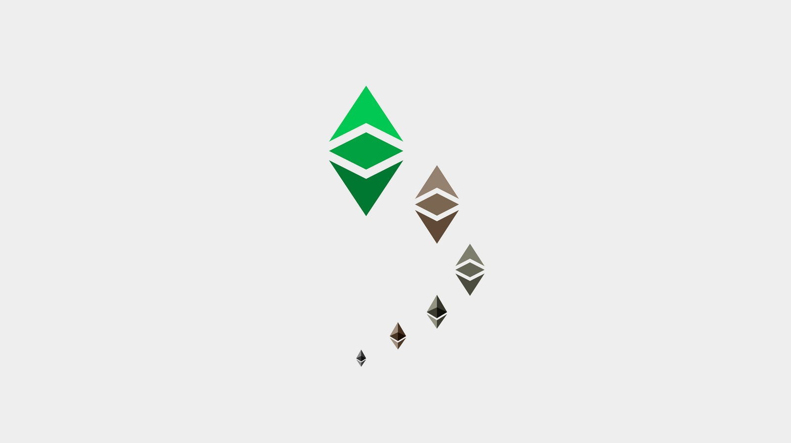
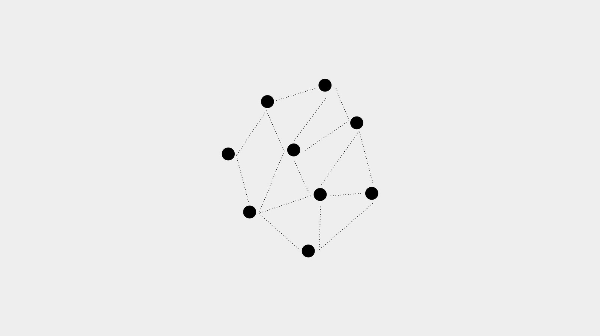
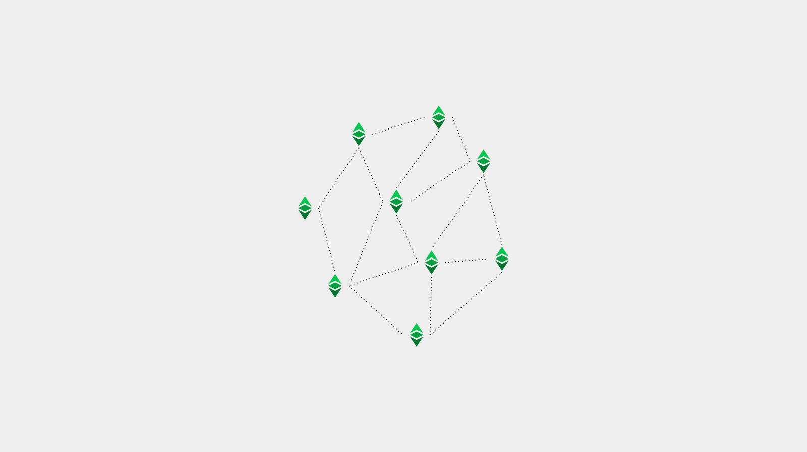
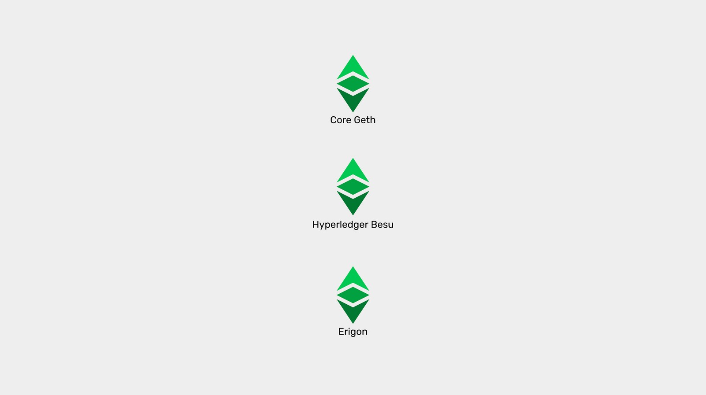

---
**You can listen to or watch this video here:**

<iframe width="560" height="315" src="https://www.youtube.com/embed/vedsLsb12Xo" title="YouTube video player" frameborder="0" allow="accelerometer; autoplay; clipboard-write; encrypted-media; gyroscope; picture-in-picture" allowfullscreen></iframe>

---

**This is the fourth part of a series that will explain the three software clients currently operating or being implemented on Ethereum Classic.** 

The series will consist of the following topics:

1. The Difference Between a Network, a Blockchain, and a Cryptocurrency 
2. The Difference Between Blockchain Software and Blockchain Protocol
3. Are There Software Clients and Servers in a Blockchain?
4. Ethereum Virtual Machine Blockchains and Ethereum Classic
5. Core Geth Explained
6. Hyperledger Besu Explained
7. Erigon Explained

---

## Non-programmable vs Programmable Blockchains

Depending on what components and design choices a blockchain has made, it may be a simple ledger with accounts, balances, and a cryptocurrency, or a more complex and versatile system with accounts, balances, a cryptocurrency, and smart contracts, making it programmable.

In our previous article, we explained what are software clients and servers and defined blockchain node software as combined client-servers. In this article we will explain a major component of smart contracts blockchain client-servers called the Ethereum Virtual Machine, or EVM for short, and how this model has become an industry standard for programmability.

Learning these details will help us understand what are, and how the various Ethereum Classic software clients work.

## What Is The Ethereum Virtual Machine (EVM)?

The EVM in blockchain client-servers is the innovation that brought smart contracts to the blockchain industry.

It is a software component that behaves like a computing machine. As part of the node software, it is replicated in all machines in the network, therefore it’s a decentralized virtual machine.

The way it works is that it has over 120 computing operation codes, or opcodes for short, that together provide near full computability.

Because client-servers may be installed in many kinds of computers with diverse operating systems, the EVM enables nodes to operate in their local environments with their local machines, and at the same time interact with the global network of blockchain nodes with a single and compatible computing standard.

This assures a unified way of operating the network and executing smart contracts.

## The EVM Model as a Standard

Because many projects have imitated the EVM model to design their blockchains, then it has become a standard in the industry.

As a standard, changes that may happen in any system of the EVM family may be integrated into other systems.

Because it is open source, anyone may contribute and anyone may copy changes or upgrades.

It is important for all projects to keep their systems aligned with the EVM standard so there is more coordination, reduced switching and lock-in costs for developers and users, and increased interoperability between the networks.

The EVM standard does not only include the EVM, but also the general format of the Ethereum protocol. 

The protocol components are the following:

1. An EVM to execute opcodes.
2. A GAS system to designate computing costs to each opcode to prevent spam and the halting problem.
3. A programming language called Solidity so developers may build dapps that are executable by the EVM.
4. State transition so the EVM may take inputs, execute programs, and produce new state outputs.
5. Storage of software programs (smart contracts) in the ledger, turning them into decentralized programs.

## Which Are the EVM Blockchains in the Market?

EVM blockchains are those blockchain projects that have adopted the EVM standard to design their systems, therefore have practically the same components described above.

A list of top blockchains that follow this standard are:

**Proof of Stake:**

- Ethereum
- BNB Smart Chain
- Cardano (through a sidechain)
- Polkadot (through a parachain)
- TRON
- Solana
- Avalanche
- Polygon
- EOS

**Proof of Work**

- Ethereum Classic

## Ethereum Classic as an EVM Blockchain

As may be seen in the list above, Ethereum Classic is the only major proof of work smart contracts blockchain and the biggest in the world.

Ethereum Classic is, indeed, the original EVM blockchain as Ethereum split from it in 2016 due to an incident called The DAO making it the second EVM compatible chain.

Ethereum Classic has been updated to all the latest EVM standard features and upgrades, except some that were not aligned with its principle of “Code Is Law”, e.g. it did not migrate to Proof of Stake and has a fixed monetary policy.

This means ETC will stay as a Proof of Work blockchain and is the largest, thus most secure smart contracts blockchain in the planet because it uses that consensus mechanism.

## The Ethereum Classic EVM Software Clients 

Ethereum Classic has three software client-servers of which two are operational, [Core Geth](https://github.com/etclabscore/core-geth) and [Hyperledger Besu](https://github.com/hyperledger/besu/), and one is in the process of being implemented on ETC, which is called [Erigon](https://github.com/ledgerwatch/erigon).

All three node client-servers comply with the ETC version of the EVM model and standard, but have some key differences that make them unique in their niches.

This will be the topic of our next three articles where we will explain each one separately.

---

**Thank you for reading this article!**

To learn more about ETC please go to: https://ethereumclassic.org
