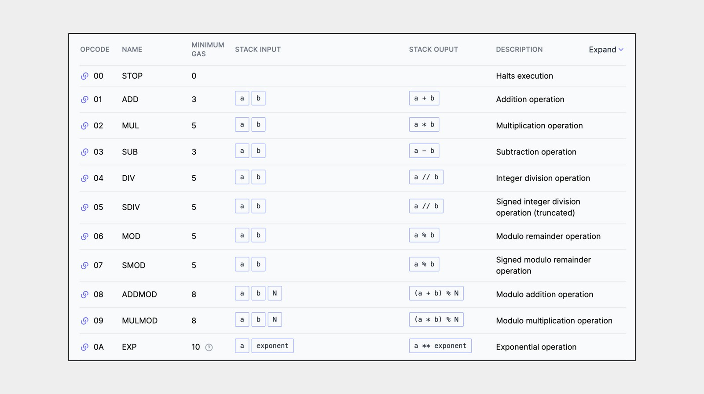
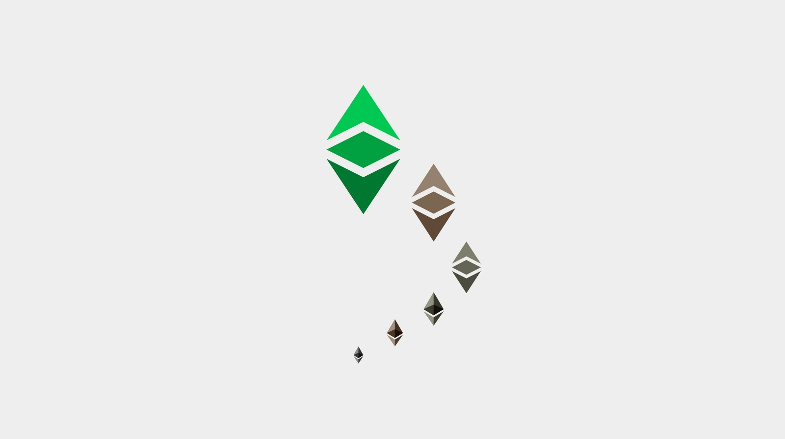
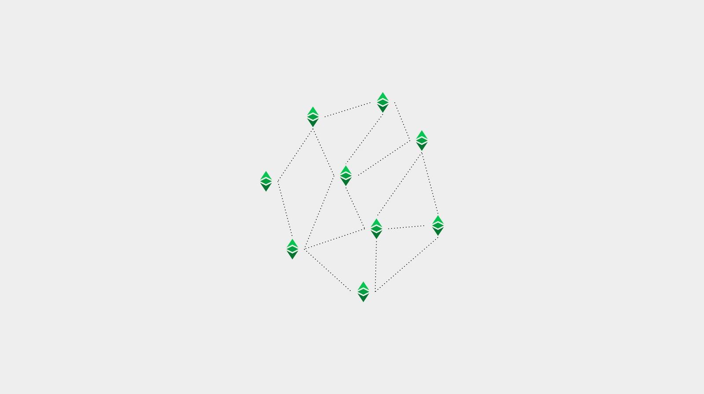

---
**欢迎由此收听或观看以下视频：**

<iframe width="560" height="315" src="https://www.youtube.com/embed/vedsLsb12Xo" title="YouTube video player" frameborder="0" allow="accelerometer; autoplay; clipboard-write; encrypted-media; gyroscope; picture-in-picture" allowfullscreen></iframe>

---

**这是本系列的第一部分，将解释目前在以太坊经典上运行或实现的三种软件客户端。**

该系列将包括以下主题:

1. 网络、区块链和加密货币之间的区别
2. 区块链软件与区块链协议的区别
3. 区块链中是否有软件客户端和服务器?
4. 以太坊虚拟机区块链和以太坊经典
5. Core Geth详解
6. 超级账本Hyperledger Besu详解
7. Erigon详解

---

## 不可编程和可编程区块链

根据区块链所做的组件和设计选择，它可能是一个具有帐户、余额和加密货币的简单账本，或者是一个具有帐户、余额、加密货币和智能合约的更复杂和通用的系统，使其可编程。

在上一篇文章中，我们解释了什么是软件客户机和服务器，并将区块链节点软件定义为组合的客户机-服务器。在本文中，我们将解释智能合约区块链客户机-服务器的一个主要组件，称为以太坊虚拟机(简称EVM)，以及这个模型如何成为可编程性的行业标准。

了解这些细节将带我们读懂不同以太坊经典软件客户端是如何运作的。

## 什么是以太坊虚拟机区块链

区块链客户机-服务器中的EVM是为区块链行业带来智能合约的创新。

它是一种像计算机一样运行的软件组件。作为节点软件的一部分，它被复制到网络中的所有机器中，因此它是一个去中心化的虚拟机。

它的工作方式是，通过120多个计算操作代码（或简称操作码）提供了几乎完全的可计算性。

由于客户机-服务器可以安装在具有不同操作系统的多种计算机中，因此EVM允许节点在其本地环境中使用其本地机器进行操作，同时使用单一且兼容的计算标准与区块链节点的全局网络进行交互。

这保证了网络操作和智能合约执行的统一性。

## 将以太坊虚拟机作为标准

由于很多项目都是模仿EVM模型来设计区块链的，因此它已经成为了行业内的标准。

作为标准，在EVM家族的任何系统中可能发生的更改都可以集成到其他系统中。

因为它是开源的，任何人都可以贡献成果，任何人都可以复制更改或升级。

对于所有项目来说，保持它们的系统与EVM标准保持一致是很重要的，这样可以更好地进行协调，减少开发人员和用户的切换和锁定成本，并提高网络之间的互操作性。

EVM标准不仅包括EVM，还包括以太坊协议的通用格式。

协议组件如下：

1. EVM执行操作码
2. 一种为每个操作码指定计算成本的GAS系统，以防止垃圾邮件和停机问题。
3. 一种叫做Solidity的编程语言使开发人员可以构建由EVM执行的dapps(去中心化APP）.
4. 状态转换，以便EVM可以接受输入、执行程序并产生新的状态输出。
5. 软件程序（智能合约）在帐本中的存储，将它们变成去中心化的程序。

## 什么是市场中的以太坊虚拟机区块链？

EVM区块链是那些采用EVM标准来设计其系统的区块链项目，因此实际上具有上述相同的组件。

遵循这一标准的顶级区块链列表如下:

持有量证明：

- 以太坊
- 币安智能链
- 艾达币 （通过侧链）
- 波卡币 （通过副链）
- 波场
- Solana
- Avalanche
- Polygon
- EOS

工作量证明：

- 以太坊经典

## 在以太坊虚拟机区块链上的以太坊经典

从上面的列表中可以看到，以太坊经典是唯一的主要工作证明智能合约区块链，也是世界上最大的工作量证明区块链。

事实上，以太坊经典是最初的EVM区块链，因为以太坊在2016年由于一个名为DAO的事件而从它分离，使其成为第二个EVM兼容链。

以太坊经典已经更新了所有最新的EVM标准功能和升级，除了一些不符合其“代码即法律”的原则。例如，它没有迁移到持有量证明，并有固定的货币政策。

这意味着ETC将继续作为工作证明区块链，并且是全球最大的工作量证明区块链。因此是最安全的智能合约区块链，因为它使用了这种共识机制。

## 以太坊经典EVM软件客户端 

以太坊经典有三个软件客户端-服务器，其中两个是可操作的，[Core Geth](https://github.com/etclabscore/core-geth)和[Hyperledger Besu](https://github.com/hyperledger/besu/)，还有一个正在ETC上实现，称为[Erigon](https://github.com/ledgerwatch/erigon)。

所有三个节点客户机-服务器都遵循EVM模型和标准的ETC版本，但有一些关键的差异使它们在各自的领域中独一无二。

这将是我们接下来三篇文章的主题，我们将分别对它们进行解释。

---

**感谢您阅读本文！**

要了解有关 ETC 的更多信息，请访问：https://ethereumclassic.org
