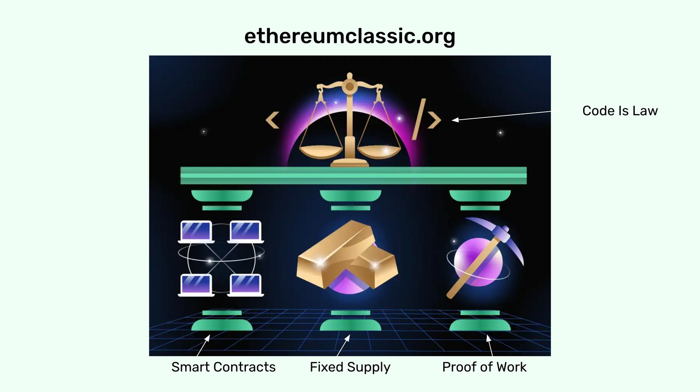
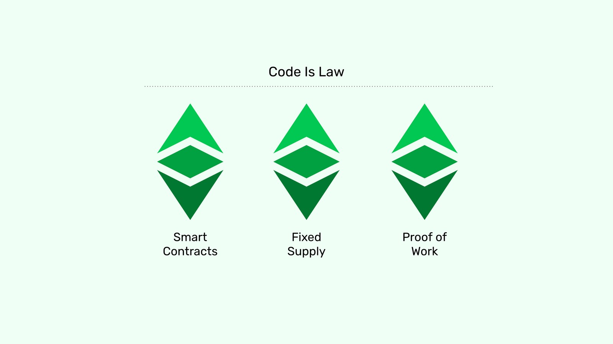
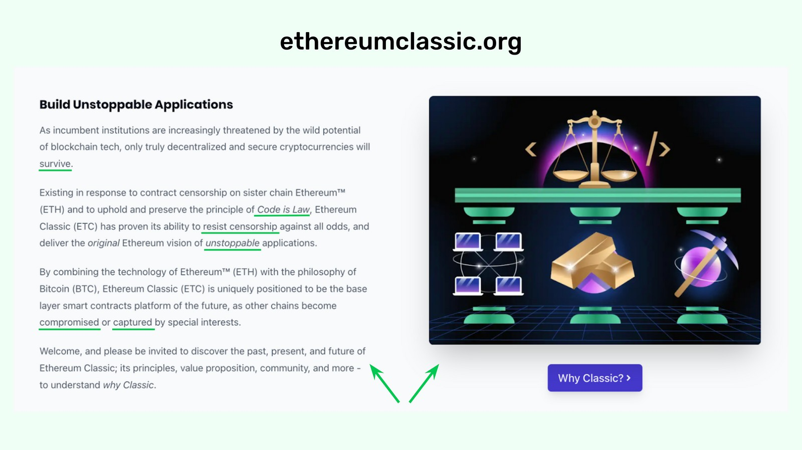
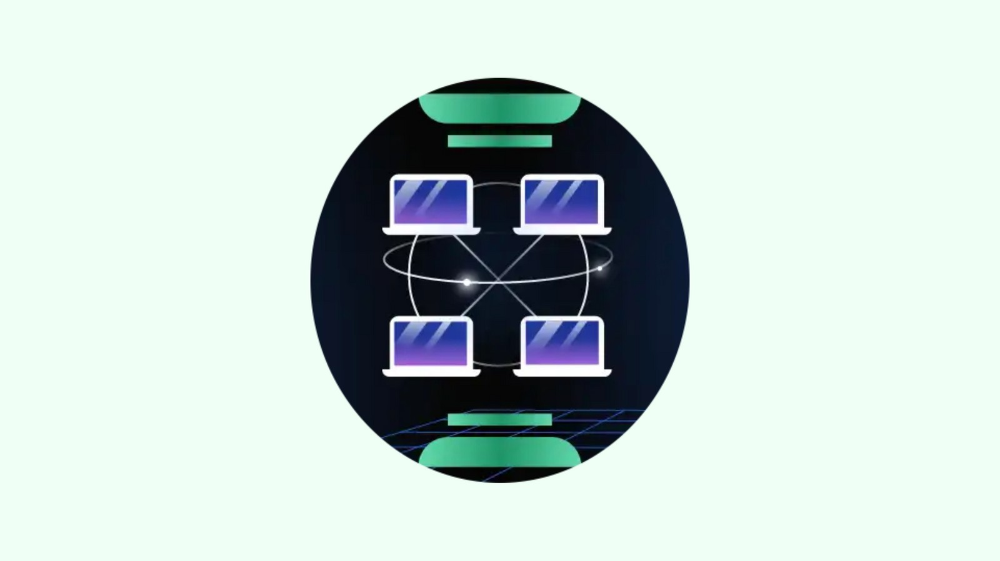
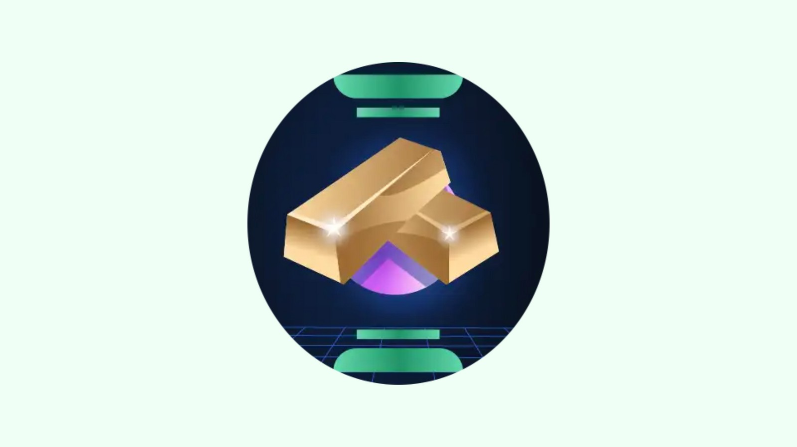
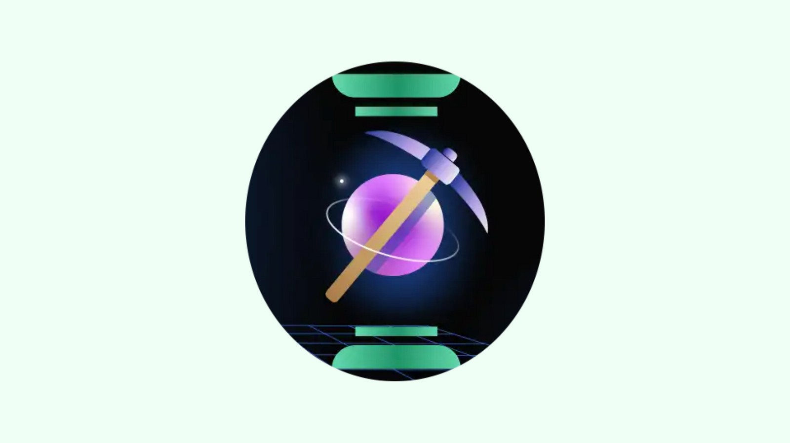
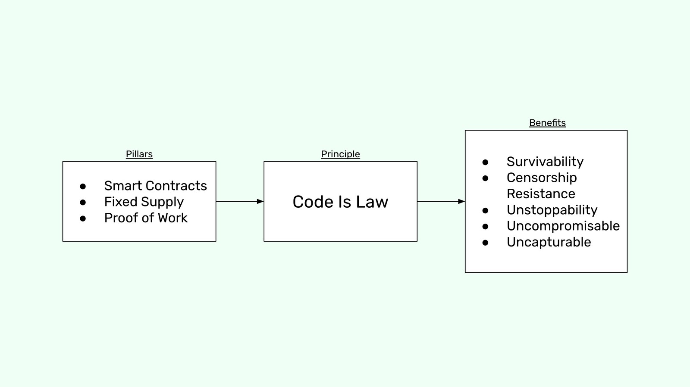

---
**You can listen to or watch this video here:**

<iframe width="560" height="315" src="https://www.youtube.com/embed/GJqwZvFRZMY" title="YouTube video player" frameborder="0" allow="accelerometer; autoplay; clipboard-write; encrypted-media; gyroscope; picture-in-picture" allowfullscreen></iframe>

---

## Main Image on ethereumclassic.org and Its Symbolism

When you go to the [Ethereum Classic website](https://ethereumclassic.org) you find the image below which has a lot of symbolism and meaning for the ETC blockchain. 

As may be seen above we marked the sections of the image with the meaning of each section. The three pillars are:

- smart contracts or programmability, 
- fixed supply which gives ETC its property of digital gold,
- Proof of Work which is the heart of the network as it provides the security of the whole system.

In the image, the three pillars hold up and support the main principle of the Ethereum Classic network, represented as justice scales in between sofware code, which means *Code Is Law*.

In abstraction, the image symbolism on the home page may be represented as in the diagram below.

## Explanatory Text Beside the Image

Beside the image on the wesbite, there is a text that explains to newcomers what is Ethereum Classic and implicitly lists five benefits of the pillars of ETC as well as the principle of *Code Is Law*.

From the text above I underlined the keywords that represent the benefits of the *Code Is Law* principle, which is upheld by the three pillars of ETC, and below I list them with their meaning:

- **Survivability:** Because of ETC's security, accounts, balances, and smart contracts will survive in the long term.
- **Censorship Resistance:** ETC is censorship resistant and unrestricted, therefore permissionless.
- **Unstoppability:** Currency tranfers and decentralized applications are unstoppable.
- **Uncompromisable:** Accounts, balances, and decentralized applications cannot be compromised as in traditional systems. 
- **Uncapturable:** ETC cannot be captured by corporations or special interests.

So, the three pillars uphold the principle of *Code Is Law*, and the principle of *Code Is Law* guarantees the benefits of survivability, censorship resistance, unstoppability, and make ETC uncompromisable and uncapturable.

Then, the question is: How do the three pillars of Ethereum Classic guarantee the principle of Code Is Law and its main benefits?

This is what we will explain in the rest of this article.

## Pillar 1: Smart Contracts

When we use the traditional web and apps on our phones or computers they interact with the central servers of tech companies and banks. This presents the risks of censorship, confiscation, restricted access, and manipulation of our activities by corporations and governments.

What good is a decentralized cryptocurrency as Bitcoin if to use it through applications, the applications themselves may be captured? What good would it be to supposedly make that cryptocurrency “programmable” if the programmes are hosted in centralized data centers and cloud services?

As smart contracts inside Ethereum Classic are decentralized software programs, they can power applications, making them decentralized applications (dapps). This means dapps on the ETC blockchain truly provide the benefits decentralization. 

This is, that the Code Is Law principle is true in ETC and this enables applications to have the same security as the currency inside the blockchain.

By “security” we mean survivability in the long term of the code on the network, resistance against censorship, unstoppability of dapps, and hence that they will be uncompromisable and uncapturable as in traditional systems.

## Pillar 2: Fixed Supply

As the security model of a proof of work blockchain depends in a great measure on demand for its services (a secure and programmable cryptocurrency in the case of Ethereum Classic) then the properties of sound money must be a key component of the system to provide the economic incentives to increase its demand.

Sound money means that the native token must be scarce, durable, costly to create, portable, divisible, fungible, and transferable. However, the more important innovation that blockchains brought to the world with regards to sound money was that the currency is also trust minimized.

Trust minimization means that the ability for any centralized entity or special interest to change the supply of the currency is significantly reduced, or practically eliminated.

This gives a much higher assurance that the monetary policy will not be arbitrarily modified and increased, diluting the wealth and property of holders, as it happens systematically with fiat money.

Because ETC’s cryptocurrency is programmed in the protocol and it has a decreasing supply that tends to zero, with a supply cap of 210,700,000 coins, then it has these desirable features and properties that we seek, therefore it is sound money and secures property rights on a global scale.

If sound money increases demand, and growing demand increases security, then sound money means survivability in the long term, censorship resistance, unstoppability of dapps, and that the system is uncompromisable and uncapturable.

## Pillar 3: Proof of Work

The Proof of Work Based Nakamoto Consensus mechanism guarantees decentralization because it:

1. **Enables consensus:** All participants in the network can have the knowledge of which is the correct and honest chain because it is very easy to discard any attackers or imposters proposing alternative chains as the only way to build legitimate blocks is by doing a lot of work, consuming enormous amounts of energy.

2. **Enables chain selection for free exit and entry:** The same method of discarding the imposters who did not do the work and only including the blocks that did the work make proof of work blockchains absolutely free to enter and exit at any time with no permission nor direction from anyone.

3. **Protects transactions:** Because to build the blocks requires so much work by machines and expenditure of enormous amounts of electricity, if any attacker wanted to reverse the chain of blocks to the past to introduce fake transactions, censor, or eliminate accounts or balances, they would have to do all the work again.

4. **Imposes a cost to create the money:** The reward per block, which issues new native tokens, only happens if the work to build a block is done. This feature is what is analogous to gold in the real world and makes ETC digital gold.

The decentralization provided by the above features is the heart of the security of Ethereum Classic, thus survivability in the long term, censorship resistance, unstoppability of dapps, and that the system is uncompromisable and uncapturable.

## In Summary

**Smart contracts** provide programmability inside the blockchain and this enables applications to have the same security as the currency.

**Fixed supply** provides economic incentives in the form of sound money for the network to grow and become more secure.

**Proof of Work** makes the network truly decentralized, censorship resistant, immutable, and enables anyone in the world to participate permissionlessly.

---

**Thank you for reading this article!**

To learn more about ETC please go to: https://ethereumclassic.org

