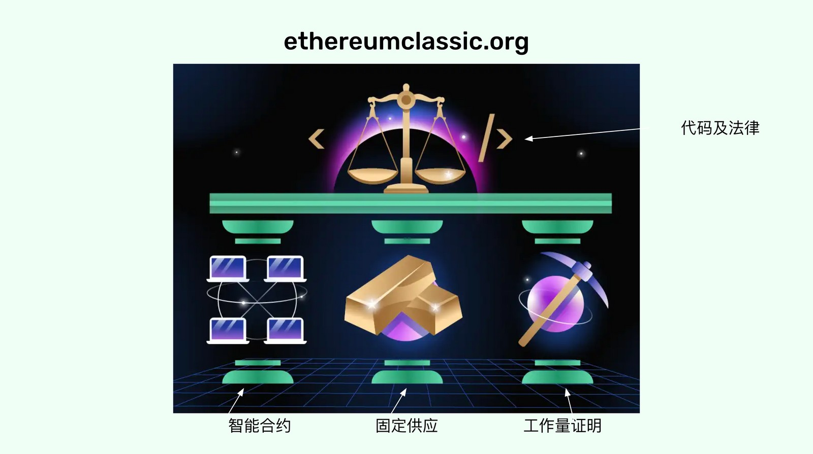
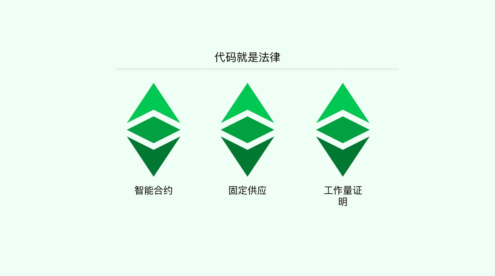
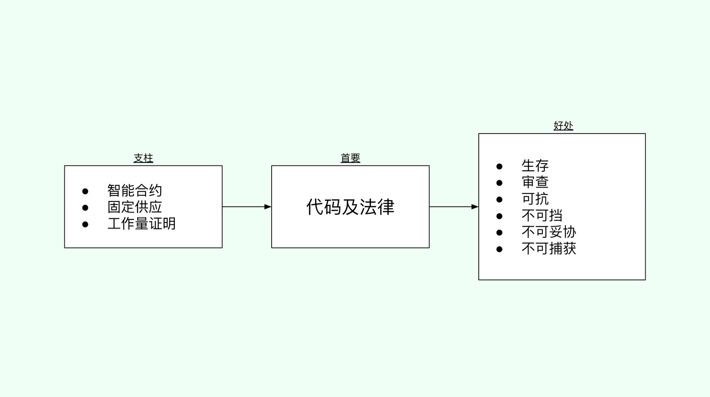

---
**欢迎由此收听或观看文章内容：**

<iframe width="560" height="315" src="https://www.youtube.com/embed/GJqwZvFRZMY" title="YouTube video player" frameborder="0" allow="accelerometer; autoplay; clipboard-write; encrypted-media; gyroscope; picture-in-picture" allowfullscreen></iframe>

---

## Ethereumclassic.org 上的主要图像及其象征意义

当您访问以太坊经典网站时，您会发现下面的图片对ETC区块链有很多象征意义。 

正如上面所看到的，我们用每个部分的含义标记了图像的各个部分。三大支柱是:

- 智能合约或可编程性，
- 这让ETC拥有了数字黄金的属性
- 工作量证明，它是网络的核心，因为它提供了整个系统的安全性。

在图中，这三根支柱支撑着以太坊经典网络的主要原则，表现为软件代码之间的正义天平，也就是code Is Law。

抽象地说，主页上的图像符号可以如下图所示。

## 图像说明

在网站的图片旁边，有一段文字向新来者解释了什么是以太坊经典，并隐式列出了ETC支柱的五个好处以及代码及法律的原则。

在上文，我列出了代表代码即法律的关键字，而代码及法律是由ETC的三个支柱所支撑，其含义如下：
 
- 不可审查:ETC是抵制审查和不受限制的，因此不允许。
- 不可阻挡:货币转账和去中心化应用是不可阻挡的。
- 不可妥协:帐户、余额和去中心化的应用程序不能像传统系统那样被妥协。
- 不可捕获:ETC不能被公司或特殊利益捕获。

因此，三大支柱坚持了法典即法律的原则，法典即法律的原则保证了生存的好处、审查的阻力、并使ETC不受妥协和捕获。

那么，问题来了:以太坊经典的三大支柱是如何保证“代码即法律”的原则及其主要利益的?

这将是接下来文章将讲述的内容。

## 第一支柱：智能合约

当我们使用手机或电脑上的传统网络和应用程序时，它们与科技公司和银行的中央服务器进行交互。这就带来了审查、没收、限制访问以及公司和政府操纵我们活动的风险。

如果通过应用程序使用去中心化的比特币，应用程序本身可能会被捕获的话有什么好处呢? 如果程序托管在中央数据中心和云服务中，那么让加密货币“可编程”又有什么好处呢?

由于以太坊经典中的智能合约是去中心化的软件程序，它们可以驱动应用程序，使其成为去中心化的应用程序(dapp)。这意味着ETC区块链上的dapp真正提供了去中心化的好处。

也就是说，代码即法律的原则在ETC中是正确的。这使得应用程序具有与区块链中的货币相同的安全性。

所谓的“安全”，我们指的是在网络上代码的长期生存能力，对审查的抵抗，dapp的不可阻挡性，因此它们将像传统系统一样不可妥协和不可捕获。

## 第二支柱： 固定供应

由于工作证明区块链的安全模型在很大程度上取决于对其服务的需求(以以太坊经典为例，是一种安全且可编程的加密货币)，因此健全货币的属性必须是系统的关键组成部分，以提供经济激励来增加其需求。

健全的货币意味着原生代币必须是稀缺的、耐用的、昂贵的、便携的、可分割的、可替代的和可转移的。然而，区块链给世界带来的关于健全货币的更重要的创新是，货币也被信任最小化。

信任最小化意味着任何中央实体或特殊利益改变货币供应的能力被显著降低，或实际上被消除。

这大大提高了货币政策不会被随意修改和增加，从而想法币一样稀释持有人的财富和财产。

因为ETC的加密货币是在协议中编程的，它的供应量逐渐减少，接近于零，供应上限为210,70万枚，然后它有这些我们想要的特征和属性，因此它是稳健的货币，并在全球范围内保护产权。

如果健全的货币增加了需求，而不断增长的需求增加了安全性，那么健全的货币就意味着长期的生存能力，审查的阻力，dapp的不可阻挡性，以及这个系统是不可妥协和不可捕获的。

## 第三支柱：工作量证明

基于工作证明的中本共识机制保证了权力下放，因为:

实现共识:网络中的所有参与者都可以知道哪条链是正确和诚实的，因为很容易去除任何提出替代链作为构建合法区块的唯一方法的攻击者或冒名顶替者，只需要做大量的工作，消耗大量的能量。

允许自由进出的链选择:同样的方法，丢弃那些没有做过工作的冒名顶替者，只包括做过工作的区块，使得工作证明区块链在任何时候都可以完全自由进出，不需要任何人的许可或指导。

保护交易:因为构建这些区块需要大量的机器工作和大量的电力支出，如果任何攻击者想要将区块链逆转到过去，以引入虚假交易、审查或消除账户或余额，他们将不得不重新做所有的工作。

创建货币的成本:每个区块的奖励(发行新的原生代币)只在构建区块的工作完成时发生。这一特性与现实世界中的黄金类似，使ETC成为数字黄金。

上述特性提供的去中心化是以太坊经典安全的核心，因此具有长期的生存能力、审查阻力、dapp的不可阻挡性，以及系统不可妥协和不可捕获。

## 总结

智能合约在区块链内部提供可编程性，这使应用程序具有与货币相同的安全性。

固定供给以稳健货币的形式为网络的增长和变得更加安全提供了经济激励。

工作量证明使网络真正去中心化、抵制审查、不可改变，并使世界上的任何人都能不经许可地参与其中。

---

**感谢您阅读本文！**

要了解有关 ETC 的更多信息，请访问：https://ethereumclassic.org
