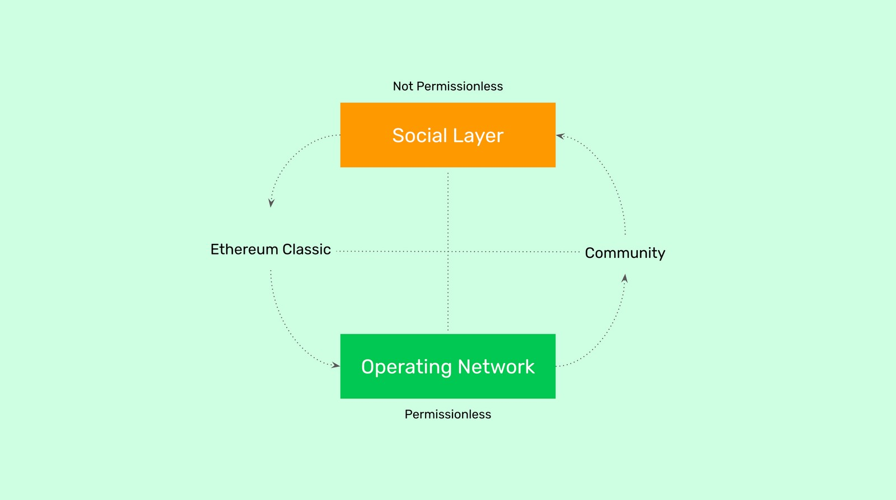

---
**You can listen to or watch this video here:**

<iframe width="560" height="315" src="https://www.youtube.com/embed/LmHnVjMiE90" title="YouTube video player" frameborder="0" allow="accelerometer; autoplay; clipboard-write; encrypted-media; gyroscope; picture-in-picture" allowfullscreen></iframe>

---

The permissionless paradox in Ethereum Classic is this: To maximize permissionlessness in the ETC blockchain, you must reduce permissionlessness in the community that most influences it. Or, to put it more bluntly, the ETC community should not be permissionless.

By "ETC community" I mean the social media outlets such as the Discord server, the GitHub organization and its various repositories, the ECIP process, and other non-mainnet forums.

There is something I call the "freedom conservation law" which means that to increase freedom in one place, you need to reduce freedom in another. This is how civilization works.

In civilized societies, no one can go around destroying life and property. These are individual guarantees that need strong rules and enforcement to be implemented and took thousands of years to develop. So, in essence, all participants in a civilized society must sacrifice their absolute individual freedom, by following the rule of law, to maximize their individual freedom in the context of civilized society. To maximize your freedom you must sacrifice your absolute freedom.

This marks a separation between the operating network and the ETC community. The ETC community is the social layer. The social layer is where ideas and actors exist and work. If all the ecosystem participants in the social layer were convinced of a bad idea by a bad actor, then bad ideas would be introduced to the operating network, reducing its decentralization, thus reducing its permissionlessness.

A system that seeks freedom, must not allow anti-freedom in the system.

All the above ideas seem counterintuitive: If freedom is freedom, and permissionlessness in permissionlessness, then why should anything be prohibited or not allowed?

The answer is that freedom is not a normal state in nature. It is not, like many believe, "the law of the jungle". To the contrary, freedom is the result of artificial and very strict and thoroughly enforced rules. The "law of the jungle" is anti-freedom and only depends on brute force. In it, the destruction of life and liberty are permitted.

Despite what utopian thinkers believe, life, liberty, and property are not natural occurrences, nature is actually hostile to living beings. Any man or woman who lives in civilized society would likely not survive very long if they were left in the wilderness.

Life, liberty, and property are artificially created benefits of artificial environments, very carefully designed by men to organize civilized society. 

In the same way, permissionlessness in a blockchain as Ethereum Classic is not a natural state, it is the result of a carefully designed protocol that guarantees sound money, property, and agreements in a decentralized network on a global scale. Deviations in that protocol would significantly weaken these guarantees.

Another thing that sounds counterintuitive is that the more zealous about its principles and intolerant about deviations the Ethereum Classic community is, then the more permissionless ETC will be.

Indeed, ETC community members and the ecosystem at large; including core contributors, community participants, volunteers, miners, node operators, investors, dapp developers, and users; should memorize and know by heart the Ethereum Classic philosophy and principles just as Rabbis and Pastors cite the Bible by book, chapter, and verse.

There shouldn't be a drop of misunderstanding or doubt in anyone, and everyone should defend the *Code Is Law* principle with all their hearts and souls.

That ETC is permissionless means that, as long as they have an internet connection, anyone from any place in the world should be able to freely create accounts, enter transactions and smart contracts, or participate in the network as a miner, node operator, user, investor, or any other prescribed capacity.

However, with the same intensity and passion, to keep and maintain this level of freedom, the ETC social layer must always reject and never permit bad ideas or bad actors in any of its forums or assets, including the Discord server, the GitHub organization and its various repositories, and the ECIP process.

It is common to hear many people in ETC community forums confounding permissionlessness with "freedom of speech". This is wrong. Bad ideas and bad actors must be prohibited. The community must not be permissionless.

Permissionlessness in the operating ETC network is guaranteed by a very strong set of rules, enforced by the strength of cryptography and by the enormous power of the proof of work consensus mechanism. Bad ideas introduced through the social layer can seriously undermine this structure, and thus undermine permissionlessness itself.

And, because the social layer is where the security holes are, then the social layer must be extremely principled and very carefully guarded.

Permissionlessness is for the blockchain, not the community.

---

**Thank you for reading this article!**

To learn more about ETC please go to: https://ethereumclassic.org
