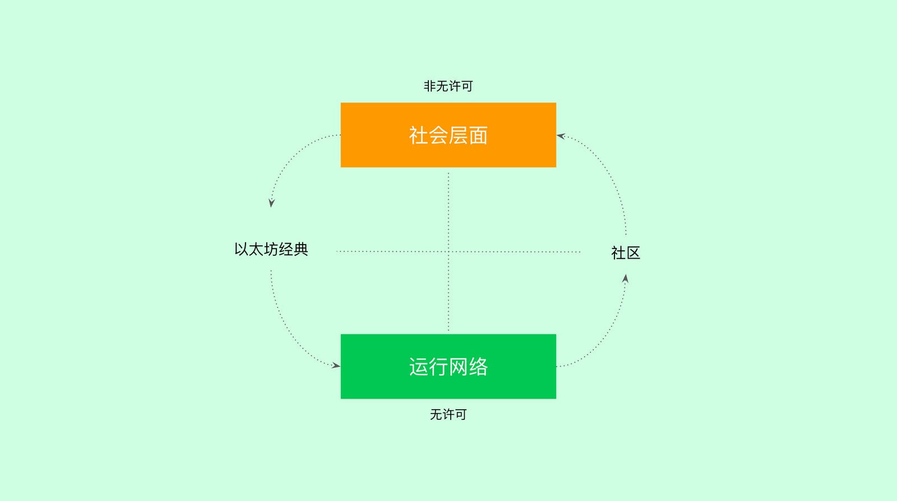

---
**欢迎由此观看或收听本篇文章:**

<iframe width="560" height="315" src="https://www.youtube.com/embed/LmHnVjMiE90" title="YouTube video player" frameborder="0" allow="accelerometer; autoplay; clipboard-write; encrypted-media; gyroscope; picture-in-picture" allowfullscreen></iframe>

---

以太坊经典中的无许可悖论是这样的:为了最大化ETC区块链中的无许可，您必须减少对其影响最大的社区中的无许可。或者，更直白地说，ETC社区不应该没有许可。

所谓的“ETC社区”指的是社会媒体渠道。如Discord服务器、GitHub组织及其各种存储库、ECIP过程和其他非主网论坛。

“自由守恒定律”的意思是：为了增加一个地方的自由，需要减少另一个地方的自由。这就是文明的运作方式。

在文明社会中，没有人可以到处破坏生命和财产。这些都是个人的保证并需要强有力的规则和执行来实施，需要数千年的时间来发展。所以，从本质上讲，文明社会的所有参与者都必须牺牲自己绝对的个人自由，遵循法治，从而在文明社会的背景下最大化地实现个人自由。为了最大化个人的自由，个人必须牺牲绝对自由。

这标志着运营网络和ETC社区之间的分离。ETC社区是社会层 - 社会层面是思想和行动者存在和发挥作用的地方。如果社会层中的所有生态系统参与者都被不好的想法打断，那么不好的想法就会被引入运营网络，去中心化被减少，从而减少它的不许可性。

一个追求自由的体系，一定不能允许反自由的体系存在。

所有以上的想法似乎都是违反直觉的:如果自由即自由，无许可是无许可，那么为什么要禁止或不允许任何事情呢?

答案是，自由在本质上不是一种正常的状态。它不像许多人认为的那样是“弱肉强食”。相反，自由是人为的、非常严格和彻底执行的规则的结果。“弱肉强食”是反自由的，只靠蛮力。在这里，破坏生命和自由是被允许的。

尽管乌托邦式的思想家们相信生命、自由和财产并不是自然发生的，大自然实际上是对生物怀有敌意的。任何生活在文明社会的男人或女人，如果留在荒野中，都可能活不了多久。

生命、自由和财产都是人为创造的，是人为环境的好处，是人们精心设计来组织文明社会的。

同样地，在区块链中，像以太坊经典(Ethereum Classic)那样的无许可状态不是一种自然状态，它是精心设计的协议的结果，该协议在全球范围内的去中心化网络中保证了健全的货币、财产和协议。偏离该议定书将大大削弱这些保证。

另一件听起来违反直觉的事情是，以太坊经典社区对其原则越狂热，对偏差越不容忍，ETC的不许可越强。

事实上，ETC社区成员和整个生态系统包括核心贡献者、社区参与者、志愿者、矿工、节点运营商、投资者、dapp开发者和用户，应该记住并记住以太坊经典哲学和原则，就像拉比和牧师引用圣经的书，章节和诗句。

不应该对任何人有丝毫的误解或怀疑，每个人都应该全心全意地捍卫“法典即法律”原则。

ETC是的无许可意味着只要他们有互联网连接，世界上任何地方的任何人都可以自由创建账户。它们进行交易和智能合约，或作为矿工、节点操作员、用户、投资者或任何其他规定的能力参与网络。

然而，为了保持和维持这种程度的自由，ETC社交层必须始终拒绝并绝不允许在其任何论坛或资产中出现不良行动者，包括Discord服务器、GitHub组织及其各种存储库，以及ECIP过程。

在ETC社区论坛上经常听到很多人把不允许与“言论自由”混为一谈。不良行为必须被禁止，且此种行为为错误的。社区不能没有许可。

ETC网络的无许可运行是由一套非常强大的规则来保证的。他由强大的密码学和强大的工作证明共识机制来执行。不良的概念会通过社会层面严重破坏此结构，从而破坏无许可本身。

而且，因为社会层是安全漏洞所在，所以社会层必须非常有原则并且非常小心地保护。

不许可并未针对社区，而是针对区块链。

---

**感谢您阅读本文！**

要了解有关 ETC 的更多信息，请访问：https://ethereumclassic.org
