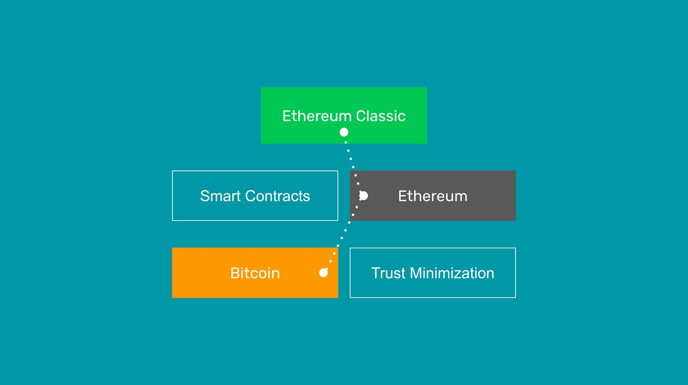

---
**You can listen to or watch this video here:**

[video]

---

In January of 2009 Satoshi Nakamoto launched the Bitcoin network. Previously, in October of 2008, he had already published the Bitcoin [white paper](https://bitcoin.org/bitcoin.pdf) where he mentioned trust minimization [14 times](https://etherplan.com/2020/02/29/satoshi-nakamoto-mentioned-trust-minimization-14-times-in-the-bitcoin-white-paper/10210/).

However, Bitcoin as a technology provides a very simple task: It is a ledger that only holds accounts and balances and people can send transactions to move money from account to account. That's it. Nothing more. 

Nevertheless, the fact that it provides a simple service must not undermine the incredible innovation and philosophical objectives that it accomplished. The proof of work mechanism that Satoshi Nakamoto invented is a giant leap forward for humanity, comparable to the printing press in the 1440s or the internet in the 1990s. It is a historic change of paradigm in the way money works.

The philosophy and accomplishment of trust minimization in Bitcoin means that now individuals and businesses may control  and hold their money in their own custody without any intermediaries. They can also send transactions to make transfers in a permissionless and censorship resistant manner.

In banking, providers have custody of wealth and grant permissioned access to owners. In Bitcoin, owners have custody of their wealth and may do whatever they want with no permission.

This stemmed from a strong [Cypherpunk](https://en.wikipedia.org/wiki/Cypherpunk) philosophical basis. Their objective was sound and decentralized money in a peer-to-peer system, and the only way to accomplish this was to eliminate trusted third parties. It is no coincidence that Satoshi made this statement in the first paragraph of his paper:

*"...but the main benefits are lost if a trusted third party is still required..."*

To accomplish the goal of trust minimization, the technology of proof of work is fundamental. The main benefit of this consensus mechanism, called nakamoto consensus, is that it provides a means for all participants in the network to arrive to the same exact state of the ledger every 10 minutes just by verifying the proof of work hash created by miners when sending a block of new transactions. 

Additionally, this same feature enables any participant to exit and enter the network whenever they want, without asking permission or without the supervision of anyone.

These benefits, plus the fact that the work in proof of work protects the integrity of transactions by creating a security wall, and imposes a cost to create the currency, making it sound money, made it possible to run the system without trusted third parties.

Bitcoin's core innovation is this level of security, not innovation in the form of the latest gimmicks or bells and whistles.

Ethereum Classic has this exact same philosophy. ETC stayed with the proof of work consensus mechanism despite all [major smart contracts networks](https://coinmarketcap.com/view/smart-contracts/) using proof of stake, and even when Ethereum [migrated](https://ethereum.org/en/upgrades/merge/) from proof of work to proof of stake in September of 2022.

In ETC, as in Bitcoin, the innovation is security through trust minimization.

But Ethereum Classic does not operate like Bitcoin. ETC has the same exact design as Ethereum. In other words, it is an EVM blockchain.

What is an EVM blockchain? 

Another of the Cypherpunks' goals was to integrate smart contracts, or decentralized software programmes, inside the digital currency network. What use is a decentralized currency as Bitcoin if to use it and program the money you need to use apps that are hosted in centralized servers, data centers, or cloud services?

This was the solution that Vitalik Buterin invented: Ethereum.

Like Bitcoin, Ethereum holds accounts and balances in its ledger, but unlike Bitcoin, Ethereum also supports the addition of smart contracts, which are decentralized software programs that may be used to program the money. This made Ethereum a programmable blockchain.

The Ethereum Virtual Machine (EVM) model consists of the following components:

1. A ledger with accounts and balances, and a cryptocurrency.
2. A virtual machine that is replicated in all participating nodes of the network, making it a virtual decentralized computer.
3. More than one hundred and twenty operation codes (opcodes) that the virtual machine may execute, making near [Turing complete](https://en.wikipedia.org/wiki/Turing_completeness).
4. A programming language, called Solidity, that can produce code in the form of software programs that is executable by the virtual machine.
5. The ability to store these programs inside the network's database which is replicated in all participating nodes, making the programs decentralized, also known as "smart contracts".
6. A gas system, that designates a number of computation units, called gas, that each opcode in the virtual machine consumes, and that must be paid for by users, so that all the nodes running the virtual machine may get paid for their work and know when to stop executing a program, solving the halting problem in a decentralized manner.

With all the above features combined, the Ethereum network accomplished the task of adding smart contracts to the basic accounts and balances network that was Bitcoin.

Ethereum Classic has exactly the same design as Ethereum, and shares the same features. This is because Ethereum Classic is actually the original Ethereum!

Ethereum and Ethereum Classic were one chain since inception in 2015, but due to a controversy called [TheDAO](https://en.wikipedia.org/wiki/The_DAO_(organization))  in 2016, Ethereum split from the mainnet and departed with a completely different philosophy than ETC.

The controversy was that the Ethereum side wanted to confiscate the funds of a hacker, and the Ethereum Classic side wanted to uphold the philosophy immutability of the chain. This principle in ETC became known as [*Code Is Law*](https://ethereumclassic.org/why-classic/code-is-law) and is its most fundamental tenet.

Since that split, Ethereum has decided to follow a philosophy called [weak subjectivity](https://blog.ethereum.org/2014/11/25/proof-stake-learned-love-weak-subjectivity). This was the moral basis for migrating to the less secure proof of stake consensus mechanism, which is basically to run the network very much like the banking system. Weak subjectivity has a security of last resort that they call "social consensus" which means that, ultimately, anything that goes on inside the network may be modified, rectified, or manually managed by the participants in the network. This is absolutely antithetical to Bitcoin's and thus Ethereum Classic's philosophy.  

This is why in Ethereum Classic we say "ETC is BTC philosophy, with ETH technology". 

Due to its design choices, ETC has a system where both the currency and the decentralized applications are inside the same security environment of the proof of work blockchain. With this technology it is possible to design decentralized applications (dapps) where even if the founders or the company of a dapp disappear the smart contracts, accounts, and balances may still be perfectly safe inside the blockchain. 

ETC is a fusion of the best of both worlds: The marvel of proof of work as a consensus mechanism with its true censorship resistance, permissionlessness, and immutability, and the computability, programability, and versatility of smart contracts.

In ETC the money and the dapps are decentralized, immutable, permissionless, and censorship resistant. This is the essence of the principle of *Code Is Law*, which is largely upheld by the combination of Bitcoin's invention of the proof of work consensus mechanism and Ethereum's innovation of smart contracts.

---

**Thank you for reading this article!**

To learn more about ETC please go to: https://ethereumclassic.org
