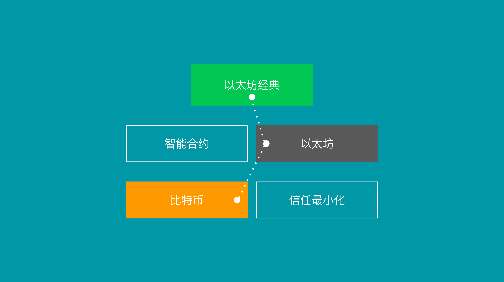

---
**欢迎您由此观看或收听本期视频:**

<iframe width="560" height="315" src="https://www.youtube.com/embed/wK-PyAOG0WM" title="YouTube video player" frameborder="0" allow="accelerometer; autoplay; clipboard-write; encrypted-media; gyroscope; picture-in-picture" allowfullscreen></iframe>

---

2009年1月，中本聪推出了比特币网络。此前，在2008年10月，他已经发表了比特币[白皮书](https://bitcoin.org/bitcoin.pdf)，其中他[14次](https://etherplan.com/2020/02/29/satoshi-nakamoto-mentioned-trust-minimization-14-times-in-the-bitcoin-white-paper/10210/)提到信任最小化。

然而，比特币作为一种技术提供了一个非常简单的任务:它是一个只持有账户的账本，人们可以发送交易，将资金从一个账户转移到另一个账户。就是这样，仅此而已。

然而，它提供简单的服务这一事实绝不能破坏它所实现的令人难以置信的创新和哲学目标。中本聪发明的工作量证明机制对人类来说是一个巨大的飞跃，堪比14世纪50年代的印刷机或20世纪90年代的互联网。这是货币运作模式历史性的变革。

比特币的理念和信任最小化的成就意味着现在个人和企业可以在没有任何中介的情况下控制和持有他们的资金。他们还可以发送交易，以一种不受许可和审查的方式进行转账。

在银行业，服务提供者拥有财富的托管权，并向财富所有者授予许可访问权限。在比特币中，所有者对他们自己的财富拥有监护权，并可以在没有许可的情况下做任何他们想做的事情。

这种机制源于强大的Cypherpunk（密码朋克）哲学基础。他们的目标是在点对点系统中探寻并将货币去中心化。而实现这一目标的唯一方法是消除认为可靠的第三方。中本聪在白皮书的第一段中这样说并非巧合:

＂...但如果仍然需要一个值得信任的第三方，主要的好处就消失了……”

为了实现信任最小化的目标，工作量证明技术是基础。这种被称为“中本共识”(Nakamoto consensus)机制的主要好处是，它为网络中的所有参与者提供了一种方法，只需验证矿工在发送新交易块时创建的工作哈希证明，就可以每10分钟到达账本的相同状态。

此外，这个相同的功能使任何参与者都可以在他们想要的时候退出和进入网络，无需征得任何人的许可或监督。

这些好处，加上工作量证明中的工作通过创建安全墙来保护交易的完整性，增加了创建货币的成本，使其成为可靠的货币，使得在没有可信第三方的情况下成功运行。

比特币的核心创新是其安全性，而不是最新的噱头或花里胡哨的创新。

以太坊经典具有完全相同的哲学。尽管所有[主要的智能合约网络](https://en.wikipedia.org/wiki/Smart_contract)都使用权益证明，ETC仍然坚持工作量证明共识机制，即使以太坊在2022年9月从工作量证明[迁移](https://ethereum.org/en/upgrades/merge/)到权益证明。

在ETC中，就像在比特币中一样，其创新是通过最小化信任来实现其安全性。

但以太坊经典不像比特币那样运作。ETC具有与以太坊完全相同的设计。换句话说，它是一个EVM区块链。

什么是EVM区块链？

密码朋克的另一个目标是将[智能合约](https://en.wikipedia.org/wiki/Smart_contract)或去中心化软件程序集成到数字货币网络中。如果使用比特币这样的去中心化货币，并为使用托管在中央服务器、数据中心或云服务中的应用程序编写所需的资金，那么它有什么用呢?

这就是Vitalik Buterin在2013年发明的解决方案:[以太坊](https://ethereum.org/en/whitepaper/)。

与比特币一样，以太坊在其账本中持有账户和余额，但与比特币不同的是，以太坊还支持添加智能合约 - 一种可用于对货币进行编程的去中心化的软件程序。这使得以太坊成为一个可编程的区块链。

以太坊虚拟机(EVM)模型由以下组件组成:

1. 有账户和余额的分类账，以及加密货币。
2. 在网络的所有参与节点中复制的虚拟机，使其成为虚拟去中心化计算机。
3. 虚拟机可以执行的操作码(opcodes)超过120个，接近[图灵完备](https://en.wikipedia.org/wiki/Turing_completeness)。
4. 一种被称为Solidity的编程语言，它可以生成虚拟机可执行的软件程序形式的代码。
5. 将这些程序存储在网络数据库中的能力，该数据库在所有参与节点中复制，使程序去中心化，也称为“智能合约”。
6. 一种gas系统，它指定了一些计算单元。虚拟机中的每个操作码都要消耗这些计算单元，并且必须由用户付费，这样运行虚拟机的所有节点都可以获得工作报酬，并知道何时停止执行程序，以分散的方式解决停止问题。
7. 每15秒就会创建一个新的区块。

结合上述所有功能，以太坊网络完成了将智能合约添加到比特币基本账户和余额网络的任务。

以太坊经典具有与以太坊完全相同的设计，并具有相同的功能。这是因为以太坊经典实际上是最初的以太坊!

以太坊和以太坊经典自2015年成立以来一直是一条链，但由于2016年发生了一场名为[TheDAO](https://en.wikipedia.org/wiki/The_DAO_(organization))的争议，以太坊从主网中分离出来，并以与ETC完全不同的哲学离开。

争议在于，以太坊方面希望手动没收黑客的资金，将其归还给原所有者，而以太坊经典方面则希望秉持链的不变性哲学，不没收资金，而是让人们在网络之外解决这些问题。这一原则在ETC中被称为[“代码即法律”](https://ethereumclassic.org/why-classic/code-is-law)，是其最基本的原则。

自从那次分裂以来，以太坊决定遵循一种称为[弱主体性](https://blog.ethereum.org/2014/11/25/proof-stake-learned-love-weak-subjectivity)的哲学。这是迁移到不太安全的权益证明共识机制的道德基础，该机制基本上是像银行系统一样运行网络。弱主体性有一种最后的安全手段，他们称之为“社会共识”，这意味着，最终，网络中发生的任何事情都可能被网络中的参与者修改、纠正或手动管理。这与比特币和以太坊经典的信任最小化和不可变的哲学完全相反。

这就是为什么在以太坊经典中我们说“ETC是比特币哲学，ETH技术”。

由于其设计选择，ETC有一个系统，其中货币和去中心化应用程序都在工作证明区块链的同一个安全环境中。有了这项技术，就可以设计去中心化的应用程序(dapp)，即使dapp的创始人或公司消失了，智能合约、账户和余额在区块链中仍然是完全安全的。

ETC是两个世界最好的融合:工作量证明作为一种共识机制的奇迹，具有真正的抗审查性、无许可性和不可变性，以及智能合约的可计算性、可编程性和多功能性。

在ETC中，货币和dapp是去中心化的，不可更改的，无许可的，抗审查的。这就是Code is Law代码及法则原则的精髓所在，比特币发明工作量证明共识机制，以太坊创新智能合约，在很大程度上支撑了这一原则。

---

**感谢您阅读本文！**

要了解有关 ETC 的更多信息，请访问：https://ethereumclassic.org
