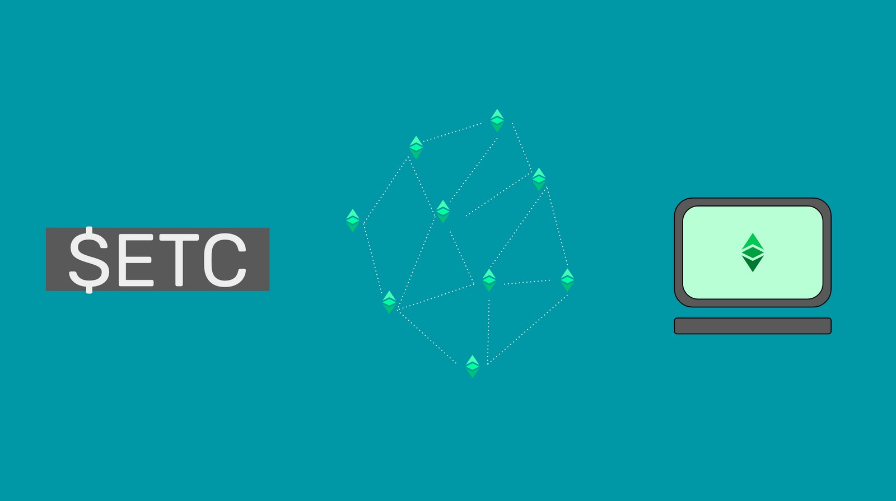
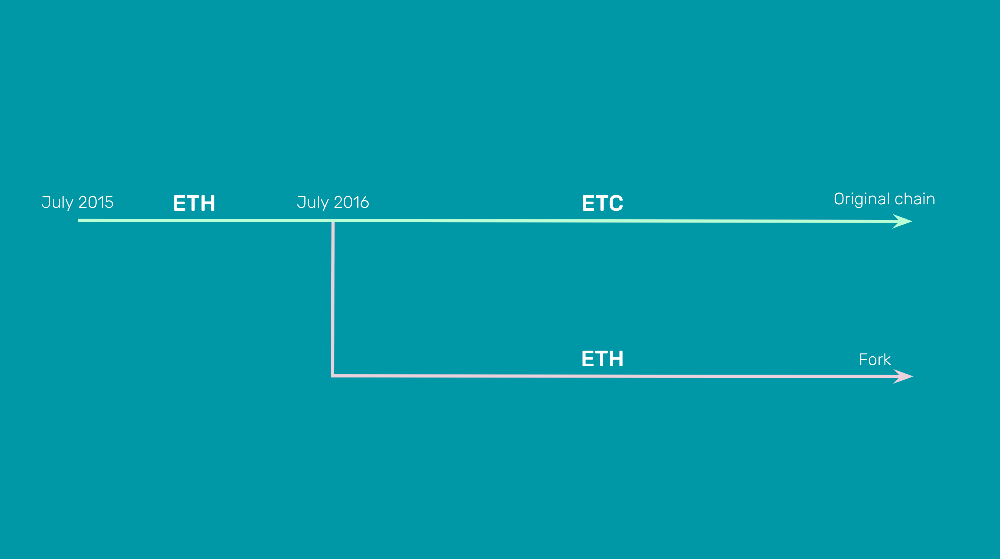

---
**You can listen to or watch this video here:**

<lala lala>

---

Ethereum Classic (ETC) is a cryptocurrency, a blockchain, and a world computer.

It is a cryptocurrency because it has a coin called Ether or ETC, which trades under the symbol $ETC, that has a fixed monetary policy and a capped supply of 210,700,000, making it not only suitable for global permissionless payments, but also for use as a store of value.

ETC is a blockchain because it is a network of machines around the world which follow a censorship resistant protocol to manage a database that contains accounts and balances, and accepts blocks of new transactions every 15 seconds to move money from one account to another.

It is a world computer because it also stores decentralized programs, called smart contracts, that can be used to power unstoppable applications or dapps.  

## Structure

To accomplish the features mentioned above, ETC has a virtual machine called the [Ethereum Virtual Machine](https://ethereum.org/en/developers/docs/evm/), or EVM for short, that has more than [120 opcodes](https://ethervm.io/), which is replicated in all the network nodes, making it a decentralized virtual machine. This component enables the participating computers execute the decentralized software programs stored in the blockchain's ledger.

The decentralized software programs, or smart contracts, are programmed in a software language called [Solidity](https://en.wikipedia.org/wiki/Solidity) that encodes them using the opcodes of the EVM so they can be executed inside the system.

One of the great inventions of Ethereum Classic was the gas system, which is a model that designates a number of units, called gas, per opcode so users may pay for these units for the participating machines to execute them. This method solved several problems such as spam, the halting problem, and the compensation for miners, to enable smart contracts in a decentralized peer-to-peer network.

## Difference With Bitcoin

Bitcoin is a cryptocurrency and a blockchain only and its sole function is to maintain accounts and balances. This makes it like a pocket calculator compared to Ethereum Classic. 

However, what makes Ethereum Classic and Bitcoin similar is that both use the key invention of Satoshi Nakamoto, which is proof of work.

The full name of the system is "Proof of Work Based Nakamoto Consensus" and it consists of making a subset of the machines of the network, called miners, perform a function called mining, which requires lots of computational work and expenditure of electricity. The result of this work is a cryptographic stamp that is added to blocks of transactions, hence the term "blockchain", which are produced in specific time intervals and then sent to the rest of the network to include them as the latest state of the system.

Nakamoto Consensus achieves something that was not possible before, which is that computers in the network, no matter where they are in the world or who they belong to, can agree, without permission or supervision, in a decentralize manner, what is the latest state of the network.

## Difference With Ethereum

There are four things that define the differences between Ethereum Classic and Ethereum (ETH).

1. **ETC is the original chain and ETH is a fork:** When Ethereum was launched in 2015, both Ethereum Classic and Ethereum were one chain, but in 2016 there was a controversy called TheDAO that provoked Ethereum to split from the mainnet. Ever since, they have been two separated networks and ETC has followed a very conservative philosophy of high security called [*Code Is Law*](https://ethereumclassic.org/blog/2016-09-09-code-is-law) and Ethereum has followed a more risky philosophy called [*Weak Subjectivity*](https://blog.ethereum.org/2014/11/25/proof-stake-learned-love-weak-subjectivity) with the aim of making it more scalable.

2. **ETC is proof of work and ETH is proof of stake:** Ethereum migrated from proof of work to proof of stake, which is less secure, but more scalable so this was more in line with their philosophy. ETC stayed and will stick to proof of work forever, so this means that it is truly decentralized, permissionless, and immutable.

3. **ETC has a fixed monetary policy and ETH does not:** ETC has a fixed monetary policy very similar to that of Bitcoin, with a cap of 210,700,000 coins, making it programmable digital gold. Ethereum does not have a fixed monetary policy, they have changed it six times since inception and it is uncertain what the supply will be in any give year.

4. **ETC censorship resistant and ETH is not:** As miners who produce blocks to include new transactions in proof of work blockchains as ETC do not have to comply with financial regulations or international sanctions because they are not financial providers, and because they may move from place to place and mine anonymously, they can include all transactions sent to the network from anywhere inside the blocks. Ethereum proof of stake stakers are in a large measure regulated financial institutions based in western nations who have to comply with local and international restrictions and sanctions and this has mande Ethereum a predominantly [censored network](https://www.mevwatch.info/) because they are obligated to exclude transactions from certain sanctioned accounts.    

## The Security vs Scalability Tradeoff

As mentioned above, Ethereum Classic is highly secure because it uses proof of work and full replication of the database as its consensus model. Indeed, ETC is the [largest](https://coinmarketcap.com/view/pow/) and most secure smart contracts blockchain in the world. This makes it optimal as a base layer blockchain system as it may be used for settlements and high value, low volume use cases.

As proof of work does not enable scalability in the form of high transaction volumes, then ETC may have other systems in higher layers that may process larger transaction volumes, but settle inside ETC. This design is the most popular in the industry to achieve scalability, examples of which are the [Lightning Network](https://lightning.network/) as a layer 2 of Bitcoin and [rollups](https://ethereum.org/en/layer-2/) as a layer 2 of Ethereum. 

## Dapps Are Inside the Secure Environment of the Blockchain

As the largest and most secure smart contracts network in the world, ETC has one thing that differentiates it and makes it unique. Unlike Bitcoin, Dogecoin, and Litecoin (the other large proof of work blockchains in the world) ETC is programmable with smart contracts. This means that dapps may exist inside its highly secure environment. 

What use are Bitcoin, Dogecoin, and Litecoin if to program their coins or use applications on them the software programs have to be hosted in centralized servers, corporate data centers, or cloud services?

In ETC, the backbone of dapps can be as trust minimized as the money, which makes ETC an incredibly unique and valuable system for truly secure applications and use cases.

## Known for Its Principle of *Code Is Law*

As mentioned in this article, the three pillars of Ethereum Classic are that it uses proof of work as its consensus mechanism, it has a fixed supply, and it supports smart contracts.

The three pillars in its design and structure make true the principle of *Code Is Law* because ETC is concretely and tangibly decentralized, immutable, and permissionless.

Because of these features, then ETC has the benefits of survivability, censorship resistance, unstoppability, and therefore is uncompromisable and uncapturable.

---

**Thank you for reading this article!**

To learn more about ETC please go to: https://ethereumclassic.org
