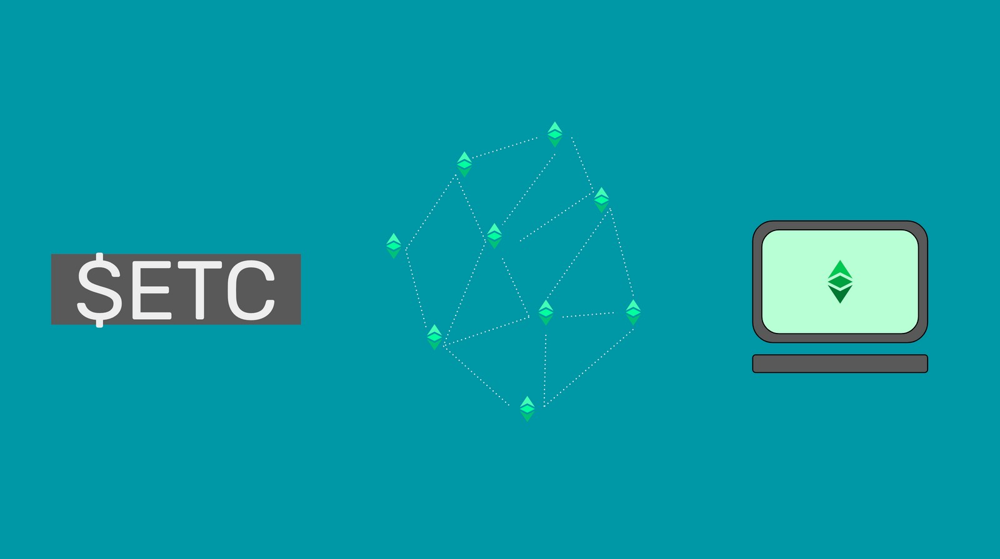
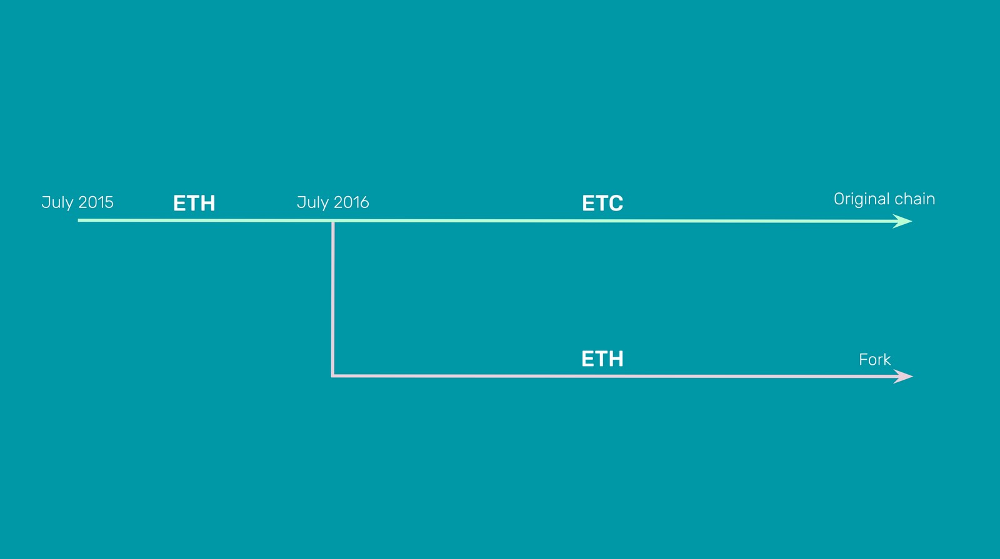

---
**欢迎由此收听或观看本期内容：**

<iframe width="560" height="315" src="https://www.youtube.com/embed/gG6un3SyZyo" title="YouTube video player" frameborder="0" allow="accelerometer; autoplay; clipboard-write; encrypted-media; gyroscope; picture-in-picture" allowfullscreen></iframe>

---

以太坊经典(ETC)是一种加密货币，一个区块链，一个世界计算机。

它是一种加密货币，因为它有一种名为以太币或ETC的硬币，交易代码为$ETC，具有固定的货币政策和210,700,000个硬币的上限供应，使其不仅适合全球无需许可的支付，而且还可以用作价值储存。

ETC是一个区块链，因为它是一个由世界各地的机器组成的网络，它遵循一个抗审查协议来管理一个包含账户和余额的数据库，并每15秒接受一次新交易块，将资金从一个账户转移到另一个账户。

它是一台世界计算机，因为它还存储了去中心化的程序，称为智能合约，可用于为不可阻挡的应用程序或dapp提供动力。  

## 构架

为了实现上述功能，ETC拥有一个[以太坊虚拟机](https://ethereum.org/en/developers/docs/evm/)(Ethereum virtual machine，简称EVM)，它有超过[120个操作码](https://ethervm.io/)，在所有网络节点中复制，使其成为一个去中心化的虚拟机。该组件使参与的计算机能够执行存储在区块链账本中的去中心化软件程序。

去中心化的软件程序或智能合约是用一种名为[Solidity](https://en.wikipedia.org/wiki/Solidity)的软件语言编写的，该软件语言使用EVM的操作码对它们进行编码，以便它们可以在系统内执行。

以太坊经典的伟大发明之一是gas系统，这是一种模型，它为每个操作码指定了许多单元，称为gas，因此用户可以为参与的机器支付这些单元来执行它们。这种方法解决了垃圾邮件、暂停问题和矿工补偿等几个问题，使智能合约在去中心化的点对点网络中成为可能。

## 与比特币的区别

比特币是一种加密货币，仅为区块链，其唯一功能是维护账户和余额。这使得它与以太坊经典相比，就像一个袖珍计算器。

然而，以太坊经典和比特币的相似之处在于，它们都使用了中本聪的关键发明，即工作量证明。

该系统的全称是“基于工作量证明的中本共识”，它由网络机器的一个子集(称为矿工)组成，执行一种称为挖矿的功能，这需要大量的计算工作和电力消耗。这项工作的结果是一个加密戳，它被添加到交易块中，因此被称为“区块链”，它在特定的时间间隔内产生，然后发送到网络的其他部分，将它们作为系统的最新状态。

“中本共识”实现了以前不可能实现的事情，那就是网络中的计算机，无论它们在世界的哪个地方，属于谁，都可以以去中心化的方式，在没有许可或监督的情况下，就网络的最新状态达成一致。

## 与以太坊的区别

有四个东西定义了以太坊经典和以太坊(ETH)之间的区别。

1. ETC是原始链，ETH是分叉:当以太坊在2015年推出时，以太坊经典和以太坊都是一条链，但在2016年出现了一个名为TheDAO的争议，导致以太坊从主网分裂。从那以后，它们一直是两个独立的网络，ETC遵循了一种非常保守的高安全性哲学，称为代码即法律，以太坊遵循了一种更冒险的哲学，称为弱主体性，目的是使其更具可扩展性。

3. ETC是工作量证明，ETH是权益证明:以太坊从工作量证明迁移到权益证明，不太安全，但更可扩展，所以这更符合他们的理念。ETC一直坚持并将永远坚持工作量证明，所以这意味着它是真正去中心化的、无许可的和不可变的。

4. ETC有固定的货币政策，而ETH没有:ETC的固定货币政策与比特币非常相似，上限为210,700,000枚，使其成为可编程的数字黄金。以太坊没有固定的货币政策，自成立以来，他们已经改变了六次，而且在任何给定的年份，供应将是不确定的。

5. ETC是抗审查的，而ETH不是:作为生产区块的矿工，他们在工作量证明区块链中包含新的交易。因为他们不是金融提供商，并且因为他们可以从一个地方移动到另一个地方并匿名挖矿，他们可以包括从区块内任何地方发送到网络的所有交易，也不必遵守金融法规或国际制裁。以太坊的股东在很大程度上是西方国家受监管的金融机构，他们必须遵守当地和国际的限制和制裁，这使得以太坊成为一个主要受审查的网络，因为他们有义务排除某些受制裁的账户的交易。    

## 安全性与可扩展性的权衡

如上所述，以太坊经典是高度安全的，因为它使用工作量证明和数据库的完全复制作为其共识模型。事实上，ETC是世界上最大、最安全的智能合约区块链。这使其成为基础层区块链系统的最佳选择，因为它可以用于解决和高价值、低容量的用例。

由于工作量证明不能以高交易量的形式实现可扩展性，那么ETC可能在更高的层次上有其他系统，这些系统可以处理更大的交易量，但在ETC内部。这种设计是业界最流行的实现可扩展性的设计，例如[闪电网络](https://lightning.network/)作为比特币的第2层，[rollup](https://ethereum.org/en/layer-2/)作为以太坊的第2层。 

## Dapps在区块链的安全环境中

作为世界上最大和最安全的智能合约网络，ETC有一件事使它与众不同。与比特币、狗狗币和莱特币(世界上另一种大型工作量证明区块链)不同，ETC是可编程的智能合约。这意味着dapps存在于其高度安全的环境中。

如果要对比特币、狗狗币和莱特币进行编程或在其上使用应用程序，软件程序必须托管在中央服务器、企业数据中心或云服务中，那么比特币、狗狗币和莱特币有什么用呢?

在ETC中，dapp的主干可以像金钱一样最小化信任，这使得ETC成为一个真正安全的应用程序和用例的独特而有价值的系统。

## 以“代码即法律”原则而闻名

正如本文中提到的，以太坊经典的三大支柱是，它使用工作量证明作为共识机制，它有固定的供应，它支持智能合约。

其设计和结构中的三大支柱实现了“代码即法律”的原则，因为ETC是具体而有形的去中心化、不可变和无许可的。

由于这些特性，ETC具有可生存性、抗审查性、不可阻挡性等优点，因此是不可妥协和不可捕获的。

---

**感谢您阅读本文！**

要了解有关 ETC 的更多信息，请访问：https://ethereumclassic.org
