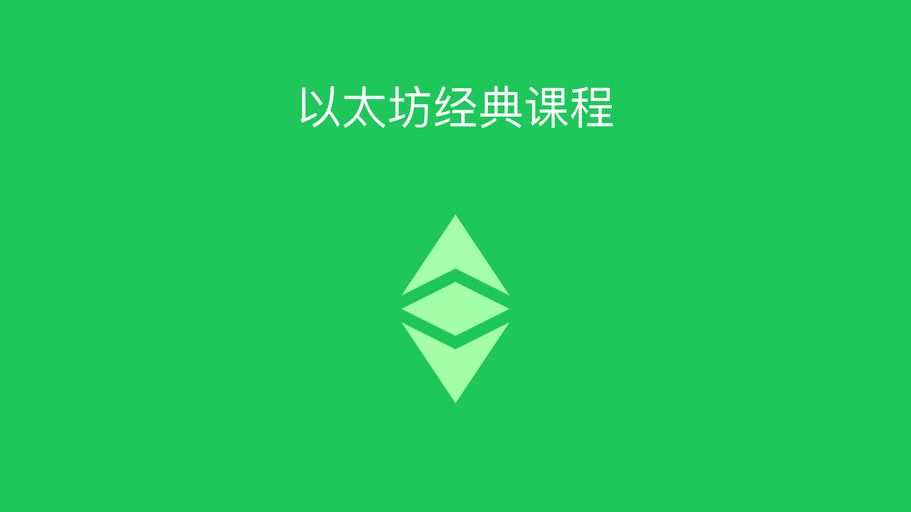

---
**You can listen to or watch this video here:**

<iframe width="560" height="315" src="https://www.youtube.com/embed/YtWbwd2ItIM" title="YouTube video player" frameborder="0" allow="accelerometer; autoplay; clipboard-write; encrypted-media; gyroscope; picture-in-picture" allowfullscreen></iframe>

---

This is an introduction to the Ethereum Classic course.

Ethereum Classic (ETC) is one of the most important and valuable blockchains in the world. Indeed, it is the largest proof of work smart contracts blockchain, and the most secure system to host and operate decentralized applications.

This course is meant to be a detailed explanation of each part of Ethereum Classic, but to accomplish this task it is necessary to learn the background of the blockchain industry, how everything works, what is in store for the future of the sector, and how Ethereum Classic fits in all this.

The Ethereum Classic Course is organized in fours sections: 

1. History
2. How ETC Works
3. Industry Organization
4. What Is in Store for the Future

Below are the classes with the topics that we will touch in each section.

## Part 1: History

1. Public Key Cryptography
2. Cypherpunks
3. The First Digital Currency Attempts
4. Satoshi Nakamoto and Bitcoin
5. Vitalik Buterin and Ethereum
6. Ethereum Classic Is the Original Chain
7. Ethereum Classic Philosophy of Code Is Law
8. Programmable Digital Gold: The Ethereum Classic Monetary Policy

## Part 2: How ETC Works

9. The Units and Denominations of Ethereum Classic
10. How Proof of Work (PoW) Works
11. The PoW security model: The Physical vs the Social Layers
12. What Is Proof of Stake?
13. What Is Proof of Authority?
14. What Are Smart Contracts?
15. What Are Dapps?
16. What Is WETC?
17. What Are Private Keys, Public Keys, and Addresses?
18. The Difference Between Wallets and Addresses
19. What Are Raw Private Keys, Private Key JSON Files, and Secret Passphrases?
20. What are Custodial and Non-custodial Wallets?
21. What Are Hardware and Software Wallets?
22. What Are Hot and Cold Wallets?

## Part 3: Industry Organization

23. What Are Native Cryptocurrencies?
24. What Are Programmable Native Cryptocurrencies?
25. What Are ERC-20 Tokens?
26. What Are Convertible Stablecoins?
27. What Are Algorithmic Stablecoins?
28. What Are Privacy Coins?
29. What Are Decentralized Finance (DeFi) Coins?
30. What Are File Storage Coins?
31. Where to Find Cryptocurrency Lists and Prices
32. What Are Block Explorers?
33. What Are Centralized and Decentralized Exchanges?

## Part 4: What Is in Store for the Future

34. The Layers of the Blockchain Industry
35. Non-Fungible Tokens
36. Ownership Records and Property Registries on Blockchains
37. DAOs
38. Contracts Between Individuals and Businesses on the Blockchain

As seen in this introduction the Ethereum Classic course promises to be a thorough educational experience about ETC and the industry in general and is divided in several sections with small units so they are easier to process and comprehend.

The course will be delivered as one class per week in 5 to 15 minute videos and accompanying text posts so it is more versatile and flexible for people to learn in their preferred formats and timing.

The videos will be posted in a playlist on the Ethereum Classic Updates YouTube channel and the blog posts will be listed in one page on the Ethereum Classic community website. 

---

**Thank you for reading this post!**

To learn more about Ethereum Classic please go to: https://ethereumclassic.org/

