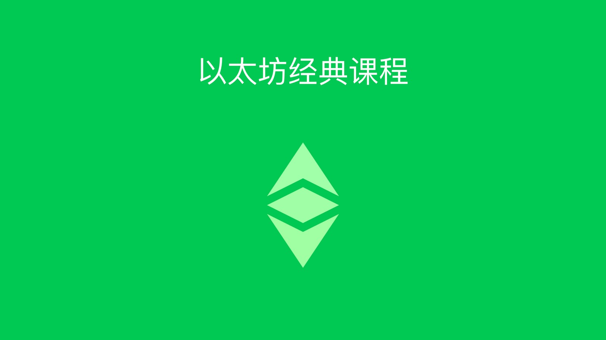

---
**欢迎由此收听或观看本期内容:**

<iframe width="560" height="315" src="https://www.youtube.com/embed/YtWbwd2ItIM" title="YouTube video player" frameborder="0" allow="accelerometer; autoplay; clipboard-write; encrypted-media; gyroscope; picture-in-picture" allowfullscreen></iframe>

---

这是以太坊经典课程的介绍。

以太坊经典(ETC)是世界上最重要和最有价值的区块链之一。事实上，它是最大的工作量证明智能合约区块链，也是托管和运行去中心化应用程序的最安全的系统。

本课程旨在详细解释以太坊经典的每个部分，但为了完成这一任务，大家有必要了解区块链行业的背景，一切是如何运作的，该行业的未来是什么，以及以太坊经典如何适应这一切。

以太坊经典课程分为四个部分:

1. 历史
2. ETC是如何运作的
3. 产业组织
4. 未来会发生什么

以下是课程内容详细目录

## 第一部分：历史

1. 公钥密码学
2. 密码朋克
3. 第一次数字货币尝试
4. 中本聪与比特币
5. 维塔利克·布特林与以太坊
6. 以太坊经典是原始链
7. 以太坊经典的哲学是代码及法律
8. 可编程数字黄金:以太坊经典货币政策

## 第二部分：ETC是如何运作的

9. 以太坊经典的单位和名称
10. 工作量证明(PoW)是如何运作的
11. PoW安全模型:物理层vs社会层
12. 什么是权益证明?
13. 什么是权威证明?
14. 什么是智能合约？
15. 什么是 Dapps?
16. 什么是 WETC?
17. 什么是私钥、公钥和地址?
18. 钱包和地址的区别
19. 什么是原始私钥、私钥JSON文件和秘密密码?
20. 什么是托管钱包和非托管钱包?
21. 什么是硬件钱包和软件钱包？
22. 什么是热钱包和冷钱包？

## 第三部分：产业组织

23. 什么是原生加密货币?
24. 什么是可编程原生加密货币?
25. 什么是ERC-20代币?
26. 什么是可兑换稳定币?
27. 什么是算法稳定币?
28. 什么是隐私币?
29. 什么是去中心化金融(DeFi)币?
30. 什么是文件存储币?
31. 在哪里可以找到加密货币列表和价格
32. 什么是区块探索器?
33. 什么是中心化和去中心化的交易所?

## 第四部分:未来会发生什么

34. 区块链行业的不同层次
35. 非同质代币
36. 区块链上的所有权记录和财产登记
37. 分布式自主组织 DAOs
38. 个人与企业在区块链上的合同

正如在介绍中所看到的，以太坊经典课程承诺：这是关于ETC和整个行业的全方位教育体验。为使其更通俗易懂，课程分为几个小单元。

该课程将以每周5-15分钟的视频和随附的文本帖子的形式提供，以便大家可以根据自己喜欢的形式和时间学习，从而更加灵活。

这些视频将在以太坊经典更新YouTube频道的播放列表中发布，博客文章将在以太坊经典社区网站的一个页面中列出。

---

**感谢您阅读本篇文章**

想了解更多有关以太坊经典，欢迎访问: https://ethereumclassic.org/

