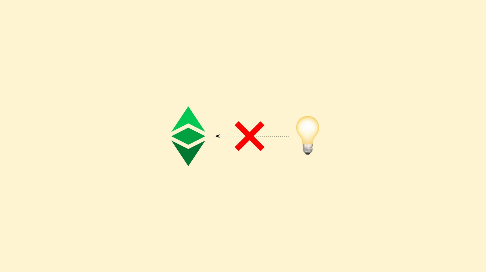
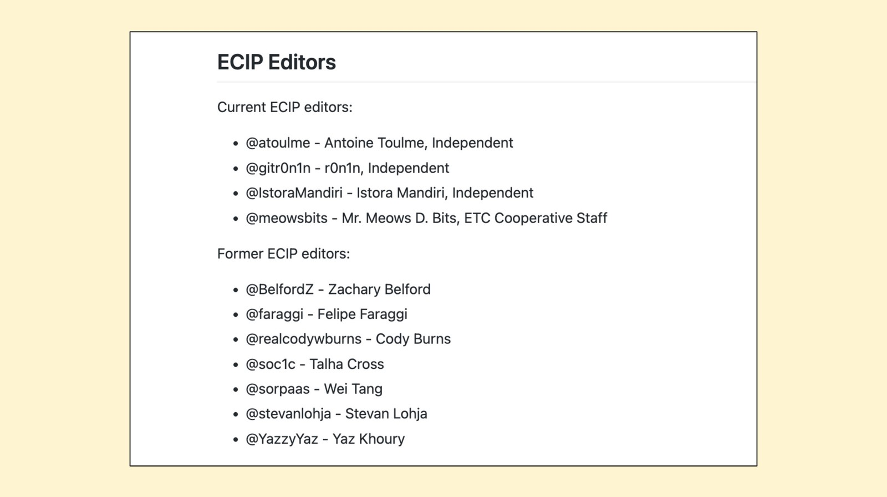
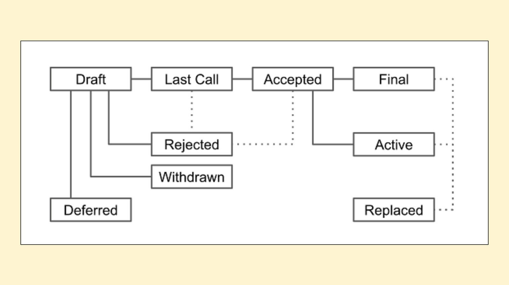

---
**You can listen to or watch this video here:**

<iframe width="560" height="315" src="https://www.youtube.com/embed/ktt_4ATtiWM" title="YouTube video player" frameborder="0" allow="accelerometer; autoplay; clipboard-write; encrypted-media; gyroscope; picture-in-picture" allowfullscreen></iframe>

---

**This is the first part of a series that will explain how to contribute to Ethereum Classic in a variety of ways.** 

The videos and posts in the series will contain the title “How to Contribute to ETC:” with the following topic extensions: 

1. The Improvement Proposal Process (ECIP)
2. The Community Website
3. Community Tweets
4. Community Volunteering
5. Mining
6. Operating a Node
7. Donating Money
8. Building a Dapp

---

## What Is the ECIP Process?

Usually, internet protocols have improvement proposal processes for engineers and computer scientists to suggest changes, upgrades, or fixes.

In cryptocurrencies, the method is practically the same. Projects like Bitcoin have the “Bitcoin Improvement Proposal” process (BIP), Ethereum has the “Ethereum Improvement Proposal” process (EIP), and Ethereum Classic has the “Ethereum Classic Improvement Proposal” process (ECIP).

In this video we will explain the different parts of the ECIP process including who can contribute and how it works.

## Who Can Contribute to the ECIP Process?

In the world there are approximately 30 million software developers, and the majority use the software development and versioning control platform called GitHub. So, in theory, all GitHub users are allowed to contribute to the ECIP process.

However, the reality is that there are specialized software engineers and computer scientists who have historically contributed the most to projects like Ethereum Classic.

To be sure, you don’t have to strictly be a software engineer or computer scientist to contribute to a blockchain project. If it is a good idea, it is a good idea. There are several instances in which non-technical participants have also proposed improvements to systems as Ethereum Classic.

## Warning: The Permissionless Paradox in Ethereum Classic

Nevertheless, contribution does not mean approval or adoption. 

An ECIP may be submitted to the process and there is a good chance it will be rejected if it is not aligned with the philosophy and principles of Ethereum Classic.

There are even instances in the industry where proposals have been formally approved, but never adopted by actual blockchain network operators. These instances sometimes led to network splits or forks.

ETC in particular has a strict philosophy of permissionless access to the operating network, but that does not mean that there is permissionless access to propose any kind of changes. This apparent contradiction is called the permissionless paradox.

## The ECIP Website

The best way to start to understand the ECIP process is to go to the Ethereum Classic [ECIP website](https://ecips.ethereumclassic.org).

There, all the historic proposals are organized and categorized so you can study and analyze them. 

The documents include the debates that have taken place in each instance, so this gives a glimpse of what kind of preparation and thoroughness ECIP proposers must have when introducing new ideas.

## The ECIP GitHub Repository

Once, you are familiar with the historical ECIPs, then you may head to the ECIP repository on GitHub where all the action takes place.

The repository is located at [github.com/ethereumclassic/ECIPs](github.com/ethereumclassic/ECIPs) and there you will find several resources including:

- The specs folder with all the ECIPs of Ethereum Classic.
- A README file that you may follow to initiate a proposal.
- ECIP-1000 with the rules of the process.
- ECIP-X as a template to write your first ECIP.

## ECIP Rules

All the rules of the ECIP process are explained in one ECIP numbered 1000. You will find it as [ECIP-1000](https://github.com/ethereumclassic/ECIPs/blob/master/_specs/ecip-1000.md).

It is important to read the rules as any deviations or mistakes may cause your proposal to be dead on arrival.

ECIP-1000 is also a sort of code of ethics that you must follow, and includes sections as:

- The steps to follow
- ECIP format and structure
- ECIP types
- ECIP status progression
- How ECIPs must be licensed

## ECIP Editors

Another part of the ECIP process, that is also explained in ECIP-1000, is the editing process.

When you enter an ECIP, it will be read and commented by the current designated editors who are volunteers in charge of making sure that the ECIP rules are followed, that the proposals are well formatted, and that the proposers and ideas are not spammers or bogus.

Unlike the public community of ETC, and blockchains in general, the ECIP process and debate must be conducted in a respectful and professional manner, and ideas must be thoroughly articulated with solid arguments, assumptions, and specific proofs when necessary. 

## ECIP Types

The ECIPs entered into the process will be organized in three large categories:

- **Standard track:** These ECIPs are proposals to change or upgrade the protocol of the ETC network. They may be further sub-categorized by core changes, network changes, interface modifications, or as ETC best practice proposals.
- **Meta ECIPs:** These proposals describe a process of how the ETC ecosystem should go about with a particular way of making changes or implementing ECIPs.
- **Informational ECIPs:** These ECIPs are not usually concrete change proposals but provide commentary and analysis of design issues, warnings, or other important topics.

## ECIP Status and Stages

As mentioned before, Ethereum Classic is a very principled and strict network and ecosystem when it comes to guaranteeing true decentralization and permissionlessness.

This means ECIPs may be eventually approved, rejected, or deferred if they need further work or analysis.

To have clarity of the status of an ECIP, editors and proposers must mark them with specific status labels so they can be easily tracked. These status labels are:

- **Draft:** When it’s a new ECIP
- **Last Call:** When an ECIP has general consensus
- **Accepted:** When it was approved
- **Final:** The ECIP has been integrated and tested in the software clients
- **Active:** The ECIP has been implemented in the operating network
- **Rejected:** It was turned down
- **Withdrawn:** The author took it out of the process
- **Deferred:** It needs more work or time
- **Replaced:** When an old feature was changed for a new one

## The ECIP Template

To make your life easier to write your first ECIP, there is an ECIP template called [ECIP-X](https://github.com/ethereumclassic/ECIPs/blob/master/ecip-X.md) in the Ethereum Classic ECIP repository on GitHub with a markdown model of how to write an ECIP.

In it, it has the basic sections your ECIP must include, which are defined in ECIP-1000. These are:

- Abstract
- Motivation
- Specification
- Rationale
- Implementation
- Copyright/Licensing

## You Are Welcome to Contribute!

We hope that this explanation has clarified any doubts you may have had about how to contribute to the ETC protocol as a developer, engineer, computer scientist, or non-technical person through the ECIP process.

You are welcome to contribute to Ethereum Classic.

Good ideas are always welcome!

---

**Thank you for reading this article!**

To learn more about ETC please go to: https://ethereumclassic.org
