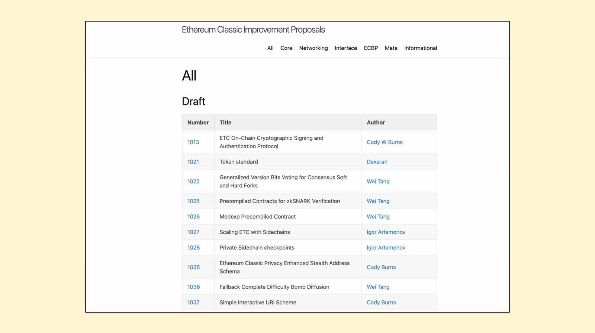

---
**欢迎由此收听或观看本期内容：**

<iframe width="560" height="315" src="https://www.youtube.com/embed/ktt_4ATtiWM" title="YouTube video player" frameborder="0" allow="accelerometer; autoplay; clipboard-write; encrypted-media; gyroscope; picture-in-picture" allowfullscreen></iframe>

---

**这是本系列的第一部分，将解释如何以各种方式为以太坊经典做出贡献。** 

该系列的视频和文章将包含“如何为ETC做出贡献”的标题，并有以下主题扩展:: 

1.改进建议流程(ECIP)
2.社区网站
3.社区推特
4.社区志愿服务
5.矿业
6.操作节点
7.捐款
8.构建Dapp

---

## 什么是改进建议流程（ECIP）？

通常，互联网协议有改进建议流程，供工程师和计算机科学家提出更改、升级或修复建议。
在加密货币中，方法实际上是相同的。像比特币这样的项目有“比特币改进提案”流程(BIP)，以太坊有“以太坊改进提案”流程(EIP)，以太坊经典有“以太坊经典改进提案”流程(ECIP)。
在本视频中，我们将解释ECIP流程的不同部分，包括都有谁可以做出贡献以及它（ECIP）是如何工作的。

## 谁可以贡献并参与到ECIP流程中?

全世界大约有3000万软件开发人员，其中大多数使用名为GitHub的软件开发和版本控制平台。因此，理论上，所有GitHub用户都可以为ECIP流程做出贡献。
然而，现实是，有专业的软件工程师和计算机科学家在历史上对以太坊经典这样的项目做出了最大的贡献。
可以肯定的是，你不必严格地成为软件工程师或计算机科学家来为区块链项目做出贡献。如果它是一个好主意，那它就是一个好主意。在一些例子中，非技术参与者也提出了对以太坊经典等系统的改进。
## 警告:以太坊经典中的无许可悖论

然而，贡献并不意味着认可或采纳。
一个ECIP可能会被提交到这个过程中，如果它不符合以太坊经典的哲学和原则，它很有可能会被拒绝。
在行业中甚至有这样的例子，提案被正式批准，但从未被实际的区块链网络运营商采用。这些实例有时会导致网络分裂或分叉。
ETC对运营网络的无权限访问有着严格的理念，但这并不意味着有无权限访问来提出任何类型的改变。这种明显的矛盾被称为无许可悖论。

## ECIP网站

理解ECIP最好的方式就是访问以太坊经典 [ECIP 网站](https://ecips.ethereumclassic.org).

在那里，所有的历史提案都进行了组织和分类，以便您可以研究和分析它们。
这些文件包括了在每个实例中进行的辩论，因此可以大致了解ECIP提案者在介绍新想法时必须具备什么样的准备和准备程度。
## GitHub ECIP存储库

一旦熟悉了历史ECIP，就可以访问GitHub上的ECIP存储库，所有操作都记录在那里。
存储库位于 [github.com/ethereumclassic/ECIPs](github.com/ethereumclassic/ECIPs) 此链接包含很多资源，例如：

- 以太坊经典所有ECIP的specs文件夹。
- 一个README文件，您可以根据该文件发起一个建议。
- 带有流程和规定的ECIP-1000。
- 协助您完成第一份ECIP的模版ECIP-X。
## ECIP 规定

ECIP过程的所有规则都在一个编号为1000的ECIP中解释。 您可以在GitHub中找到 [ECIP-1000](https://github.com/ethereumclassic/ECIPs/blob/master/_specs/ecip-1000.md).

阅读规则是很重要的，因为任何偏差或错误都可能导致你的提案一到就夭折。
ECIP-1000也是一种你必须遵守的道德规范，包括以下部分:
- 须遵循的步骤
- ECIP 格式和结构
- ECIP 种类
- ECIP 状态与进程
- ECIPs如何获得必要许可
## ECIP 编辑人

ECIP流程的另一部分(ECIP-1000中也有解释)是编辑流程。
当你输入一个ECIP时，它将被当前指定的编辑阅读和评论，这些编辑是志愿者，他们负责确保ECIP规则得到遵守，提案格式良好，提案者和想法不是垃圾邮件或虚假的。
与ETC的公共社区和一般的区块链不同，ECIP的过程和辩论必须以尊重和专业的方式进行，并且必须在必要时通过扎实的论点、假设和具体的证明来彻底阐明想法。
## ECIP种类

进入ECIP进程的将分为三大类:

- **标准跟踪:** 这些ECIP是改变或升级ETC网络协议的建议。它们可以进一步细分为核心变更、网络变更、接口修改或ETC最佳实践建议。
- **元ECIP:** 这些建议描述了ETC生态系统应该如何以一种特定的方式进行改变或实施ECIP的过程。
- **信息化ECIP:** 这些ecip通常不是具体的变更建议，而是对设计问题、警告或其他重要主题提供评论和分析。

## ECIP状态和阶段

如前所述，以太坊经典是一个非常有原则和严格的网络和生态系统，它保证了真正的去中心化和无权限。
这意味着如果需要进一步的工作或分析，ECIP最终可能会被批准、拒绝或推迟。
为了明确ECIP的状态，编辑和提案者必须用特定的状态标签标记它们，以便易于跟踪。这些状态标签是:
- **草稿 Draft:** 当起草一个新的ECIP时
- **最后公告 Last Call:** 当一个ECIP具有普遍共识时
- **已接受 Accepted:** 当ECIP已被接受
- **已完结 Final** 在软件客户端中对ECIP进行了集成和测试
- **已激活 Active:** 操作网络中已经实现了ECIP
- **已拒绝 Rejected:** 提议已拒绝
- **已撤销 Withdrawn:** 作者把它从过程中去掉了
- **已延期 Deferred:** 它需要更多的工作或时间
- **已替代 Replaced:** 当一个旧的特性被一个新的特性所改变时

## ECIP 模版

为了减轻您第一个ECIP可能带来的困扰, 有一个名为[ECIP-X](https://github.com/ethereumclassic/ECIPs/blob/master/ecip-X.md) 的模版，已在GitHub上的以太坊经典ECIP存储库中，可以帮助您编写ECIP。

其中包含ECIP必须包含的基本部分，这些部分在ECIP-1000中定义。这些都是:
- 摘要
- 动机
- 规范
- 基本原理
- 实现
- 版权/许可

## 欢迎您来做出提议!

我们希望这个文章回答了您对于作为开发人员、工程师、计算机科学家或非技术人员如何通过ECIP流程为ETC协议做出贡献的任何疑问。
欢迎您为以太坊经典做出贡献和提议。
好的点子，永远都不晚！

---

**感谢您阅读本文!**

了解有关ETC更多详情，请访问: https://ethereumclassic.org
