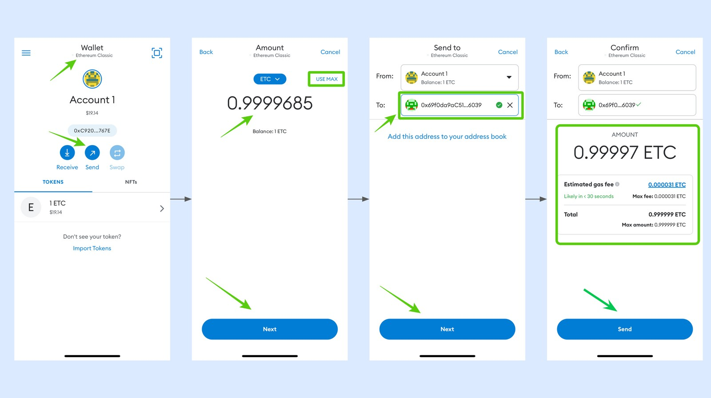
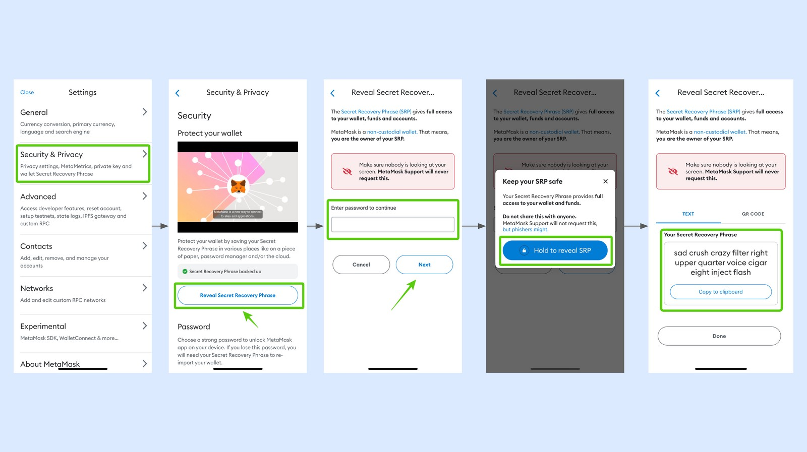

---
**You can listen to or watch this video here:**

<iframe width="560" height="315" src="https://www.youtube.com/embed/kSIsxrcT2c8" title="YouTube video player" frameborder="0" allow="accelerometer; autoplay; clipboard-write; encrypted-media; gyroscope; picture-in-picture" allowfullscreen></iframe>

---

In this article we explain from how to add Ethereum Classic to MetaMask to how to operate it and back it up. 

## 1. Adding the Ethereum Classic Blockchain to MetaMask

If you have MetaMask on your phone, you will know that it operates by default with Ethereum (ETH). However, it may be used with Ethereum Classic (ETC) as it is also an EVM blockchain, therefore share the same standard.

To add ETC as a network on MetaMask you need to:

1. Open the networks dropdown menu and select “Add a network” and then “CUSTOM NETWORKS”.
2. In the next step, enter the following information in the form provided:
    - Network Name: Ethereum Classic
    - RPC URL: https://www.ethercluster.com/etc
    - Chain ID: 61
    - Symbol: ETC
    - Block Explorer URL: https://blockscout.com/etc/mainnet/
3. Click “Add”.

## 2. Receiving ETC for the First Time

Now you will see both the Ethereum and Ethereum Classic networks in the networks dropdown menu. To receive ETC, make sure to select Ethereum Classic. Then follow these instructions:

1. Press the “Receive” button.
2. In the next screen you will see a QR code, which you may use to show someone to send you ETC.
3. Or, if you need to copy and paste your address to send it over the internet by text, email, or other means to someone else then press the “Copy” button and it will be copied to your clipboard.

## 3. How to Send ETC

To send ETC, make sure that you are on the ETC chain by selecting ETC on the network dropdown menu. Then follow these instructions:
	
1. Press the “Send” button.
2. In the next screen enter the amount you wish to send (for this example we selected “USE MAX”) and press “Next”.
3. In the next screen paste the address you wish to send ETC to in the “To” field and press “Next”.
4. In the next screen, review the transaction for gas fee and total amount. If it’s ok, then press “Send”.

## 4. Checking Your Balance and Transaction History

Whenever you wish to check your balance, you can open MetaMask, make sure you are on the ETC network from the dropdown menu, an you will see the balance on the home screen.

To review the transaction history of that account, tap on the area where the balance is and you will be taken to the next screen where you will see both the balance and the transaction history.

## 5. Cancel Sent Transactions

Because ETC is an EVM chain as Ethereum, then it has the same features. When you send transactions you can also cancel them as long as they have not yet been included in a block. To do this, follow these instructions:

1. Send a transaction as explained above (in this example are sending 0.50 ETC).
2. In the next screen you will see a confirmation of your transaction submission, but if you wish to cancel it, press the balance area ASAP.
3. In the next step you will see the submitted transaction with two buttons below, “Speed up” and “Cancel”, press the “Cancel” button.
4. In the next screen press “Yes, let’s try”.
5. If your transaction was cancelled you will see it in the next screen.
6. Note that the gas fee for the cancelation is 0.00001 ETC.

## 6. Speed Up Sent Transactions

Similarly as cancelling a transaction, on ETC you can also speed up transactions that have not yet been included in a block. To do this follow these instructions:

1. Send a transaction as explained above (in this example we are sending 0.99993).
2. In the next screen you will see a confirmation of your transaction submission, but if you wish to speed it up, press the balance area.
3. In the next step you will see the submitted transaction with two buttons below, “Speed up” and “Cancel”, press the “Speed up” button.
4. In the next screen press “Yes, let’s try”.
5. The speed up transaction will be sent and your transaction should get executed faster.
6. Note that the gas fee for the speedup is 0.00001 ETC.

## 7. Create More ETC Addresses

For you convenience, to categorize your crypto assets, or for privacy reasons, you can have many ETC addresses inside Metamask. To add new addresses follow these instructions:

1. Make sure you are on the ETC network, then tap on the icon above the account you are on.
2. In the next screen, MetaMask will have several options. Select “Create a new account”.
3. Immediately, a new account will be generated in the screen and will be assigned the next number in the account list. In this example it is “Account 2”.
4. If you want to use that account, tap it to select it.
5. When you go back to the home, you will see that account as the default account. 

## 8. Use the Same Addresses in Ethereum Classic or in Ethereum

Because ETC and ETH are totally compatible, then you can actually use the same addresses interchangeably. This is, you can use your same ETC address inside the ETH blockchain and vice versa.

To do this, just go to the address you want to use, then change the network on the network dropdown menu and select which one you wish to use.

The address will work on both chains.

## 9. Back Up Your Wallet

It is imperative that you back up your MetaMask wallet because if you lose your phone or your data you will lose access to all your crypto.

To do this, MetaMask has a 12 word secret passphrase that is like a password that may be used to regenerate all your addresses. Once you back it up, you can import your 12 words again in a new device and recover your assets.

Your backup should be in paper and not in digital form because if you store your words in a computer or phone, they may be lost, compromised, or hacked.

Once you have it in paper, you should make a couple of copies and keep them in safe places.

### Steps to Back Up Your Wallet

To back up your Metamask wallet, follow these instructions:

1. Open the main menu and tap on “Security & Privacy”.
2. Then, press the “Reveal Secret Recovery Phrase” button.
3. In the next screen, enter your password for MetaMask.
4. In the next step, press and hold the "Hold to reveal SRP” button.
5. Your 12 word secret passphrase will be revealed. 
6. Remember to write it on paper and to put it away in a safe place.

---

**Thank you for reading this tutorial!**

To start using MetaMask with ETC go to: https://metamask.io

To learn more about ETC go to: https://ethereumclassic.org
