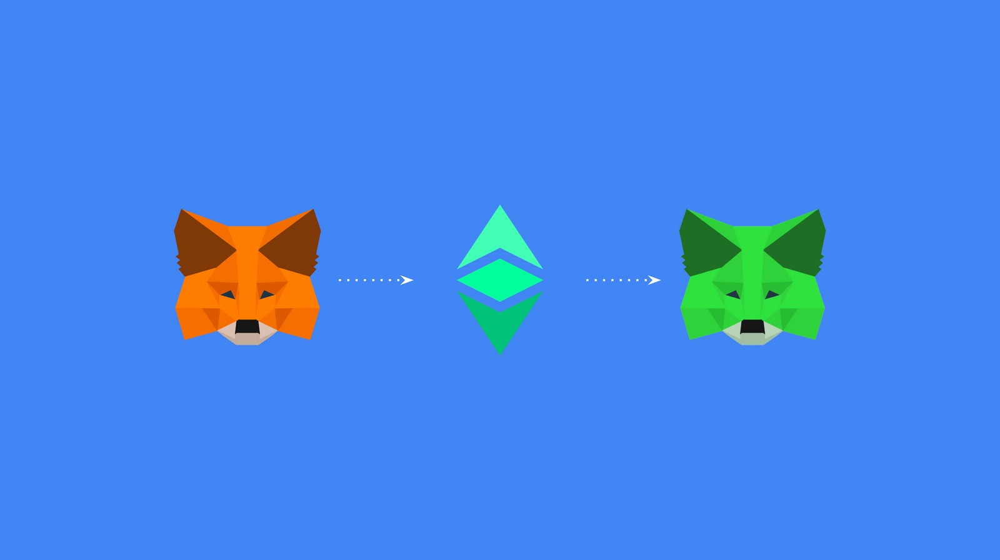
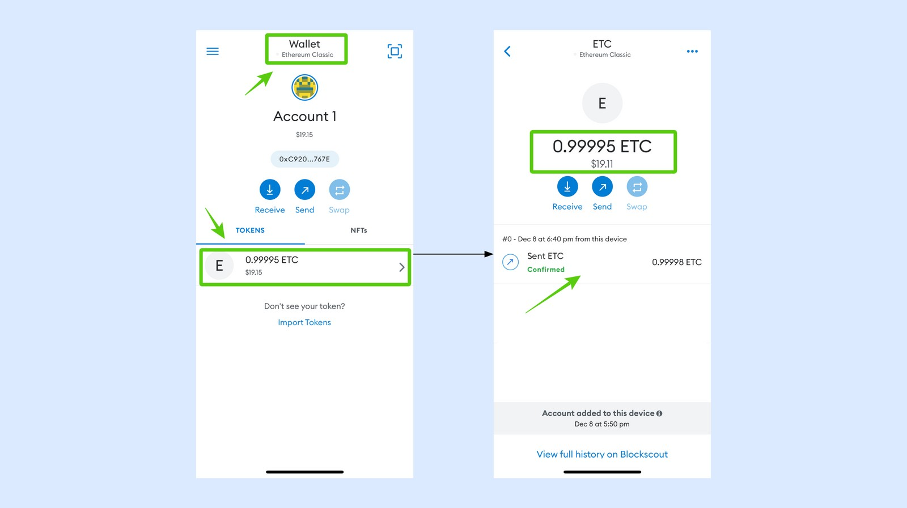
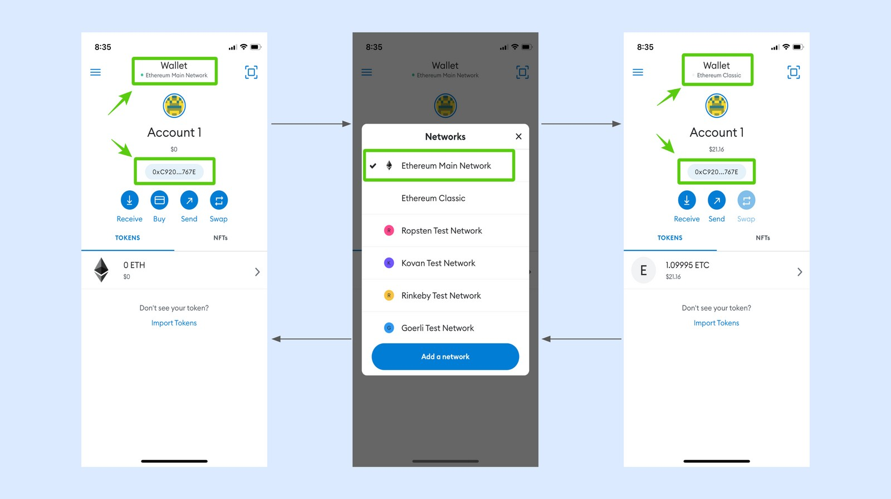
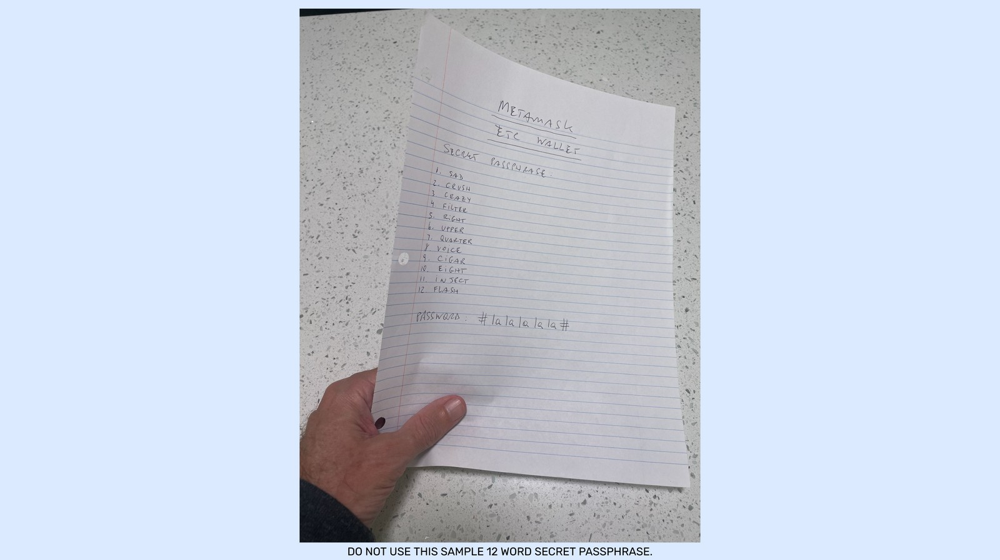

---
**欢迎由此观看或收听本期内容:**

<iframe width="560" height="315" src="https://www.youtube.com/embed/85xAV8jzpQQ" title="YouTube video player" frameborder="0" allow="accelerometer; autoplay; clipboard-write; encrypted-media; gyroscope; picture-in-picture" allowfullscreen></iframe>

---

在本文中，我们将解释如何将以太坊经典添加到MetaMask小狐狸钱包，以及如何操作和备份它。

## 1. 将以太坊经典区块链加入到小狐狸当中

如果你的手机上有MetaMask，你会知道它默认使用以太坊(ETH)运行。但是，它可以与以太坊经典(ETC)一起使用，因为它也是EVM区块链，因此共享相同的标准。

要在MetaMask上添加ETC作为网络，您需要:
1. 打开网络下拉菜单，选择“添加网络”（“Add a network”），然后选择“自定义网络”（“CUSTOM NETWORKS”）。
2. 下一步，在提供的表单中输入以下信息:
    - 网络名称: 以太坊经典
    - RPC URL: https://etc.rivet.link
    - 链ID（Chain ID）: 61
    - 符号（Symbol）: ETC
    - 区块搜索URL（Block Explorer URL）: https://blockscout.com/etc/mainnet/
3. 点击“添加”（“Add”）.

## 2. 首次收到ETC

现在，您将在网络下拉菜单中看到以太坊和以太坊经典网络。要接收ETC，请确保选择以太坊经典。然后请参考以下说明：

1. 按“接收”（“Receive”）键。
2. 在下一个屏幕中，您会看到一个QR码，该码可以用来他人发送ETC。
3. 或者，如果你需要复制并粘贴你的地址，通过互联网通过文本、电子邮件或其他方式发送给其他人，您可以直接按下“复制”按钮，它将被复制到你的剪贴板。

## 3. 如何发送ETC

要发送ETC，请在网络下拉菜单中选择ETC，以确保您在ETC链上。然后请按照以下说明:
	
1. 点击“发送”（“Send”）。 
2. 在下一个屏幕中输入您希望发送的金额(本例中我们选择“USE MAX”)并按“下一步”（“next”）。
3. 在下一个屏幕中，将您希望发送ETC的地址粘贴在“To”字段中，然后按“next”。
4. 在下一个屏幕中，查看交易的矿工费用和总金额。如确认无误，按“Send”键发送。

## 4. 检查您的余额和交易历史

当你想检查你的余额时，你可以打开小狐狸钱包，从下拉菜单中确保您在ETC网络上，您会在主屏幕上看到余额。
要查看该帐户的交易历史，轻按余额所在区域，您将进入下一个屏幕，在那里您将同时看到余额和交易历史。

## 5. 取消已发送交易

因为ETC是一个与以太坊一样的EVM链，所以它具有相同的特性。当您在发送交易时，只要它们还没有包含在一个块中，您也可以取消它们。要做到这一点，请遵循以下说明:
1.发送如上所述的交易(在本例中发送0.50 ETC)。
2. 在下一个屏幕中，您将看到您的交易提交确认，但如果您希望取消它，请尽快按余额区域。
3. 在下一步中，您将看到提交的事务，下面有两个按钮，“加速”和“取消”，按下“取消”按钮。
4. 在下一个屏幕中按“Yes, let 's try”。
5. 如果您的交易被取消，您将在下一个屏幕中看到它。
6. 请注意，取消的矿工费为0.00001 ETC。

## 6. 加速已发送交易

与取消交易类似，在ETC上，您还可以加快尚未包含在区块中的交易。要做到这一点，请遵循以下说明:
1.发送如上所述的事务(在本例中，我们发送0.99993)。
2.在下一个屏幕中，您将看到您的交易提交确认，但如果您希望加快速度，请按余额区域。
3. 在下一步中，您将看到提交的事务，下面有两个按钮，“加速”和“取消”，按“加速”按钮。
4. 在下一个屏幕中按“Yes, let 's try”。
5. 加速交易将被发送，您的交易将更快地执行。
6. 请注意，加速的矿工费是0.00001 ETC。

## 7. 创建更多ETC地址

为了方便使用，分类您的加密资产或出于隐私原因，您可以在小狐狸中中有许多ETC地址。要添加新地址，请遵循以下说明:

1. 确保您在ETC网络上，然后点击你所在账户上方的图标。
2. 在下一个屏幕中，小狐狸钱包将提供几个选项。选择“创建新帐户”。
3. 屏幕上立即将生成一个新帐户，并将在帐户列表中分配下一个号码。在本例中为“Account 2”。
4. 如果您想使用该帐户，轻按以选择它。
5. 当您返回主页时，您将看到该帐户作为默认帐户。

## 8. 在以太坊经典或以太坊中使用相同的地址

因为ETC和ETH是完全兼容的，所以你实际上可以互换使用相同的地址。也就是说，您可以在ETH区块链中使用相同的ETC地址，反之亦然。
要做到这一点，只需转到您想要使用的地址，然后在网络下拉菜单上更改网络，并选择您希望使用的网络。
该地址在两条链上都有效。

WARNING: THIS FEATURE IS ONLY FOR ADDRESSES YOU CONTROL AND USE WITH METAMASK BECAUSE YOU OWN THE PRIVATE KEYS FOR THEM. DO NOT SEND ETC OR OTHER CRYPTO ASSETS TO THIRD PARTIES TO ADDRESSES THAT ARE IN ETHEREUM OR ETHEREUM CLASSIC INTERCHANGEABLY AS YOU DO NOT KNOW NOR CONTROL THE RECEIVING ADDRESSES. THIS IS ESPECIALLY TRUE FOR SMART CONTRACTS ADDRESSES, WHICH ARE NOT INTERCHABGEABLE BETWEEN ETHEREUM AND ETHEREUM CLASSIC. IF YOU SEND CRYPTO ASSETS ON ETC TO THIRD PARTY ETHEREUM ADDRESSES AND VICE VERSA, YOU MAY LOSE YOUR CRYPTO ASSETS.

## 9. 备份您的钱包

备份您的小狐狸钱包非常重要，因为如果您丢失了你的手机或数据，您将无法访问您所有的加密货币。

为了做到这一点，小狐狸有一个12字的秘密密码，就像一个密码，可以用来重新生成你所有的地址。一旦你备份了它，你就可以在新设备中重新导入你的12个单词，恢复你的资产。
您的的备份应该是纸质的，而不是数字形式的，因为如果你把你的文字存储在电脑或手机里，它们可能会丢失、泄露或被黑客攻击。

一旦你有了书面文件，您应该复印几份，并把它们放在安全的地方。
### 备份钱包的步骤

要备份小狐狸钱包，请遵循以下说明:
1.打开主菜单，点击“安全与隐私”。
2.然后，按下“揭示秘密恢复短语”按钮。
3.在下一个屏幕中，输入小狐狸的密码。
4.下一步，按住“保持显示SRP”按钮。
5.您的12字的秘密密码将被揭露。
6.记得把它写在纸上，并把它放在一个安全的地方。

---

**感谢您阅读本期教程!**

开始使用小狐狸钱包并发送ETC，请访问 https://metamask.io

了解更多ETC相关内容，请访问: https://ethereumclassic.org
