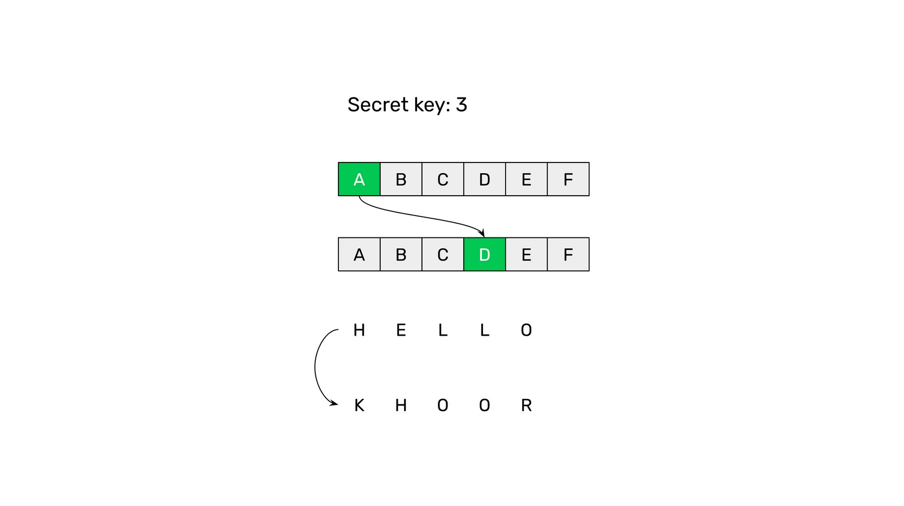

---
**You can listen to or watch this video here:**

<iframe width="560" height="315" src="https://www.youtube.com/embed/dolcI5kfsec" title="YouTube video player" frameborder="0" allow="accelerometer; autoplay; clipboard-write; encrypted-media; gyroscope; picture-in-picture" allowfullscreen></iframe>

---

## Ethereum Classic and Cryptography

Ethereum Classic is part of an industry that many call the “cryptocurrency industry”. The prefix “crypto” refers to cryptography, which is part of the science of cryptology.

The reason why that prefix is used is because many parts and components of a network that supports a cryptocurrency are possible due to cryptographic functions.

In this 1st class of the Ethereum Classic Course we will discuss one of the most important components, which was actually the primary development that kick-started cryptographic security on the internet in general: Public Key Cryptography.   

## Cryptography Before: The Caesar Cypher

For thousands of years and until the discovery of public key cryptography, the only way to transfer secure encrypted messages between parties was that all participants needed to know the same secret key to be able to encrypt and decrypt the messages.

For example, the Caesar cipher was used by Julius Caesar to communicate securely with his generals. The system consisted of shiting the letters of the words by a number. This number was the “secret key” that Caesar and all his generals needed to know to be able to communicate

For example, if the key was the number 3, then the letters of a word had to be shifted by 3 positions, so the letter A was written as a D.

With this method, the word HELLO would be encrypted to KHOOR making it unintelligible to the enemy.

## The Public Key Cryptography Revolution

Because to communicate on the internet requires passing messages between strangers, then trying to coordinate for all participants to know the same private key for each message was not only cumbersome but also extremely insecure.

The invention, in the late 70s, of public key cryptography solved this. The solution was to have a system that would create a public key for every participant, and each participant would have their own secret key.

To send a message, the sender only needed to encrypt it with the public key of the receiver, and the receiver could use his secret key to decrypt it.

The way it works is that there is a cryptographic function that transforms a very large number into another very large number. The the original or seed number is the secret or private key, and the resulting number, when passing the private key through the function, is the public key that may be known by anyone.

It is very easy to generate the public key, but by knowing the public key, it is practically impossible to figure out the private key. This was the fundamental solution to the safety of the system.

This model revolutionized and enabled security on the internet including secure messaging, payments, and, decades later, the cryptocurrency industry.

## Private Key and Public Key on a Blockchain

In cryptocurrency or blockchain networks, the private key is what each user has in their wallet apps to sign transactions.

The private key is like a password to control the public key on the blockchain, so the security of the private key is extremely important.

The public key is like the user’s “bank account” or “address” on the blockchain.

## Your Address and Your Crypto Assets

The public key is like a bank account or the “address”, as it’s commonly known, of the user because under that account is where their crypto assets are sent by others, received by the user, and stored.

To be able to send those crypto assets to other addresses then the private key is needed to sign the transactions.

## Address Formats In Different Blockchains

Although all blockchains use the same model for users to manage and control their assets on the networks, the formats of the addresses may vary.

For example, Ethereum Classic and Ethereum public addresses are identical because they are both fully compatible and both share the same standards. This means that the same private and public keys may be used on both blockchains.

However, in Bitcoin, the design choice was that the public key had to be processed with an additional function to transform the public key into a special base 58 number to make it more human readable and avoid the confusion of some special characters.

---

**Thank you for reading this article!**

To learn more about ETC please go to: https://ethereumclassic.org
