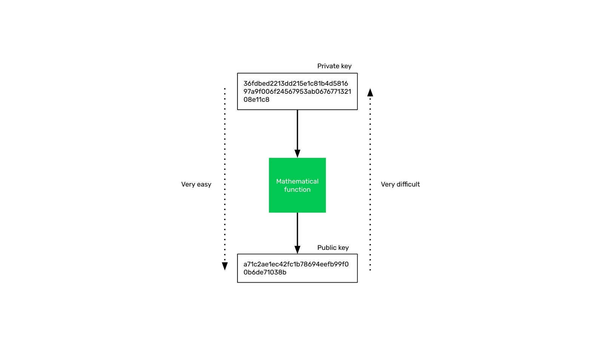
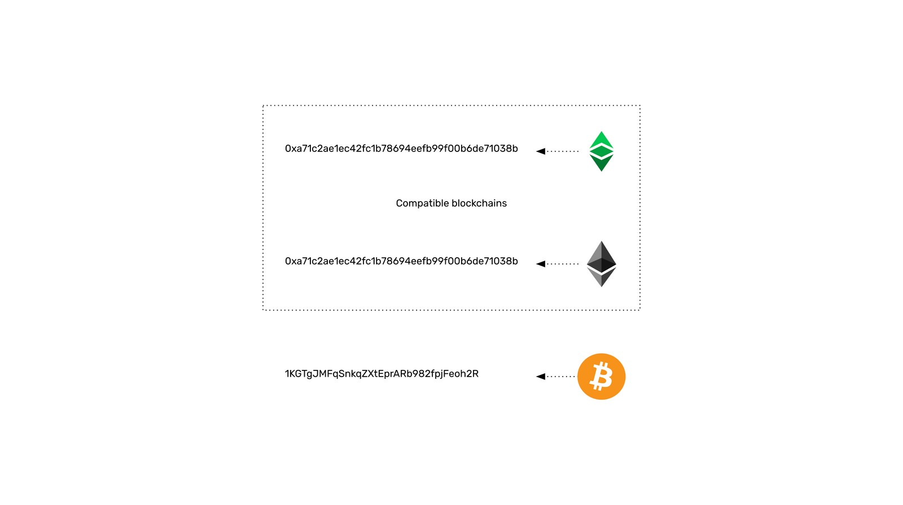

---
**欢迎由此观看或收听本期视频:**

<iframe width="560" height="315" src="https://www.youtube.com/embed/dolcI5kfsec" title="YouTube video player" frameborder="0" allow="accelerometer; autoplay; clipboard-write; encrypted-media; gyroscope; picture-in-picture" allowfullscreen></iframe>

---

## 以太坊经典和密码学

以太坊经典是一个被许多人称为“加密货币行业”的一部分。前缀“crypto”指的是密码学，这是密码学科学的一部分。

使用该前缀的原因是由于加密功能，支持加密货币的网络的许多部分和组件都是可能的。

在以太坊经典课程的第一堂课中，我们将讨论最重要的组件之一，这实际上是启动互联网加密安全的主要开发:公钥密码学。

## 以前的密码学:凯撒密码

数千年来，直到公钥密码学被发现，在各方之间传输安全加密消息的唯一方法是所有参与者都需要知道相同的密钥，以便能够加密和解密消息。

例如，凯撒密码被凯撒大帝用来与他的将军们进行安全通信。这个系统由一个数字来打乱单词的字母组成。这个数字是“秘密钥匙”，凯撒和他所有的将军都需要知道这个数字才能进行沟通
例如，如果键是数字3，那么一个单词的字母必须移动3个位置，因此字母a被写成D。

使用这种方法，单词HELLO将被加密为KHOOR，使敌人无法理解它。

## 公钥密码革命

因为在互联网上进行通信需要在陌生人之间传递消息，那么试图协调所有参与者知道每条消息的相同私钥不仅很麻烦，而且非常不安全。

70年代末，公钥密码学的发明解决了这个问题。解决方案是有一个系统，为每个参与者创建一个公钥，每个参与者都有自己的密钥。

要发送消息，发送方只需要用接收方的公钥对其进行加密，接收方可以使用自己的密钥对其进行解密。

它的工作方式是，有一个密码函数，把一个非常大的数字转换成另一个非常大的数字。原始数字或种子数字是密钥或私钥，当通过函数传递私钥时，结果数字是任何人都可能知道的公钥。
生成公钥非常容易，但是仅限于知道公钥，实际上需要计算出私钥并不可能。这是系统安全的根本解决方案。

这种模式彻底改变并实现了互联网安全，包括安全消息传递、支付，以及几十年后的加密货币行业。

## 区块链上的私钥和公钥

在加密货币或区块链网络中，私钥是每个用户在钱包应用程序中用于签署交易的东西。

私钥就像密码一样控制区块链上的公钥，因此私钥的安全性非常重要。

公钥就像用户在区块链上的“银行账户”或“地址”。

## 您的地址和您的加密资产

公钥就像一个银行账户或用户的“地址”，因为在这个账户下，他们的加密资产被用户发送、接收和存储。

为了能够将这些加密资产发送到其他地址，那么就需要私钥来签署交易。

## 不同区块链中的地址格式

虽然所有的区块链都使用相同的模型让用户管理和控制他们在网络上的资产，但地址的格式可能会有所不同。

例如，以太坊经典和以太坊公共地址是相同的，因为它们都是完全兼容的，并且都共享相同的标准。这意味着可以在两个区块链上使用相同的私钥和公钥。

然而，在比特币中，设计选择是必须用额外的功能来处理公钥，将公钥转换为特殊的58基数数字，以使其更易于人类阅读，并避免一些特殊字符的混淆。

---

**感谢您阅读本篇文章!**

了解更多有关ETC相关内容，请访问: https://ethereumclassic.org
