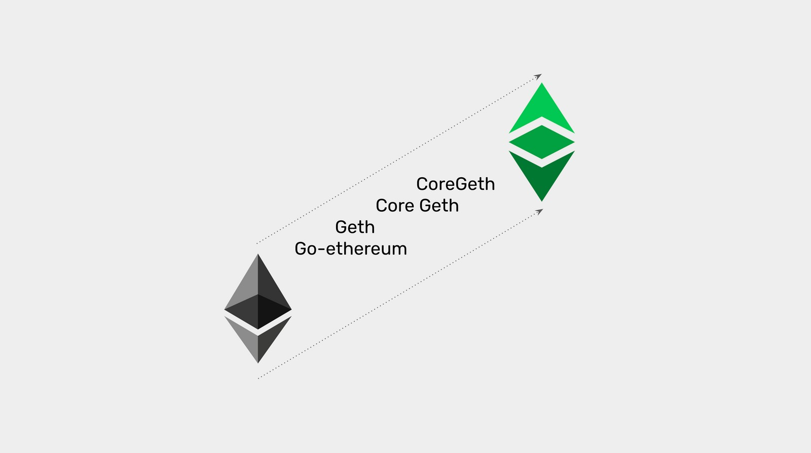
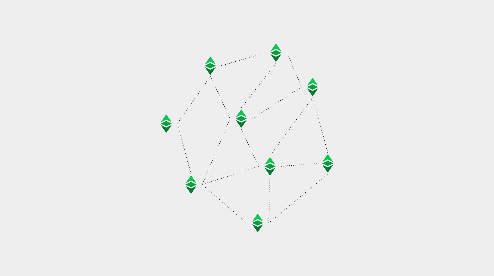

---
**You can listen to or watch this video here:**

<iframe width="560" height="315" src="https://www.youtube.com/embed/rWEB28nXQ5M" title="YouTube video player" frameborder="0" allow="accelerometer; autoplay; clipboard-write; encrypted-media; gyroscope; picture-in-picture" allowfullscreen></iframe>

---

**This is the fifth part of a series that will explain the three software clients currently operating or being implemented on Ethereum Classic.** 

The series will consist of the following topics:

1. The Difference Between a Network, a Blockchain, and a Cryptocurrency 
2. The Difference Between Blockchain Software and Blockchain Protocol
3. Are There Software Clients and Servers in a Blockchain?
4. Ethereum Virtual Machine Blockchains and Ethereum Classic
5. Core Geth Explained
6. Hyperledger Besu Explained
7. Erigon Explained

---

## Reviewed Concepts in This series

In our previous four articles we have explained the basics of what are networks, blockchains, and cryptocurrencies; the differences between blockchain software and blockchain protocols; whether there are software clients and servers in cryptocurrency networks; and what is Ethereum Classic's position in the segment of Ethereum Virtual Machine (EVM) blockchains.

In this article we will apply all this knowledge to explain what is the Ethereum Classic Core Geth (also spelled CoreGeth) software client and what are its unique features, types, and functions.

## Ethereum Classic Is a Network, a Blockchain, and a Cryptocurrency

As we explained in the first post of this series:

**Ethereum Classic is a network** because it is a system of machines, nodes, and a shared database called a blockchain. In particular, it is a public network and its software is open source so that anyone can audit and use it to participate in the system.

**Ethereum Classic is a blockchain** because its database contains a ledger with accounts and balances, where transactions are fully transmitted and form a fully replicated chain of blocks.

**Ethereum Classic is a cryptocurrency** because its ledger tracks a coin called ETC that is scarce, durable, costly to create, portable, divisible, fungible, and transferable, so it may be used for payments and as a store of value.

## Core Geth Is the Ethereum Classic Network Node Software

Blockchains are peer to peer networks and each participating machine in the system is called a node. 

For a machine to be a node it needs to run a software application that contains the set of rules of the protocol of that particular network.

Core Geth is, indeed, the Ethereum Classic network node software, also called “software client”.

## Core Geth Is Both a Software Client and Server

However, blockchain networks are not hierarchical systems where some machines have more clout than others or there are permissioned instances or privileges. In ETC all online peer nodes are equal and all replicate the same exact state every 15 seconds.

This replication means that all nodes actually have the role of receiving transactions and blocks and retransmitting them to all other nodes. Similarly, when new nodes connect to the network, they consult with existing participating nodes what is the state of the network and then download from them all the history in what is called the Initial Block Download (IBD).

Due to this equal status of all nodes in the network and that all send and receive information from all other nodes, then there are no real distinct server and client roles, but they are all really servers and clients. 

## Core Geth Is a Full EVM Node Software

Core Geth is a node server and client that is compliant with all the EVM standard components and mining capabilities.

The general protocol components are the following:

1. An EVM to execute opcodes.
2. A GAS system to designate computing costs to each opcode to prevent spam and the halting problem.
3. A programming language called Solidity so developers may build dapps that are executable by the EVM.
4. State transition so the EVM may take inputs, execute programs, and produce new state outputs.
5. Storage of software programs (smart contracts) in the ledger, turning them into decentralized programs.

Core Geth works primarily for ETC, but may be run for other EVM blockchains as well.

## Unique Features

Ethereum Classic as a protocol, and thus Core Geth in particular, have several unique features that differentiate the client-server from other node software applications from other blockchains.

### ETC Hash

One of these unique features is the ETC Hash mining algorithm.

As Ethereum was using the ETH Hash algorithm, Ethereum Classic had to differentiate its mining format to defend itself from 51% attacks that came from the Ethereum computing base. This led to the creation of ETC Hash.

ETC Hash is a modification of ETH Hash where one component, the DAG, which is a large file that must be used during the mining process, was reduced in size and its size growth was slowed to permit smaller GPU miners; with GPU card capacities that had lower memories, such as 3GB, 4GB, and 6GB; mine and stay mining in Ethereum Classic for a longer period of time.

### MESS

MESS stands for “Modified Exponential Subjective Scoring” and is another unique feature of ETC.

The MESS scoring system created a process where existing nodes in the network would demand multiple times more hashing power from any alternative blockchain being proposed by any alternative mining group.

This system minimized the probability of 51% attacks on ETC because for any attacking computing base, to be able to propose and have its alternative blockchain accepted by the network, it would have to build a much larger hash rate than the one existing in ETC.

Now that ETC is the leading proof of work blockchain in the GPU mining segment, this feature is not as useful as before, but it really provided protection while Ethereum was the major GPU blockchain.

### Articulated Configurations

When smart contracts blockchains as Ethereum Classic, Ethereum, Binance Smart Chain, etc. make upgrades, they usually set a future block number to include the new features. To do this, all node operators are alerted of the hard fork block number, and, if they want to continue participating in the canonical chain, they need to upgrade their node software to include the new features.

New changes have been historically made in blocks of changes with no flexibility or ability to select individual features. Core Geth changed this with articulated configurations.

This unique feature, allows Core Geth nodes to separate the individual changes of an upgrade and select which changes are to be activated upon the hard fork.

This functionality has not only made ETC extremely flexible in carefully selecting what upgrades best fit its Code Is Law philosophy, but has also made Core Geth much better for testing new features, as well as able to support other chains.

### Open RPC

RPCs or “Remote Procedure Calls” are a way in which machines in peer to peer networks as Ethereum Classic communicate by calling each other and sending each other the requested information. This process is usually done with JSON encoding, which is a file format.

However, there has to be a specification of the protocol for these JSON-RPC calls between machines.

Open RPC was developed by ETC Labs, a past ETC core development company, and is a specification that defines a standard, programming language-agnostic interface description for JSON-RPC APIs (Application Programming Interfaces).

It is a unique tool of ETC from a user perspective, although it may be used by any other system, and is a good specification for a way to describe the API that uses JSON-RPC.

It also generates its own documentation which is very complete and useful for node operators. 

### Parity Style Tracing Logs

One of the most successful Ethereum node software clients was called Parity. The feature that distinguished it from the Go-Ethereum client, one of the original and most popular Ethereum clients, was that it kept a log of all node activity. 

This log was very useful to track and trace the detailed operation of nodes, down times, reasons for downtimes, and general supervision of the system.

Core Geth integrated this feature so it has a full Parity style tracing log. This is a unique and very useful feature for node operators such as wallet providers, node as a service providers, exchanges, and block explorers.

## Future Upgrades: The EVMC

Today, EVM chains, including ETC, usually support their own isolated EVM and format.

The EVMC (Ethereum Virtual Machine Connector) system is a low level application binary interface (ABI) that will enable software clients as Core Geth to work with external EVMs as well as it own local one.

## Core Geth May Have Different Configurations

Core Geth is a full featured Ethereum Classic client-server and may be used with the following configurations:

**Archival node:** A node that stores the block headers, the tree of hashed transactions (called Merkle Patricia tree), and all the original data of all transactions sent to the blockchain. This is the largest and most heavy to operate and longest to download kind of node.

**Full node:** A node that stores the block headers and the Merkle Patricia tree, but does not store all the original transactions. This is a relatively secure kind of node, much faster to download, and lighter to operate than the archival node.

**Light node:** A node that only stores the block headers and nothing more. This is a very fast to download and the lightest to operate kind of node, but it is much less secure and more dependent as it always needs other nodes in the network to confirm hashed transactions from the Merkle Patricia tree to be able to verify them. 

## Core Geth May Have Different Functions

As a node software that is configurable and flexible, Core geth may be used for the following functions:

**Verifying node:** Exchanges, large institutional investors, and crypto custody services need to run nodes able to verify their positions in the network directly. As a fully featured, secure, and battle tested node client, Core Geth can perfectly be used for this function.  

**Miner:** Core Geth includes the full mining algorithm of Ethereum Classic, therefore it may be used by both miners and mining pools to run their operations.

**Node as a Service (NaaS):** Startups and companies who run NaaS services can use Core Geth to provide wallet queries to third parties, transaction processing, statistics and charts, and block explorer services.

---

**Thank you for reading this article!**

To learn more about ETC please go to: https://ethereumclassic.org
