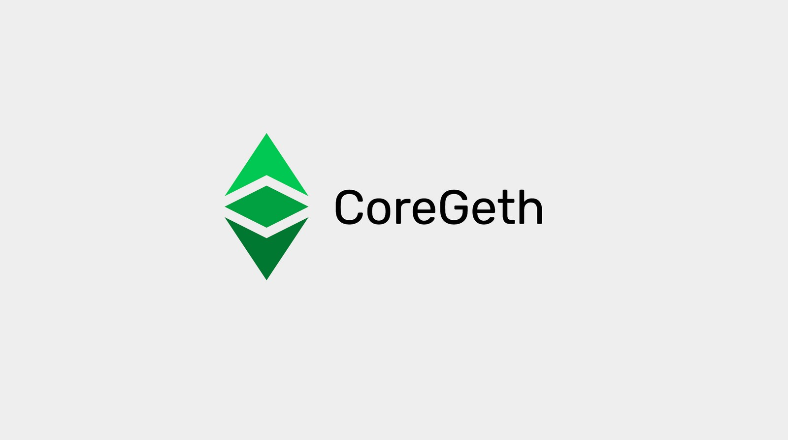

---
**欢迎由此收听或观看本期内容:**

<iframe width="560" height="315" src="https://www.youtube.com/embed/rWEB28nXQ5M" title="YouTube video player" frameborder="0" allow="accelerometer; autoplay; clipboard-write; encrypted-media; gyroscope; picture-in-picture" allowfullscreen></iframe>

---

**这是该系列的第五部分，将解释目前在以太坊经典上运行或实现的三个软件客户端。** 

该系列将包括以下主题:

1. 网络、区块链和加密货币之间的区别
2. 区块链软件与区块链协议的区别
3. 区块链中是否存在软件客户端和服务器?
4. 以太坊虚拟机区块链和以太坊经典
5. Core Geth详解
6. 超级账本Besu详解
7. Erigon详解

---

## 本系列中的回顾概念

在我们之前的四篇文章中，我们已经解释了什么是网络、区块链和加密货币的基础知识;区块链软件与区块链协议的区别;加密货币网络中是否存在软件客户端和服务器;以及以太坊经典在以太坊虚拟机(EVM)区块链中的位置。

在本文中，我们将应用所有这些知识来解释什么是以太坊经典核心Geth(也拼写为CoreGeth)软件客户端，以及它的独特功能、类型和功能。

## 以太坊经典是一个网络，一个区块链，一个加密货币

正如我们在本系列的第一篇文章中解释的那样:

**以太坊经典是一个网络** 因为它是一个由机器、节点和名为区块链的共享数据库组成的系统。特别是，它是一个公共网络，其软件是开源的，因此任何人都可以审计并使用它来参与系统。

**以太坊经典是一个区块链** 因为它的数据库包含一个账户和余额的分类账，在那里交易被完全传输，并形成一个完全复制的区块链。

**以太坊经典是一种加密货币** 因为它的账本追踪一种叫做ETC的硬币，这种硬币稀缺、耐用、制造成本高、可携带、可分割、可替代、可转让，所以它可以用于支付和价值储存。

## Core Geth是以太坊经典网络节点软件 

区块链是点对点网络，系统中的每个参与机器称为一个节点。

一台机器要成为一个节点，它需要运行一个包含特定网络协议规则集的软件应用程序。

Core Geth实际上是以太坊经典网络节点软件，也被称为“软件客户端”。

## Core Geth既是软件服务器又是软件客户端

然而，区块链网络不是分层系统，其中一些机器比其他机器有更大的影响力，或者有被允许的实例或特权。在ETC中，所有对等节点都是相等的，并且每15秒复制一次完全相同的状态。

这种复制意味着所有节点实际上都具有接收事务和区块，并将它们重新发送到所有其他节点的角色。类似地，当新节点连接到网络时，它们会咨询现有参与节点的网络状态，然后从它们那里下载所有历史记录，称为初始块下载(Initial Block download, IBD)。

由于网络中所有节点的这种平等状态，以及所有节点都从所有其他节点发送和接收信息，因此没有真正不同的服务器和客户端角色，它们都是真正的服务器和客户端。

## Core Geth是一个完整的EVM节点软件

Core Geth是一个节点服务器和客户端，它兼容所有EVM标准组件和挖掘功能。

通用协议组件如下:

1. 执行操作码的EVM。
2. GAS系统指定每个操作码的计算成本，以防止垃圾邮件和停止问题。
3.一种名为Solidity的编程语言，因此开发人员可以构建可由EVM执行的dapp。
4. 状态转换，因此EVM可以接受输入，执行程序，并产生新的状态输出。
5. 在账本中存储软件程序(智能合约)，将其转换为分散的程序。

Core Geth主要适用于ETC，但也可以用于其他EVM区块链。

## 特殊功能

以太坊经典作为一种协议，特别是Core Geth，具有几个独特的功能，可以将客户端-服务器与其他节点软件应用程序以及其他区块链区分开来。

### ETC 哈希

这些独特的功能之一是ETC哈希挖掘算法。

由于以太坊使用ETH哈希算法，以太坊经典必须区分其挖掘格式，以防御来自以太坊计算基础的51%攻击。这导致了ETC散列的创建。

ETC哈希是ETH哈希的修改版，其中一个组件DAG(挖矿过程中必须使用的大文件)的大小被减小，其增长被减缓，以允许拥有更小的GPU的矿工工作;GPU卡容量较低，如3GB、4GB和6GB;可以使挖矿并在以太坊经典中挖矿停留更长时间。

### MESS

MESS是“修正指数主观评分”的缩写，是ETC的另一个独特之处。

MESS评分系统创建了一个过程，在这个过程中，网络中的现有节点将需要从任何替代挖矿组提出的任何替代区块链中获得数倍以上的哈希能力。

该系统最大限度地降低了对ETC进行51%攻击的概率，因为对于任何攻击计算基地来说，为了能够提出并让其替代方案区块链被网络接受，它必须建立比ETC中现有的更大的哈希率。

现在ETC是GPU挖掘领域区块链工作的主要证明，这个功能不像以前那么有用了，但当以太坊是主要的GPU区块链时，它确实提供了必不可少的保护作用。

### 精密的配置

当智能合约区块链如以太坊经典、以太坊、币安智能链、Polkadot等进行升级时，他们通常会设置一个未来的区块号来包含新功能。要做到这一点，所有节点操作员都会收到硬分叉区块号的警告，如果他们想继续参与规范链，他们需要升级节点软件以包含新功能。

从历史上看，新的更改都是在更改块中进行的，没有选择单个特性的灵活性或能力。Core Geth用铰接配置改变了这一点。

这一独特的特性允许Core Geth节点分离升级的各个更改，并选择在硬分叉时激活哪些更改。

这一功能不仅使ETC在仔细选择最适合其“代码即法律”理念的升级方面非常灵活，而且还使Core Geth更好地测试新功能，并能够支持其他链。

### 开放RPC

RPC或“远端程序呼叫（Remote Procedure Calls）”是点对点网络中的机器(如以太坊经典)通过相互调用和相互发送请求信息进行通信的一种方式。这个过程通常使用为JSON的文件格式的编码完成。

但是，对于机器之间的这些JSON-RPC呼叫，必须有一个协议规范。

开放RPC是由ETC实验室开发的，这是一家过去的ETC核心所开发的公司。它是一个为JSON-RPC API(Application Programming Interfaces 应用程序编程接口)定义标准、与编程语言无关的接口描述的规范。

从用户的角度来看，尽管它可以被任何其他系统使用，它是ETC的一个独特工具。并且，它是描述使用JSON-RPC API的一种很好的规范。

它还生成了自己的文档，保障了节点操作人员使用时的完整和实用性。

### Parity跟踪日志

以太坊节点软件最成功的客户端之一被称为Parity。它与Go-Ethereum客户端(最初和最受欢迎的以太坊客户端之一)的区别在于，它保存了所有节点活动的日志。

该日志对于跟踪和跟踪节点的详细操作、停机时间、停机原因以及系统的一般监督非常有用。

Core Geth集成了这个功能，所以它有一个完整的Parity风格跟踪日志。这是一个独特且非常实用的特性，适用于节点运营商。例如钱包提供商、节点即服务提供商、交易所和块浏览器。

## 未来升级方向: 以太坊虚拟机

今天，EVM链，包括ETC，通常支持他们自己独立的EVM和格式。

EVMC(以太坊虚拟机连接器)系统是一个低级应用程序二进制接口(ABI)，它将使软件客户端如Core Geth能够与外部evm以及它自己的本地EVM一起工作。

## Core Geth 可能会有不同的配置

Core Geth是一个功能齐全的以太坊经典客户端-服务器，可以与以下配置一起使用:

**归档节点:** 存储区块头、散列交易树(称为Merkle Patricia树)以及发送到区块链的所有交易的所有原始数据的节点。这是最大、操作最重、下载时间最长的一类节点。

**完整节点:** 存储块头和Merkle Patricia树的节点，但不存储所有原始事务。这是一种相对安全的节点，下载速度比归档节点快得多，操作起来也更轻便。

**超轻节点:** 只存储块标头的节点。这是一种下载速度非常快、操作最轻的节点，但它的安全性要低得多，依赖性更强，因为它总是需要网络中的其他节点来确认Merkle Patricia树中的散列交易，以便能够验证它们。

## Core Geth 可能会有不同功能

Core Geth是一款可配置、灵活的节点软件，可实现以下功能:

**验证节点:** 交易所、大型机构投资者和加密托管服务需要运行能够直接验证其在网络中的位置的节点。作为一个功能齐全、安全且经过实战测试的节点客户端，Core Geth可以完美地用于此功能。

**矿工:** Core Geth包含以太坊经典的完整挖掘算法，因此矿工和矿池都可以使用它来运行他们的操作。

**节点即服务(NaaS):** 运行NaaS服务的初创公司和公司可以使用Core Geth向第三方提供钱包查询、事务处理、统计和图表以及块浏览器服务。

---

**感谢您阅读本期文章**

想要了解更多有关ETC，请访问: https://ethereumclassic.org
