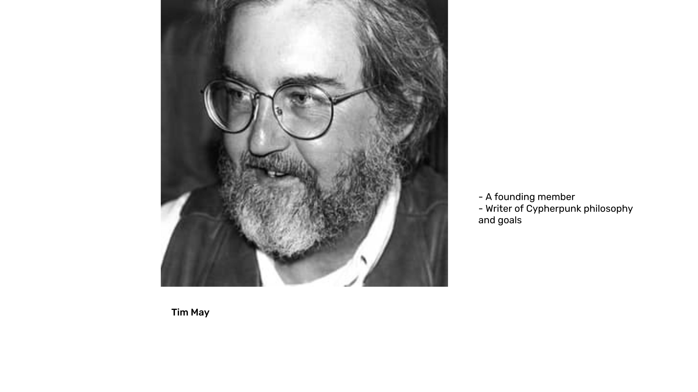
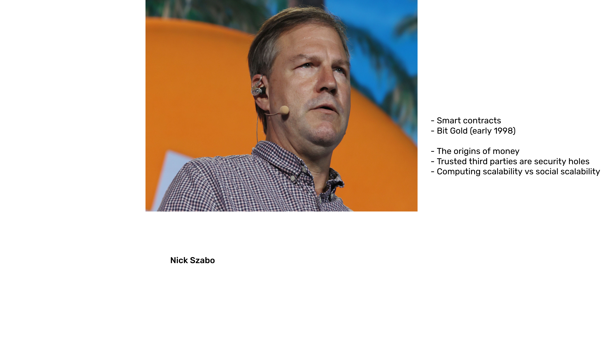

---
**You can listen to or watch this video here:**

<iframe width="560" height="315" src="https://www.youtube.com/embed/EV0cGsUnaYE" title="YouTube video player" frameborder="0" allow="accelerometer; autoplay; clipboard-write; encrypted-media; gyroscope; picture-in-picture" allowfullscreen></iframe>

---

## Ethereum Classic and the Cypherpunks

Ethereum Classic (ETC), and its incredibly secure and versatile functionality, is the product of decades of work by people who saw the potential of public key cryptography to create an internet free from centralization, capture, and manipulation by special interests.

In this 2nd class of the Ethereum Classic Course we will see how the pillars of ETC; namely, hard money, proof of work, and smart contracts; were components ideated and built through time by a group of visionary computer scientists, engineers, and polymaths who called themselves the Cypherpunks.

## Review of Public Key Cryptography

As we saw in the previous class, public key cryptography is a critical component of a blockchain such as ETC where the private key is what gives sovereignty over its wealth and apps to the individual, and through the address that it controls on the blockchain, the individual holds the crypto assets.

What the individuals who would later form the Cypherpunks had feared originally in the 1980s was that the emerging internet at the time had a dual promise: A positive one, that it would bring incredible freedom of connection and communication between people around the world, and, a negative one, that corporations and governments would be prone to capture it with mass surveillance and arbitrary intervention.

## Cypherpunk Ideas and Principles

To solve the problem, in the early 90’s the Cypherpunks formed an online group of visionary computer scientists, engineers, and philosophers who started to work on possible solutions. Their main goals were four:

1. **Privacy:** To avoid surveillance and censorship, they would use the new technology of public key cryptography to make sure people could communicate and transact with confidentiality.
2. **Hard Money:** To liberate trade from the controls and debasement of government currency, they would study money and try to create a native medium of exchange and store of value for the internet. 
3. **Smart contracts:** To replace the role of prone-to-capture traditional agents and intermediaries, they needed to invent autonomous software entities that could fulfil their functions. 
4. **Trust minimization:** To accomplish decentralization and a peer-to-peer internet with free speech and trade, the overarching principle would be trust minimization, or the significant reduction for the need of third parties to mediate in all human action.

## Cypherpunk People and Inventions: Tim May

Tim May was a founding father of the Cypherpunk movement and dedicated his time to explain the philosophy, explain terms and concepts, organize the mailing groups, and even the physical meetings they held in Silicon Valley.

Mr. May was like a role model who provided counsel, motivation, and direction to the group.

Like many Libertarians, his interests revolved around privacy, reducing arbitrary intervention on the internet, and he had a special disdain for the tax man.

He passed away in December of 2018.

## Cypherpunk People and Inventions: Adam Back

Adam Back is another Cypherpunk who in 1997 was working on a way to avoid spam in a peer-to-peer email system. If the internet were to be decentralized, then tech company email services should be avoided and each user should be able to prevent spam.

His solution was a system called HashCash that used proof of work; the heart of the technology in Bitcoin, and the heart of the consensus mechanism that ETC uses today; as a way of blocking spammers.

## Cypherpunk People and Inventions: Nick Szabo

Nick Szabo is a Cypherpunk and in 1994 invented the concept of smart contracts to create trust minimized autonomous agents that could largely replace the roles of third parties when people communicated or traded online.

When he read about HashCash in early 1998 he immediately established the connection of the proofs in the proof of work algorithm with digital gold, which is an analogy of gold in the real world, but applied to the digital world.

With this idea, he created a system called Bit Gold which became a precursor of Bitcoin and thus ETC.

As a polymath he also wrote key essays of Cypherpunk philosophy about the origins of money, why trusted third parties are security holes, and the inverse relationship between computational scalability and social scalability.

## Cypherpunk People and Inventions: Wei Dai

Wei Dai discussed the ideas of proof of work and Bit Gold with Nick Szabo in early 1998 and in late 1998 came up with the idea of B-money, a variation of Bit Gold.

The way B-money works as a network protocol is very much how Bitcoin was designed and it is also the peer-to-peer and monetary reward method that Ethereum Classic uses. 

## Cypherpunk People and Inventions: Hal Finney

Hal Finney was a legendary Cypherpunk and Bitcoiner as he had also tried to create a proof of work monetary system based on the Bit Gold model that he called RPOW which stands for Reusable Proofs of Work.

Mr. Finney was the first user of Bitcoin and wrote a lot about the network and its future success. 

Like HashCash, Bit Gold, and B-money, some of RPOW’s design was incorporated into Bitcoin by Satoshi Nakamoto and also forms part of ETC’s blueprint.

Hal Finney passed away in August of 2014.

## Next Class

In our next class we will explain the four precursor technologies invented by these Cypherpunks that eventually gave way and formed part of Bitcoin and what is now Ethereum Classic:

1. HashCash
2. Bit Gold
3. B-money
4. RPOW

---

**Thank you for reading this article!**

To learn more about ETC please go to: https://ethereumclassic.org
