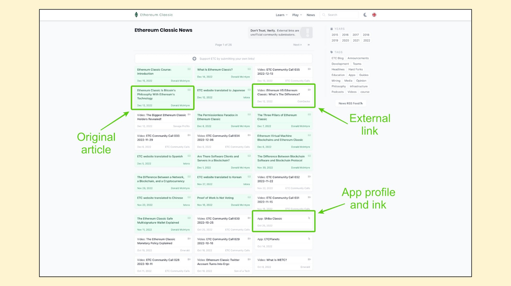
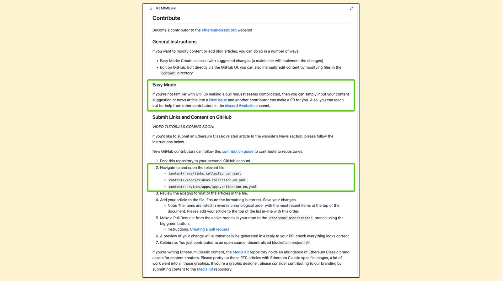
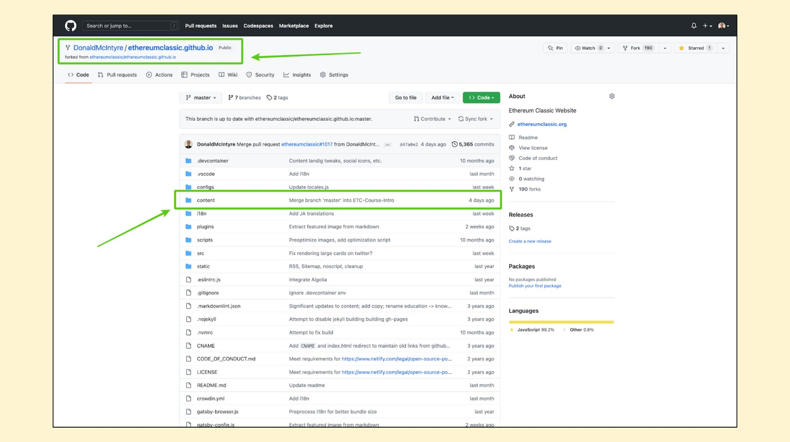

---
**欢迎由此收听或观看本期内容:**

<iframe width="560" height="315" src="https://www.youtube.com/embed/qiexydHMM3A" title="YouTube video player" frameborder="0" allow="accelerometer; autoplay; clipboard-write; encrypted-media; gyroscope; picture-in-picture" allowfullscreen></iframe>

---

**这是本系列的第二部分，讲述如何用不同的方式为以太坊经典做出贡献**

该系列的视频和帖子将包含标题“如何为ETC做出贡献:”以及以下主题扩展: 

1. The Improvement Proposal Process (ECIP)
2. The Community Website
3. Community Tweets
4. Community Volunteering
5. Mining
6. Operating a Node
7. Donating Money
8. Building a Dapp

## What Is the Community Website?


As Ethereum Classic is a decentralized blockchain network it has no presidents, CEOs, nor foundations centrally directing everything that happens inside and outside the ecosystem.

All infrastructure and resources are contributed and managed by volunteers, donors, and professionals hired by decentralist philanthropists. 

One of these resources is the community website located at ethereumclassic.org.

The website is a very complete catalogue of ecosystem articles, videos, links, tools, educational content, applications, and services.

## Who Can Contribute to the Community Website?

Being an open source project, most people in the world may contribute to the Ethereum Classic community website.

The process is located on a platform called GitHub and anyone who wishes to contribute must have an account there to propose their ideas.

The ETC community website has administrators and editors, so all proposed content units and links will be analyzed and accepted based on how relevant they are for ETC and how they fit with its Code Is Law philosophy.

## What Can Be Contributed to the Community Website?



As may be seen in the news section, there are a variety of content units and types that may be proposed. A more comprehensive list is:

1. Links to external articles
2. Links to external videos
3. Original posts
4. Frequently asked questions
5. The “Why Classic?” section
6. The Knowledge base
7. A Services page
8. A Community Page
9. A Network page
10. A Mining page
11. A Development page
12. All other static pages (About, Sitemap, etc.)

In this post we will explain specifically how to contribute links to videos, links to external articles, and original posts to the ETC community website blog.

## Check Out the Readme File With Instructions



As a good first step, if you wish to contribute, you may go to:

[https://github.com/ethereumclassic/ethereumclassic.github.io](https://github.com/ethereumclassic/ethereumclassic.github.io)

That page is the home of the website repository inside GitHub. If you scroll down, you will find a “README” section with general instructions.

In these instructions you will see there is an easy way to propose some simple content units and then a more complex process using the GitHub platform.

Following we will explain both.

## Contributing Article Links Via Easy Mode


If you know of an interesting link for a new article, news item, or analysis of ETC in any external website, then you can go to the “issues” section on the address below and start a new issue to propose the link to be included:

[https://github.com/ethereumclassic/ethereumclassic.github.io/issues/new](https://github.com/ethereumclassic/ethereumclassic.github.io/issues/new)

On the new issue page, write a title for the new issue, the reason why you wish to add the link, and then copy and paste the link.

Then, press “Submit new issue”.

The ETC community website admins will take it from there.

## Contributing Video Links Via Easy Mode


If you know of an interesting video, then you can go to the “issues” section on the address below and start a new issue to propose the link for the video to be included:

[https://github.com/ethereumclassic/ethereumclassic.github.io/issues/new](https://github.com/ethereumclassic/ethereumclassic.github.io/issues/new)

On the new issue page, write a title for the new issue, the reason why you wish to add the video, and then copy and paste the link to that video.

Then, press “Submit new issue”.

The ETC community website admins will take it from there.

## Contributing Article Links Via GitHub Pull Request


For contributing an external article link using the GitHub process, you need to go to the home of the ETC website repo at:

[https://github.com/ethereumclassic/ethereumclassic.github.io](https://github.com/ethereumclassic/ethereumclassic.github.io)

From there click on the “content” folder. 

In the next screen you will find all the types of content on the website in folders.

Click on the “news” folder as shown in the image.


Now that you are inside the folder that contains links to external articles, open the file that is named “links.collection.en.yaml”.


Inside the document, you will see all the links that have been submitted in a column starting from the latest one.

To add your link, you need to hit the edit button, add your link to the top of the column, and then go to the bottom of the page and click on “Propose changes”.

Make sure to follow the exact format that is used for this document:

```
- date: yyyy-mm-dd
   link:
   author:
   source:
   title: “”
   tags: [“”, “”]
```

## Contributing Video Links Via GitHub Pull Request


For contributing a video link using the GitHub process, you need to go to the home of the ETC website repo at:

[https://github.com/ethereumclassic/ethereumclassic.github.io](https://github.com/ethereumclassic/ethereumclassic.github.io)

From there click on the “content” folder. 

In the next screen you will find all the types of content on the website in folders.

Click on the “videos” folder as shown in the image.


Now that you are inside the folder that contains links to videos, open the file that is named “videos.collection.en.yaml”.

(You can select any other of the other files for other languages.)


Inside the document, you will see all the links to videos that have been submitted in a column starting from the latest one.

To add your video link, you need to hit the edit button, add your link to the top of the column, and then go to the bottom of the page and click on “Propose changes”.

Make sure to follow the exact format that is used for this document:

```
- title: ""
  date: yyyy-mm-dd
  uploaded: yyyy-mm-dd
  youtube: 
  tags: ["", “”]
  author:
  authorYoutube:
```

## Contributing Full Articles


To contribute full articles you have to create a pull request on GitHub from a fork of the master branch of the website from your own GitHub profile.

For this, you need to go to the home of the ETC community website repo at:

[https://github.com/ethereumclassic/ethereumclassic.github.io](https://github.com/ethereumclassic/ethereumclassic.github.io)

Then, hit the “Fork” button at the top right as shown in the image.



When you go to your fork of the ETC community website on your GitHub account, you will see at the top left that it is hosted on your GitHub URL.

From the home of your fork of the ETC community website, then click on “content”.


As this is a copy of the ETC community website all the folders and files structure will be the same.

In the next screen, click on the “blog” folder as there is where the original articles published on the ETC community website are located.


In the next screen you will see the folders of all the existing posts since the creation of the website.

To add your post, you need to open the dropdown menu on the top right that says “Add file” as seen in the image.

From there, select “Create new file”.


In the next screen you will need to do four things to create your new article:

1. Write the proper folder extension name at the top with the format:

/yyyy-mm-dd-my-article/index.md

2. Then you need to write the correct header format:

```
title: ""
date: yyyy-mm-dd
author: 
contributors: [""]
tags: ["", ""]
linkImage: ./[image-name].png
```

3. Write your content below the header.

4. When your content is ready, then press the “Commit new file” button at the bottom of the page to create a new pull request on the ETC community website master branch.

The ETC community website admins will take it from there.

## You Are Welcome to Contribute!

We hope that this explanation has clarified any doubts you may have had about how to contribute to the ETC website.

You are welcome to contribute to Ethereum Classic.

Good ideas are always welcome!

---

**Thank you for reading this article!**

To start contributing to the ETC Community website go to: [https://github.com/ethereumclassic/ethereumclassic.github.io](https://github.com/ethereumclassic/ethereumclassic.github.io)

To learn more about ETC go to: [https://ethereumclassic.org](https://ethereumclassic.org)
