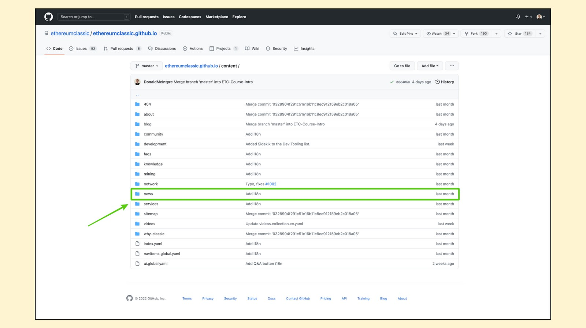
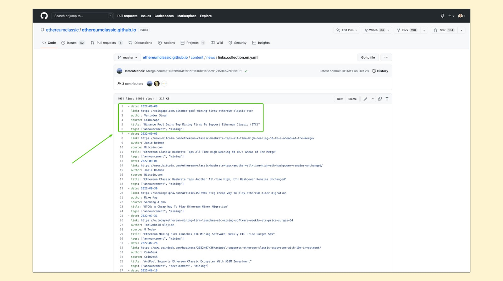
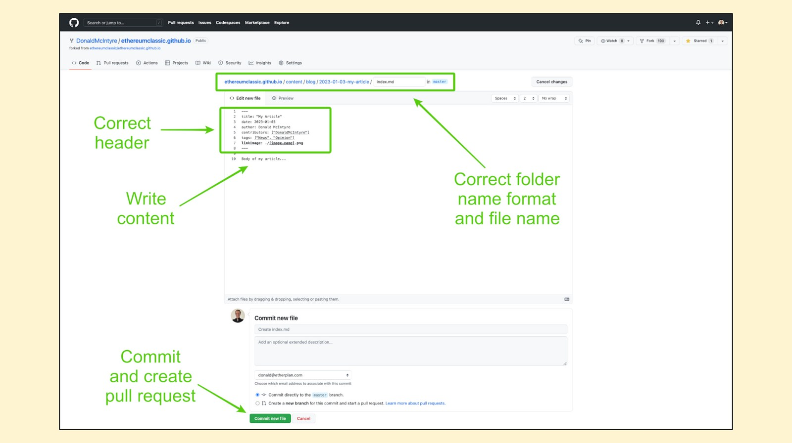

---
**欢迎由此收听或观看本期内容:**

<iframe width="560" height="315" src="https://www.youtube.com/embed/qiexydHMM3A" title="YouTube video player" frameborder="0" allow="accelerometer; autoplay; clipboard-write; encrypted-media; gyroscope; picture-in-picture" allowfullscreen></iframe>

---

**这是本系列的第二部分，讲述如何用不同的方式为以太坊经典做出贡献**

该系列的视频和帖子将包含标题“如何为ETC做出贡献:”以及以下主题扩展: 

该系列的视频和文章将包含“如何为ETC做出贡献”的标题，并有以下主题扩展::

1.改进建议流程(ECIP) 
2.社区网站 
3.社区推特 
4.社区志愿服务 
5.挖矿 
6.操作节点 
7.捐款 
8.构建Dapp

## 什么是ETC社区网站?


由于以太坊经典是一个去中心化的区块链网络，它没有总裁、首席执行官，也没有基金会集中指导生态系统内外发生的一切。

所有的基础设施和资源都是由志愿者、捐赠者和分散主义慈善家雇佣的专业人士贡献和管理的。

其中一个资源是位于ethereumclassic.org的社区网站。

该网站是一个非常完整的生态系统文章、视频、链接、工具、教育内容、应用程序和服务的目录。

## 都有谁可以为社区网站做贡献?

作为一个开源项目，世界上大多数人都可以为以太坊经典社区网站做出贡献。

这个过程位于一个名为GitHub的平台上，任何想要贡献的人都必须在那里有一个账户来提出他们的想法。

ETC社区网站有管理员和编辑，因此所有提议的内容单元和链接都将根据它们与ETC的相关性以及它们是否符合“代码即法律”哲学进行分析和接受建议。

## 什么内容可以用作社区网站贡献?


正如在首页最新消息部分可以看到的，网站可能会提出各种内容单元与类型。以下列表囊括了一个更全面的分类:

1. 外部文章链接
2. 外部视频链接
3. 原创文章
4. 常见问题
5. “为什么是经典?”
6. 知识库
7. 服务页面
8. 社区页面
9. 网络界面
10. 挖矿页面
11. 开发页面
12. 所有其他静态页面(关于、站点地图等)

在这篇文章中，我们将具体解释如何向ETC社区网站博客贡献视频链接、外部文章链接和原创文章。

## 查看带有说明的自述文件


作为好的第一步，如果您想投稿，您可以访问:

[https://github.com/ethereumclassic/ethereumclassic.github.io](https://github.com/ethereumclassic/ethereumclassic.github.io)

该页面是GitHub中网站存储库的主页。如果您向下滚动，你会发现一个“README”部分的一般自述说明。

在这些说明中，您将看到一些提出简单内容单元的方法。对于复杂的过程，您可以使用GitHub平台进行更改。

下面我们将对两者进行详细的解释。

## 通过简单模式贡献文章链接


如果您知道在任何外部网站上有关于新文章、新闻或ETC分析的有趣链接，您可以去下面地址的“问题”部分，开始一个新的问题，并上传需要包含的链接:

[https://github.com/ethereumclassic/ethereumclassic.github.io/issues/new](https://github.com/ethereumclassic/ethereumclassic.github.io/issues/new)

在新问题页面上，您需要为新的问题写一个标题，为什么你想添加链接，然后复制和粘贴链接。

然后，按“提交新问题”。

ETC社区网站管理员将从那里接手接下来的工作。

## 通过简易模式贡献视频链接


如果您有一个有趣的视频想要分享，那么您可以去下面地址的“问题”部分，开始一个新的问题，上传视频的链接:

[https://github.com/ethereumclassic/ethereumclassic.github.io/issues/new](https://github.com/ethereumclassic/ethereumclassic.github.io/issues/new)

在新问题页面上，为新问题写一个标题，你想添加视频的原因，然后复制并粘贴到该视频的链接。

然后，按“提交新问题”。

ETC社区网站管理员将从那里接手接下来的工作。

## 通过GitHub Pull Request贡献文章链接



要使用GitHub进程贡献外部文章链接，您需要访问ETC网站的储存库主页:

[https://github.com/ethereumclassic/ethereumclassic.github.io](https://github.com/ethereumclassic/ethereumclassic.github.io)

从那里点击“内容”文件夹。

在下一个屏幕中，您将在文件夹中找到网站上所有类型的内容。

如图所示，点击“新消息”文件夹。


现在您已经进入了包含外部文章链接的文件夹，打开名为“links.collection.en.yaml”的文件。



在文档内部，您将在从最新链接开始的一列中看到已提交的所有链接。

要添加链接，您需要点击编辑按钮，将链接添加到列的顶部，然后转到页面底部，单击“建议更改”。

请确保遵循本文档使用的确切格式:

```
- date: yyyy-mm-dd （日期：年-月-日）
   link: （链接：）
   author: （作者：）
   source: （来源：）
   title: “” （标题：“”）
   tags: [“”, “”] （标签：["", ""]）
```

## 通过GitHub Pull Request贡献外部视频链接


为了使用GitHub进程贡献一个视频链接，你需要去ETC网站的储存库主页:

[https://github.com/ethereumclassic/ethereumclassic.github.io](https://github.com/ethereumclassic/ethereumclassic.github.io)

从那里点击“内容”文件夹。

在下一个屏幕中，您将在文件夹中找到网站上所有类型的内容。

如图所示，点击“视频”文件夹。


现在您已经进入了包含视频链接的文件夹，打开名为“videos.collection.en.yaml”的文件。

(您可以选择其他语言的任何其他文件。)


在文档中，您将看到所有已提交的视频链接，这些链接以最新的视频开始。

要添加视频链接，您需要点击编辑按钮，将链接添加到列的顶部，然后转到页面底部，单击“建议更改”。

请确保遵循本文档使用的确切格式:

```
- title: "" （标题：“”）
  date: yyyy-mm-dd （日期：年-月-日）
  uploaded: yyyy-mm-dd （已上传：年-月-日）
  youtube: （油管：）
  tags: ["", “”] （标签：["", ""]）
  author: (作者：)
  authorYoutube: （作者油管：）
```

## 贡献完整的文章


要贡献完整的文章，您需要用自己的账号从GitHub主网站中创建一个分支的Pull Request。

为此，您需要访问ETC社区网站存储库的主页:

[https://github.com/ethereumclassic/ethereumclassic.github.io](https://github.com/ethereumclassic/ethereumclassic.github.io)

然后，点击右上角的“分支”按钮，如图所示。


当您在您的GitHub帐户上访问ETC社区网站的分支时，您会在左上角看到分支在您的GitHub URL上。

从你的ETC社区网站的主页，然后点击“内容”。


由于这是ETC社区网站的副本，所有文件夹和文件结构将是相同的。

在下一个屏幕中，单击“博客”文件夹，因为那里是ETC社区网站上发布的原始文章的位置。


在下一个屏幕中，您将看到自网站创建以来所有现有帖子的文件夹。

要添加文章，您需要打开右上方的下拉菜单，上面写着“添加文件”，如图所示。

从那里选择“创建新文件”。



在下一个屏幕中，您需要做四件事来创建新文章:

1. 在顶部写上正确的文件夹扩展名，格式如下:

/yyyy-mm-dd-my-article/index.md （/年-月-日-my-article/index.md）

2. 然后您需要写正确的标题格式:

```
title: "" （标题：“”）
date: yyyy-mm-dd （日期：年-月-日）
author: （作者：）
contributors: [""] （贡献者：[“”]）
tags: ["", ""] （标签：[“”，“”]）
linkImage: ./[image-name].png （图片链接：./[图片名称].png）
```

3. 把您的内容写在标题下面。

4. 当您的内容准备好后，按下页面底部的“提交新文件”按钮，在ETC社区网站主分支上创建一个新的Pull Request。

ETC社区网站管理员将从那里接手接下来的工作。


## 欢迎您来贡献！

我们希望这个解释已经解答了您对如何向ETC网站投稿的任何疑问。

欢迎您为以太坊经典做出贡献。

好的点子，总是受欢迎的!

---

**感谢您阅读本篇文章!**

想开始为ETC社区网站贡献，请访问: [https://github.com/ethereumclassic/ethereumclassic.github.io](https://github.com/ethereumclassic/ethereumclassic.github.io)

想要了解有关ETC的更多内容，请访问: [https://ethereumclassic.org](https://ethereumclassic.org)
