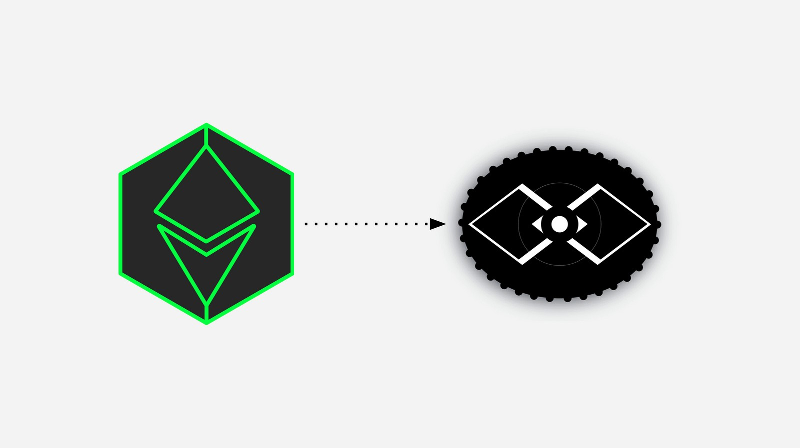

---
**Watch the ETC Cooperative's announcement here:**

<iframe width="560" height="315" src="https://www.youtube.com/embed/gYaL-yJCPB0" title="YouTube video player" frameborder="0" allow="accelerometer; autoplay; clipboard-write; encrypted-media; gyroscope; picture-in-picture; web-share" allowfullscreen></iframe>

---

## IMPORTANT ALERT:

The [ETC Cooperative has announced](https://etccooperative.org/posts/2023-01-02-the-ethereum-classic-rpc-url-is-changing-from-ethercluster-to-rivet-en) that by July 1st of 2023 it will discontinue the RPC endpoint for Ethereum Classic under the Ethercluster brand and will fully migrate the service to Rivet, a blockchain cloud service.

The Ethercluster endpoint that will be discontinued by July 1st of 2023 is:

[https://ethercluster.com/etc](https://ethercluster.com/etc)

The migration may be done immediately to the following RPC endpoint:

[https://etc.rivet.link](https://etc.rivet.link)

IF YOU ARE A WALLET SERVICE, NODE OPERATOR, MINING POOL, DAPP DEVELOPER, OR ANY OTHER KIND OF USER OF THE ETHERCLUSTER ENDPOINTS, PLEASE MIGRATE AS SOON AS POSSIBLE TO AVOID INTERRUPTIONS.

## Rationale

The ETC Cooperative stated this rationale for the migration:

*"The mission of the ETC Cooperative is to support the Ethereum Classic network and ecosystem through core development and maintenance, infrastructure support, grants and sponsorships, and marketing and communications.*

*Many of these functions are done through third party professionals and services as the cooperative does not necessarily have the staff and capabilities to perform some dedicated tasks and functions such as continuous and uninterrupted maintenance and support.*

*We have provided free public endpoints to the ETC ecosystem since mid-2019 which has allowed wallets, dapps and other services to connect to a publicly accessible ETC node to query the blockchain or to submit transactions.*

*As a small non-profit we are not well equipped to provide 24/7 operational support and have concluded that everyone would be better served if another team were to operate the endpoint service."*

## Who Is Rivet?

According to the ETC Cooperative, [Rivet](https://rivet.cloud) is an established company with a professional team dedicated to providing APIs for the blockchain industry. They have a track record of providing scalable infrastructure and privacy with total simplicity and at very reasonable prices.

The ETC Cooperative will continue to finance the cost of the free APIs and public endpoints through a contractor agreement with Rivet.

Rivet's founder, Greg Lang had this to say in the announcement:

*"We have always taken immense pride serving the ETC developer community—the OG-est of Turing-complete-smart-contracting OGs—with enterprise-grade uptime, capacity, and attentiveness. That’s why we were excited to become the endpoint provider for EtherCluster in November of 2021.*

*With this transition to https://rivet.link, ETC BUIDLers can still expect the same high-quality service they’ve come to expect from EtherCluster—because we are as committed as ever to providing the ETC community the best possible service we can deliver.*

*And now—thanks to this transition—it will be even easier for us to deliver enterprise-grade support to the community, because through https://rivet.link, developers building on ETC will know exactly who is responsible for supporting the endpoint—and who to contact if they need help.*

***Support:***

*Speaking of which, if you’re building on ETC and need support—or you have questions, comments, or feature requests, please join the Rivet discord server. We’ve got eyes on it 24/7 and we love hearing from buidlers—so don’t hesitate to reach out! Link: https://discord.gg/zANTsgdGeH*

*Discord not your thing? No worries! Hit us up at support@rivet.cloud and we’ll get right back with you.*

*Bottom line? We have always believed in the power of ETC to change the world, and we can’t wait to see what you’ll build next. If we can help, don’t hesitate to get in touch.*

*Greg Lang, Founder, Rivet"*

## Summary

THE LAST DAY FOR THE CURRENT ETHERCLUSTER RPC ENDPOINT IS JULY 1ST OF 2023.

The migration is from:

[https://ethercluster.com/etc](https://ethercluster.com/etc)

To:

[https://etc.rivet.link](https://etc.rivet.link)

PLEASE MIGRATE AS SOON AS POSSIBLE SO YOUR SERVICE DOES NOT SUFFER ANY INTERRUPTIONS IF YOU LEAVE IT FOR THE LAST MINUTE!

---

**Thank you for reading this article!**

To learn more about ETC please go to: https://ethereumclassic.org
