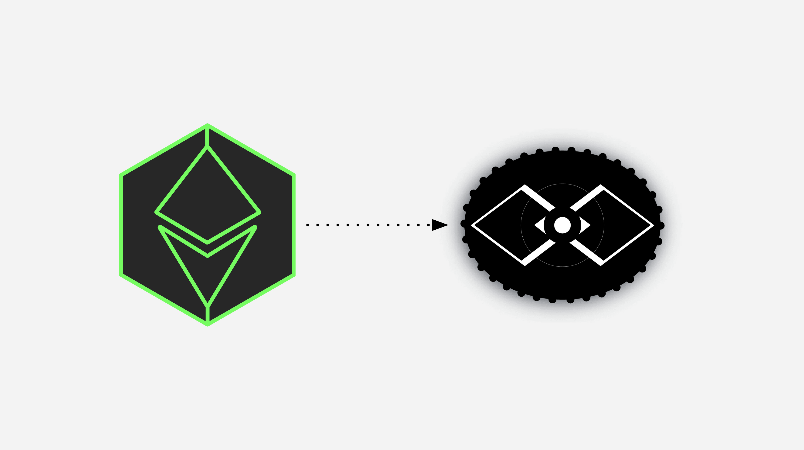

---
**请由此观看ETC的此次公告:**

<iframe width="560" height="315" src="https://www.youtube.com/embed/gYaL-yJCPB0" title="YouTube video player" frameborder="0" allow="accelerometer; autoplay; clipboard-write; encrypted-media; gyroscope; picture-in-picture; web-share" allowfullscreen></iframe>

---

## 重要告知:

[以太坊经典合作社宣布](https://etccooperative.org/posts/2023-01-02-the-ethereum-classic-rpc-url-is-changing-from-ethercluster-to-rivet-cn)由2023年7月1日起，ETC合作社将停止Ethercluster品牌下的以太坊经典的RPC端点，并将服务完全迁移到Rivet，一个区块链云服务。

The Ethercluster endpoint that will be discontinued by July 1st of 2023 is:

[https://ethercluster.com/etc](https://ethercluster.com/etc)

将于2023年7月1日停止的Ethercluster端点是:

[https://etc.rivet.link](https://etc.rivet.link)

*如果您是一个钱包服务，节点操作员，矿池，dapp开发者，或任何其他类型的以太集群端点的用户，请尽快迁移，以避免中断。

## 基本原理

ETC合作社指出移徙的理由如下:

*"ETC合作社的使命是通过核心开发和维护、基础设施支持、赠款和赞助以及营销和通信来支持以太坊经典网络和生态系统。*

*其中许多功能是通过第三方专业人员和服务机构完成的，因为合作社不一定有人员和能力来执行一些专门的任务和功能，如持续和不间断的维护和支持。*

*自2019年年中以来，我们已经为ETC生态系统提供了免费的公共端点，允许钱包、dapp和其他服务连接到公共可访问的ETC节点，以查询区块链或提交交易。*

*作为一个小型的非营利组织，我们不具备提供全天候运营支持的条件，我们认为如果有另一个团队来运营端点服务，每个人都会得到更好的服务。”*

## Rivet是谁？

据以太坊经典合作社称, [Rivet](https://rivet.cloud) 是一家成熟的公司。它拥有专业团队，并致力于为区块链行业提供API。他们在以非常合理的价格提供可扩展的基础设施，并在隐私方面有着良好的记录。

ETC合作社将继续通过与Rivet的承包商协议资助免费api和公共终端的费用。

Rivet的创始人Greg Lang在公告中说:

*"我们一直为为ETC开发人员社区服务而感到非常自豪，他们是图灵完备智能契约前辈中的前辈，具有企业级的正常运行时间、容量和注意力。这就是为什么我们很高兴能在2021年11月成为EtherCluster的端点提供商。*

*通过向 https://rivet.link 的过渡，ETC构建者仍然可以期望从ethercluster获得相同的高质量服务，因为我们一如既往地致力于为ETC社区提供我们所能提供的最好的服务。*

*现在，由于这一转变，我们将更容易向社区提供企业级支持，因为通过 https://rivet.link， 在ETC上构建的开发人员将确切地知道谁负责支持端点，以及如果他们需要帮助，可以联系谁。"*

***支持:***

*说到这里，如果您正在构建ETC并需要支持，或者您有问题、评论或功能请求，请加入Rivet discord服务器。我们24/7在线，我们喜欢听到来自构建者的消息，所以不要犹豫，欢迎联系我们! 链接: https://discord.gg/zANTsgdGeH*

*如果您不方便使用Discord，欢迎发邮件联系我们： support@rivet.cloud 我们会尽快回复您的消息。*

*我们一直相信ETC改变世界的力量，我们迫不及待地想看看你接下来会创造什么。如果我们能帮上忙，请与我们联系。*

*Greg Lang,创始人, Rivet"*

## 总结

当前ethercluster RPC端点的最后一天是2023年7月1日。

本次迁移是从

[https://ethercluster.com/etc](https://ethercluster.com/etc)

至

[https://etc.rivet.link](https://etc.rivet.link)

为了您的服务不会受到任何中断，请务必尽快迁移！

---

**感谢您阅读本期文章!**

了解更多ETC相关内容，请访问: https://ethereumclassic.org
