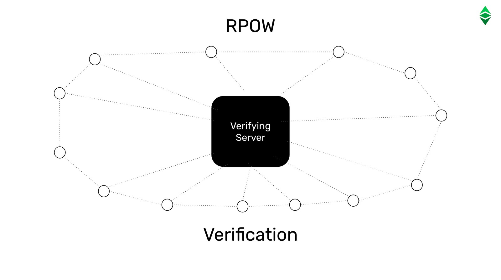
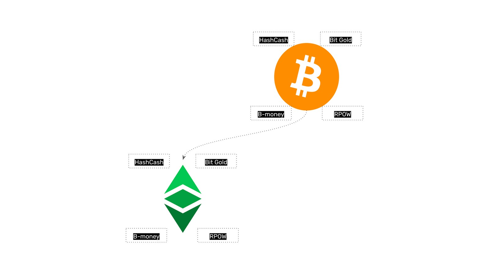

---
**You can listen to or watch this video here:**

<iframe width="560" height="315" src="https://www.youtube.com/embed/2CEE6Chfrpg" title="YouTube video player" frameborder="0" allow="accelerometer; autoplay; clipboard-write; encrypted-media; gyroscope; picture-in-picture" allowfullscreen></iframe>

---

## Cypherpunks Review

In the previous class we discussed that Ethereum Classic (ETC), and its incredibly secure and versatile functionality, is the product of decades of work by people who saw the potential of public key cryptography to create an internet free from centralization, capture, and manipulation by special interests.

These were the Cypherpunks.

In this class of the Ethereum Classic Course we will explain how their first digital currency attempts worked and how they form part of Bitcoin and hence Ethereum Classic.

## Adam Back and Hash Cash

HashCash used proof of work; the heart of the technology in Bitcoin, and the heart of the consensus mechanism that ETC uses today; as a way of blocking spam in a peer-to-peer email system.

The way it worked was that the sender email server had to do a lot of work before sending the email, and had to post the proof of work stamp on the email for the receiving server to verify that the work was done.

If, for example, the work demanded was 1 minute of computational cycles per email, then for any attacker to send, say, 1 million spam emails, its server would have to work 1 million minutes to be able to perpetrate the attack.

This would, in practice, enable a peer-to-peer email system with little to no spam.

## Nick Szabo and Bit Gold

When Nick Szabo read about HashCash in early 1998 he immediately established the connection of the proof of work stamps with digital gold, which is an analogy of gold in the real world, but applied to the digital world.

With this idea, he created a system called Bit Gold which became a precursor of Bitcoin and thus ETC.

Bit Gold puts to work a group of machines in a network to create proof of work stamps, and each one of these stamps is treated as digital gold.

This method ensured that the creation of the proof of work stamps would be very costly, as real gold is very costly to extract from nature, therefore making Bit Gold proofs a sound type of money, but on the internet.

## Wei Dai and B-money

Wei Dai discussed the ideas of proof of work and Bit Gold with Nick Szabo in early 1998 and in late 1998 came up with the idea of B-money, a variation of Bit Gold.

The way B-money worked as a network protocol was very much how Bitcoin was designed and it is also the peer-to-peer and monetary reward method that Ethereum Classic uses.

Basically, of all the nodes in the network a sub-group, called miners, would create Bit Gold and then send it to the rest of the network for verification. Once the rest of the network nodes confirmed that the proof of work stamps were legit, then they would credit the accounts of the miners, in the ledger they managed, units of a digital currency that was issued for these purposes.

## Hal Finney and RPOW

Hal Finney also tried to create a proof of work monetary system based on the Bit Gold model that he called RPOW which stands for Reusable Proofs of Work.

Like HashCash, Bit Gold, and B-money, some of RPOW’s design was incorporated into Bitcoin by Satoshi Nakamoto and also forms part of ETC’s blueprint.

RPOW consisted of a centralized verifying server that would confirm that the proofs of work sent between users were legitimate. Users would create their own Bit Gold in their machines, and then send them to others by email as payments. 

The system did not take off because the centralized server was a point of failure, but the verification process was a key contribution to the industry.

## Bitcoin and Ethereum Classic

What Satoshi Nakamoto did was to integrate all these pioneering ideas into Bitcoin, and then Ethereum Classic adopted the majority of Bitcoin’s model for its base security. 

In the next class we will explain this in detail.

---

**Thank you for reading this article!**

To learn more about ETC please go to: https://ethereumclassic.org
