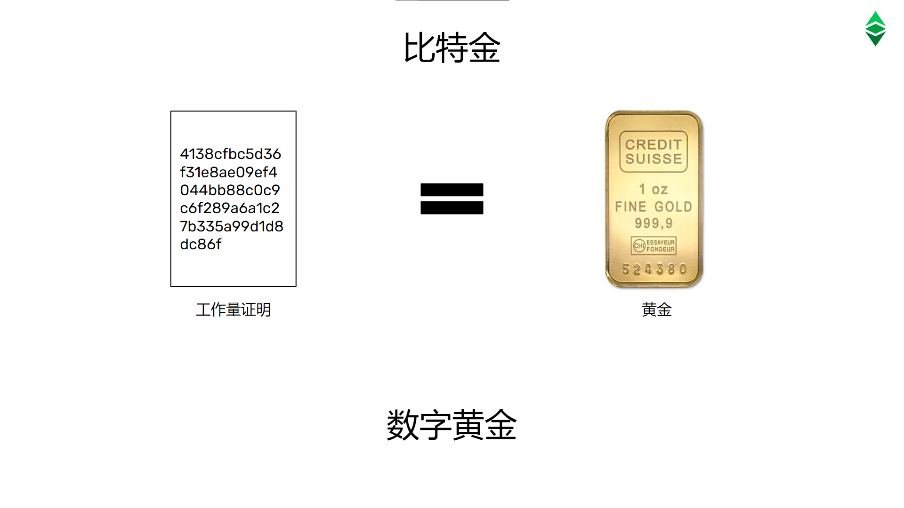

---
**欢迎由此收听或观看本期视频:**

<iframe width="560" height="315" src="https://www.youtube.com/embed/2CEE6Chfrpg" title="YouTube video player" frameborder="0" allow="accelerometer; autoplay; clipboard-write; encrypted-media; gyroscope; picture-in-picture" allowfullscreen></iframe>

---

## 密码朋克回顾

在上节课中，我们讨论了以太坊经典(ETC)及其令人难以置信的安全和多用途功能是某一些人几十年工作的产物。这些人看到了公钥加密的潜力，以创建一个不受集中、捕获和特殊利益操纵的互联网。

他们就是密码朋克。

在本节以太坊经典课程中，我们将解释他们的第一次数字货币尝试如何工作，以及他们如何形成比特币和因此以太坊经典的一部分。

## Adam Back与哈希现金

HashCash使用了工作证明;它是比特币技术的核心，以及ETC今天使用的共识机制的核心;作为点对点电子邮件系统中拦截垃圾邮件的一种方式。

它的工作方式是，发送方电子邮件服务器在发送电子邮件之前必须做很多工作，并且必须在电子邮件上张贴工作证明戳，以便接收方服务器验证工作已经完成。

例如，如果每封邮件所需要的工作是1分钟的计算周期，那么对于任何攻击者来说，例如，发送100万封垃圾邮件，其服务器将必须工作100万分钟才能实施攻击。

在实践中，这将使点对点电子邮件系统几乎没有垃圾邮件

## Nick Szabo与特金（Bit Gold）

当Nick Szabo在1998年初读到哈希现金时，他立即建立了工作量证明戳与数字黄金的纽带。数字黄金是现实世界中的黄金的类比，但适用于数字世界。

基于这个想法，他创建了一个名为比特金的系统，这成为了比特币和ETC的前身。

比特金让一组机器在网络中工作以创建工作量证明戳，其中每一个戳都被视为数字黄金。

这种方法确保了制作工作量证明戳的将是非常昂贵的，因为从自然界提取真金是非常昂贵的。因此使比特金证明是一种可靠的货币，但是其运用是在互联网上。

## Wei Dai与B-money

戴维在1998年初与Nick Szabo讨论了工作量证明和比特金的想法，并在1998年底提出了B-money的想法，也就是比特金的变体。

B-money作为网络协议的工作方式与比特币的设计方式非常相似，也是以太坊经典使用的点对点和货币奖励方式。

基本上，在网络中的所有节点中，有一个名为“矿工”的子组将创建比特金，然后将其发送到网络的其他部分进行验证。一旦其他网络节点确认工作证明印章是合法的，他们就会在他们管理的账本中，将为这些目的而发行的数字货币的单位记入矿工的账户。

## Hal Finney与RPOW（可重复使用工作量证明）

Hal Finney还试图创建一个基于比特金模型的工作证明货币系统，他称之为RPOW，意思是可重复使用工作量证明。

与哈希现金、比特金和B-money一样，RPOW的一些设计被中本聪(Satoshi Nakamoto)纳入了比特币，也构成了ETC蓝图的一部分。

RPOW由一个集中的验证服务器组成，它将确认用户之间发送的工作量证明是可靠合法的，用户便可以在自己的机器中创建自己的比特金，然后通过电子邮件将其发送给其他人作为支付方式。

由于集中式服务器是一个故障点，该系统未能成功，但RPOW的验证过程是该行业的一个关键性贡献。

## 比特币与以太坊经典

中本聪所做的就是将所有这些开创性的想法整合到比特币中，然后以太坊经典(Ethereum Classic)在基础安全方面采用了比特币的大部分模式。

在下节课中，我们将详细解释这一点。

---

**感谢您阅读本期文章!**

想要了解更多有关以太坊经典的内容，请访问: https://ethereumclassic.org
