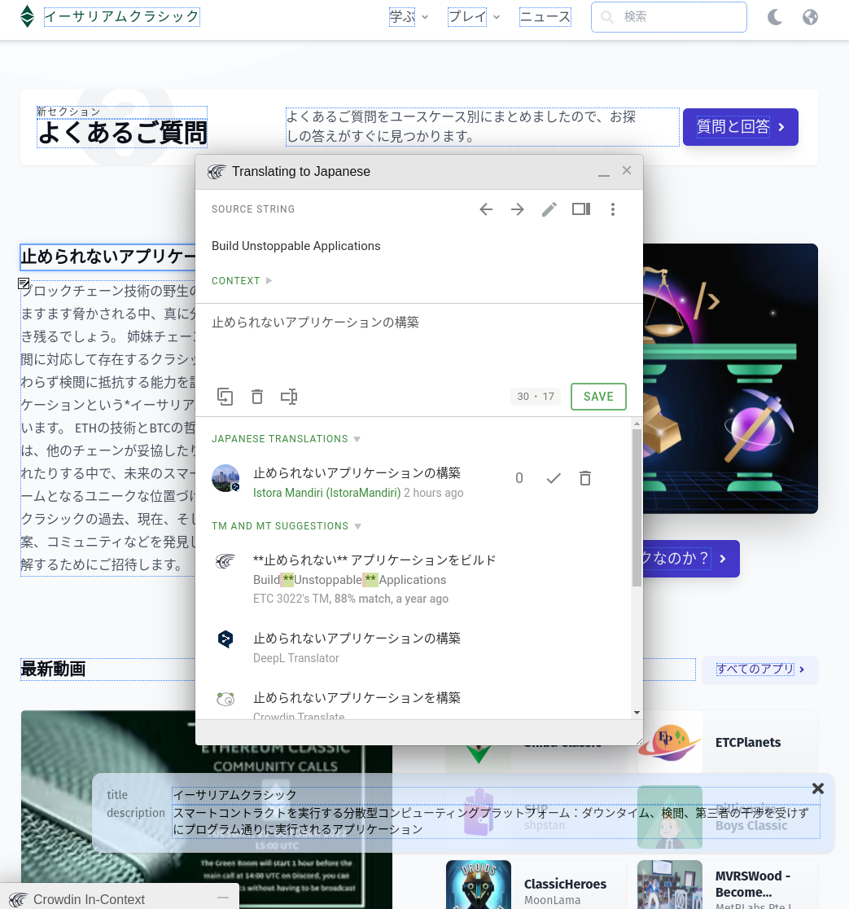

Мы рады сообщить, что сайт EthereumClassic.org теперь доступен на русском языке.

Основное содержимое сайта (включая эту запись блога) было автоматически переведено на русский язык и может быть просмотрено с помощью значка глобуса в правом верхнем углу каждой страницы. 

Исторические записи блога и материалы, предоставленные пользователями, такие как приложения, не переведены, но могут быть переведены. Видео и новости, доступные на определенных языках, также могут быть переведены.

Поскольку эти переводы были созданы компьютером, в них могут присутствовать грамматические и контекстуальные ошибки, но теперь, когда система интернационализации (i18n) и рабочий процесс внесения вкладов запущены, мы призываем членов сообщества помочь нам улучшить этот контент.

Управление переводами осуществляется через [Crowdin](https://crowdin.com), популярный сервис для совместной работы над локализацией, что должно сделать процесс внесения вклада максимально простым. Crowdin любезно предоставил проекту Ethereum Classic лицензию с открытым исходным кодом, что позволяет нам использовать их сервис без оплаты.

Если вы хотите внести свой вклад в Ethereum Classic, предложив дополнительные языки или исправив переводы, ознакомьтесь с инструкциями по внесению вклада на [GitHub-репозитории сайта ETC](https://github.com/ethereumclassic/ethereumclassic.github.io).