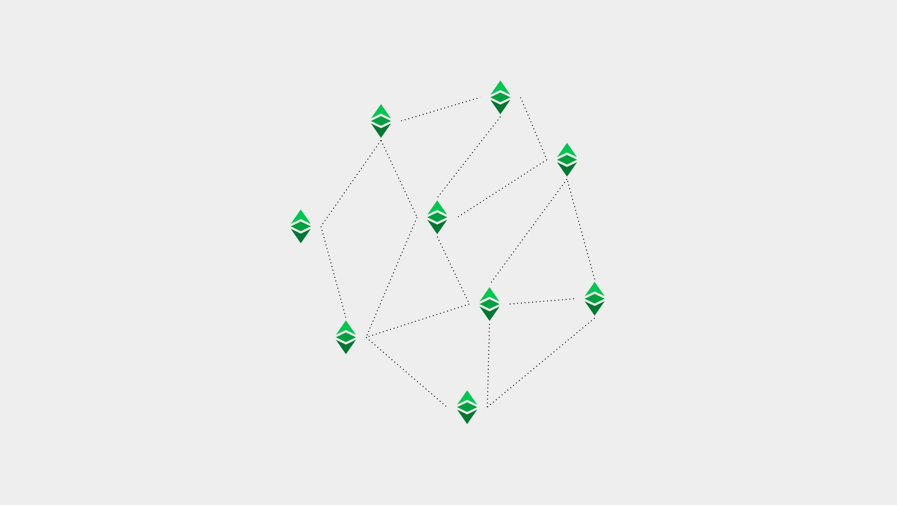

---
**You can listen to or watch this video here:**

<iframe width="560" height="315" src="https://www.youtube.com/embed/zmFdK2JlSsI" title="YouTube video player" frameborder="0" allow="accelerometer; autoplay; clipboard-write; encrypted-media; gyroscope; picture-in-picture" allowfullscreen></iframe>

---

**This is the sixth part of a series that will explain the three software clients currently operating or being implemented on Ethereum Classic.** 

The series will consist of the following topics:

1. The Difference Between a Network, a Blockchain, and a Cryptocurrency 
2. The Difference Between Blockchain Software and Blockchain Protocol
3. Are There Software Clients and Servers in a Blockchain?
4. Ethereum Virtual Machine Blockchains and Ethereum Classic
5. Core Geth Explained
6. Hyperledger Besu Explained
7. Erigon Explained

---

## Reviewed Concepts in This series

In our first four videos we have explained the basics of what are networks, blockchains, and cryptocurrencies; the differences between blockchain software and blockchain protocols; whether there are software clients and servers in cryptocurrency networks; and what is Ethereum Classic's position in the segment of Ethereum Virtual Machine (EVM) blockchains.

In this video we will apply all this knowledge to explain what is the Hyperledger Besu software client that works with Ethereum Classic, and what are its features, types, and functions.

## Ethereum Classic Is a Network, a Blockchain, and a Cryptocurrency

As we explained in the first post of this series:

**Ethereum Classic is a network** because it is a system of machines, nodes, and a shared database called a blockchain. In particular, it is a public network and its software is open source so that anyone can audit and use it to participate in the system.

**Ethereum Classic is a blockchain** because its database contains a ledger with accounts and balances, where transactions are fully transmitted and form a fully replicated chain of blocks.

**Ethereum Classic is a cryptocurrency** because its ledger tracks a coin called ETC that is scarce, durable, costly to create, portable, divisible, fungible, and transferable, so it may be used for payments and as a store of value.

## Hyperledger Besu Is a Node Client that Works With Ethereum Classic

Blockchains are peer to peer networks and each participating machine in the system is called a node. 

For a machine to be a node it needs to run a software application that contains the set of rules of the protocol of that particular network.

Hyperledger Besu is an Ethereum Classic network node software, also called “software client”.

## Hyperledger Besu Is Both a Software Client and a Server

However, blockchain networks are not hierarchical systems where some machines have more clout than others or there are permissioned instances or privileges. In ETC all peer nodes are equal and all replicate the same exact state every 15 seconds.

This replication means that all nodes actually have the role of receiving transactions and blocks and retransmitting them to all other nodes. Similarly, when new nodes connect to the network, they consult with existing participating nodes on the state of the network and then download from them all the history in what is called the Initial Block Download (IBD).

Due to this equal status of all nodes in the network and that all send and receive information from all other nodes, then there are no real distinct server and client roles, but they are all really servers and clients. 

## Hyperledger Besu Is a Full EVM Node Software

Hyperledger Besu is a node server and client that is compliant with all the EVM standard components in general and the mining capabilities of Ethereum Classic in particular.

However, it is also compatible and works with private networks and the Ethereum mainnet. 

Therefore, Hyperledger Besu may also be used for proof of authority networks (usually private networks) and proof of stake networks (as an execution client of Ethereum).

## Origin of Hyperledger Besu

The Hyperledger Besu software client was created by [Consensys](https://consensys.net/), a major blockchain company in the EVM sector, and was called [Pantheon](https://github.com/PegaSysEng/pantheon).

Later, it was donated to the [Hyperledger Foundation](https://www.hyperledger.org/), which is part of the Linux Foundation. 

Hyperledger is an open source organization that supports a suite of stable frameworks, tools and libraries for enterprise-grade blockchain.

Pantheon was renamed to [Hyperledger Besu](https://www.hyperledger.org/use/besu) and today supports private networks, Ethereum proof of stake, and Ethereum Classic proof of work.

## Hyperledger Besu Unique Features

As said above, Hyperledger Besu supports private networks, the Ethereum proof of stake network, and the Ethereum Classic proof of work blockchain.

To support ETC, it has the ETC Hash mining algorithm integrated.

The ETC Cooperative financed the integration of ETC support into the master Hyperledger Besu software, therefore it is not a downstream version of the master as Core Geth is.

However, Hyperledger Besu does not contain the Modified Exponential Subjective Scoring (MESS) feature which lets node operators exclude alternative blockchains that compete with the mainnet.

The Hyperledger Besu client can be used for mining.

## Hyperledger Besu May Have Different Functions

As an Ethereum Classic node software Hyperledger Besu may be used for the following functions:

**Verifying node:** Exchanges, large institutional investors, and crypto custody services need to run nodes able to verify their positions in the network directly. Hyperledger Besu may be perfectly used for this function.  

**Miner:** As said before, Hyperledger Besu includes the full mining algorithm of Ethereum Classic, ETC Hash, therefore it may be used by both miners and mining pools to run their operations.

**Node as a Service (NaaS):** Startups and companies who run NaaS services can use Hyperledger Besu to provide wallet queries to third parties, transaction processing, statistics and charts, and block explorer services.

## Hyperledger Besu May Have Different Configurations Except Light Node

Hyperledger Besu may be used with the following configurations:

**Archival node:** A node that stores the block headers, the tree of hashed transactions (called Merkle Patricia tree), and all the original data of all transactions sent to the blockchain. This is the largest and most heavy to operate and longest to download kind of node.

**Full node:** A node that stores the block headers and the Merkle Patricia tree, but does not store all the original transactions. This is a relatively secure kind of node, much faster to download, and lighter to operate than the archival node.

Hyperledger Besu may not be used as a light client or light node.

## How to Run Hyperledger Besu

To run Hyperledger Besu as an Ethereum Classic node, node operators and miners must go to the following repository on Github and download the client:

[https://github.com/hyperledger/besu](https://github.com/hyperledger/besu)

To activate it pointing to the ETC blockchain, the following command must be used to initiated it:

`--network=classic`

---

**Thank you for reading this article!**

To download and start using Hyperledger Besu please go to: [https://github.com/hyperledger/besu](https://github.com/hyperledger/besu)

To learn more about ETC please go to: [https://ethereumclassic.org](https://ethereumclassic.org)

