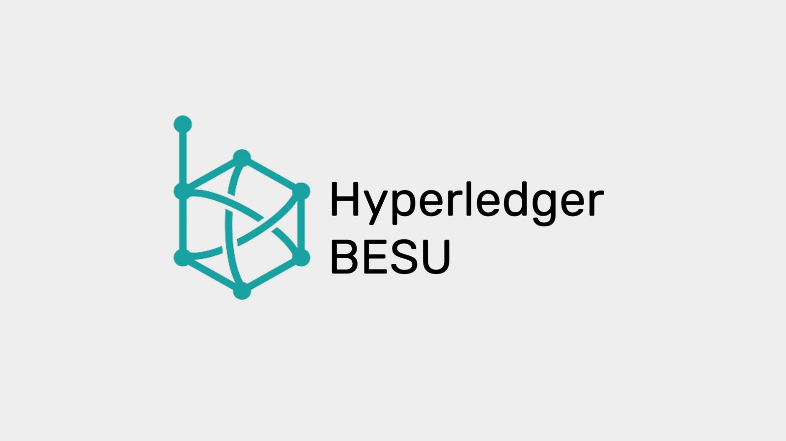

---
**欢迎由此收听或观看本期内容:**

<iframe width="560" height="315" src="https://www.youtube.com/embed/zmFdK2JlSsI" title="YouTube video player" frameborder="0" allow="accelerometer; autoplay; clipboard-write; encrypted-media; gyroscope; picture-in-picture" allowfullscreen></iframe>

---

**这是一个系列的第6部分，该系列将解释目前在以太坊经典上运行或正在实现的三种软件客户端。** 

该系列将包括以下主题:

1.网络、区块链和加密货币之间的区别
2.区块链软件与区块链协议的区别
3.区块链中是否存在软件客户端和服务器?
4.以太坊虚拟机区块链和以太坊经典
5.Core Geth详解
6.超级账本Hyperledger Besu详解
7.Erigon详解

---

## 本系列回顾的概念

在我们的前四个视频中，我们已经解释了很多内容，包括“什么是网络、区块链和加密货币的基础”、“区块链软件与区块链协议的差异”、“加密货币网络中是否存在软件客户端和服务器”、以及“以太坊经典在以太坊虚拟机(EVM)区块链中的位置"。

在本期内容中，我们将应用所有这些知识来解释什么是与以太坊经典合作的超级账本Hyperledger Besu软件客户端，以及它的特性、类型和功能。

## 以太坊经典是一个网络、区块链、和加密货币

就像我们在系列初解释的一样，

**以太坊经典是一个网络** 因为它是一个由机器、节点和称为区块链的共享数据库组成的系统。特别的是，它是一个公共网络，它的软件是开源的，因此任何人都可以审计并使用它参与系统。

**以太坊经典是一个区块链** 因为它的数据库包含一个有账户和余额的分类账，在那里交易被完全传输并形成一个完全复制的区块链。

**以太坊经典是一个加密货币** 因为它的账本追踪的是一种名为ETC的硬币，这种硬币稀有、耐用、制造成本高、可携带、可分割、可替代、可转移，所以它可以用于支付和价值储存。

## Hyperledger Besu 是一个与以太坊经典合作的节点客户端

区块链是点对点网络，系统中的每一台参与机器被称为一个节点。

一台机器要成为一个节点，它需要运行一个包含特定网络协议规则集的软件应用程序。

Hyperledger Besu是一款以太坊经典网络节点软件，也被称为“软件客户端”。

## Hyperledger Besu 既是软件客户端又是服务器

但是，区块链网络不是分级系统，在分级系统中，一些机器的影响力比其他机器大，或者有被允许的实例或特权。在ETC中，所有对等节点都是相等的，并且每15秒复制一次相同的状态。

这种复制意味着所有节点实际上都扮演着接收事务和块并将它们重新传输到所有其他节点的角色。类似地，当新的节点连接到网络时，它们会咨询现有的参与节点网络的状态，然后从它们那里下载所有的历史记录，这被称为初始块下载(IBD)。

由于网络中所有节点的状态是平等的，并且所有节点都发送和接收来自所有其他节点的信息，因此没有真正不同的服务器和客户端角色，但它们都是真正的服务器和客户端。

## Hyperledger Besu是一个完整的EVM节点软件

Hyperledger Besu是一个节点服务器和客户端，通常与所有EVM标准组件兼容，特别是与以太坊经典的挖掘功能兼容。

然而，它也兼容并与私有网络和以太坊主网工作。

因此，Hyperledger Besu也可用于权威网络(通常是私有网络)的证明和利益网络的证明(作为以太坊的执行客户端)。

## Hyperledger Besu的来源

Hyperledger Besu软件客户端是由[Consensys](https://consensys.net/)创建。Consensys是在EVM行业中的主要区块链公司。它也是[Pantheon](https://github.com/PegaSysEng/pantheon).

后来，它被捐赠给了[Hyperledger Foundation](https://www.hyperledger.org/)，这是Linux基金会的一部分。

Hyperledger是一个开源组织，为企业级区块链提供一套稳定的框架、工具和库。

Pantheon被重新命名为[Hyperledger Besu](https://www.hyperledger.org/use/besu)，现在支持私有网络、以太坊股权证明和以太坊经典工作证明。

## Hyperledger Besu的特色

如上所述，Hyperledger Besu支持私有网络、以太坊权益证明网络和以太坊经典工作证明区块链。

为了支持ETC，集成了ETC哈希挖掘算法。

ETC合作社资助将ETC支持集成到主Hyperledger Besu软件中，因此它不是像Core Geth一样的主软件的下游版本。

然而，Hyperledger Besu不包含修改的指数主观评分(MESS)功能，该功能允许节点运营商排除与主网竞争的备选区块链。

Hyperledger Besu客户端可用于挖掘。

## Hyperledger Besu的不同功能

作为以太坊经典节点软件，Hyperledger Besu可用于以下功能:

**验证节点:** 交易所、大型机构投资者和加密托管服务需要运行能够直接验证其在网络中的位置的节点。超级账本Hyperledger Besu可以完美地用于这个功能。

**挖矿:** 如前所述，Hyperledger Besu包含了以太坊经典的完整挖掘算法：ETC哈希。因此，它可以被矿工和矿池使用来运行他们的操作。

**节点即服务(NaaS):** 运行NaaS服务的初创公司和公司可以使用Hyperledger Besu向第三方提供钱包查询、交易处理、统计和图表，以及块浏览器服务。

## 除轻节点外，Hyperledger Besu 会有不同配置

Hyperledger Besu可以使用以下配置:

**归档节点:** 存储区块头、散列交易树(称为Merkle Patricia tree)和所有发送到区块链的交易的所有原始数据的节点。这是最大的，最沉重的操作和最长的下载类型的节点。

**完整节点:** 存储区块头和Merkle Patricia树，但不存储所有原始事务的节点。这是一种相对安全的节点，下载速度比归档节点快得多，操作也更轻松。

Hyperledger Besu不能用作轻客户端或轻节点。

##如何运行Hyperledger Besu

要将Hyperledger Besu作为以太坊经典节点运行，节点操作员和矿工必须到Github上的以下存储库并下载客户端:

[https://github.com/hyperledger/besu](https://github.com/hyperledger/besu)

要激活它指向ETC区块链，必须使用以下命令启动它:

`--network=classic`

---

**感谢您阅读本期文章!**

下载并开始使用超级账本Hyperledger Besu，请访问: [https://github.com/hyperledger/besu](https://github.com/hyperledger/besu)

了解更多有关ETC的相关内容，请访问: [https://ethereumclassic.org](https://ethereumclassic.org)

