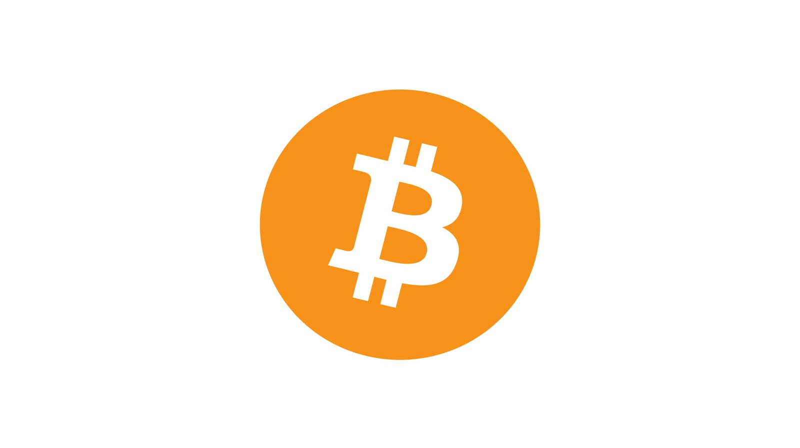
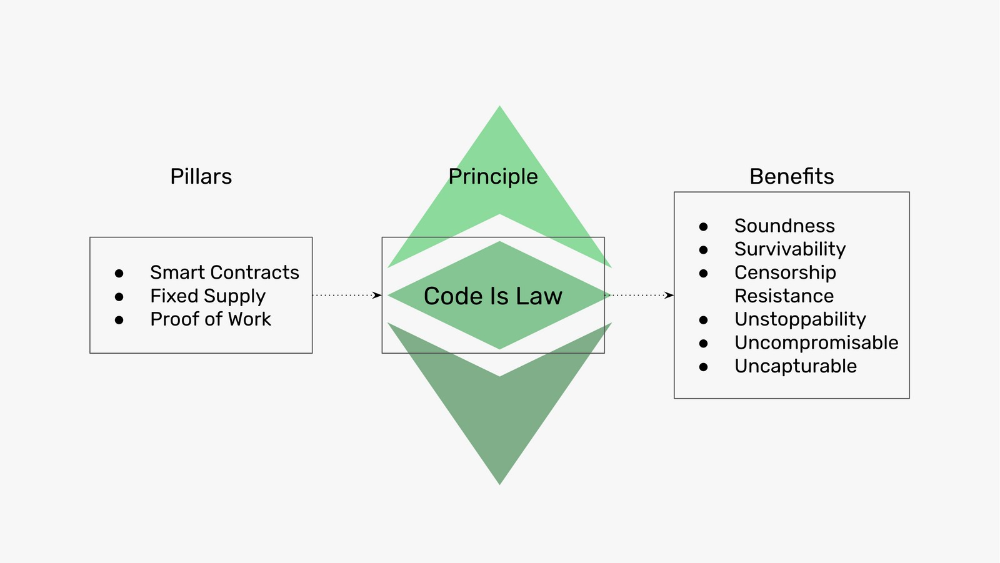

---
**You can listen to or watch this video here:**

<iframe width="560" height="315" src="https://www.youtube.com/embed/3gtE4z3NFaI" title="YouTube video player" frameborder="0" allow="accelerometer; autoplay; clipboard-write; encrypted-media; gyroscope; picture-in-picture" allowfullscreen></iframe>

---

## Satoshi Nakamoto

Satoshi Nakamoto had such knowledge and focus on the same principles as Cypherpunks that it is very likely he was one.

It is important to note that the fact that he used a pseudonym was very common among Cypherpunks. Ever since they had started working on cryptography and building systems for privacy, non-government money, and self sovereignty in the 1980s they had been frequently investigated, restricted, and surveilled by authorities.

In October of 2008, Satoshi released the Bitcoin white paper and in January of 2009 he launched the Bitcoin network.

## Bitcoin

The structure and service that Bitcoin provides is very simple. It is a ledger with accounts and balances and users may send new transactions to move money from one account to another.

That’s it. Nothing more!

However, this simplicity must not undermine the enormous feat it was. Only comparable to the invention of the internet or the printing press.

In the next sections we will explain how it works, what it accomplished, and what are the implications for Ethereum Classic.

## Full Transmission and Full Replication

Although not an innovation of Bitcoin, one of the main principles of the system is that all data must be fully transmitted and fully replicated in all the nodes of the network.

Full transmission and full replication provide the most assurance of uptime and redundancy.

The way it works is that each time a transaction is sent, it is re-transmitted by all nodes to all other nodes participating in the network so they can keep a replicated copy. This includes miners, who then proceed to build and stamp batches of data with these transactions.

## Proof of Work

The batches of data in the database of Bitcoin are called blocks and they are also fully transmitted and replicated:

When miners receive the transactions, they package them into blocks every ten minutes and then stamp them with a cryptographic function called a hash.

These hashes or stamps require enormous amounts of work and consumption of electricity for computers to generate them. This is why the process is called “mining”.

Once the miners hash the blocks of transactions, then they send them back to the rest of the network for verification and full transmission and replication.

Once verified, the blocks are included as the next batch of transactions by all nodes in their local databases, forming a chain of blocks, hence the term blockchain.

## Fixed Monetary Policy

The way Bitcoin is issued and distributed is by paying miners a reward for doing all the required work while spending enormous amounts of electricity.

When a block is verified, a preset amount of Bitcoin is created and credited to the account of the miner.

The rewards schedule per block every ten minutes determines the supply of Bitcoin, and it was preset in periods of four years, where the payment per block has been decreasing by 50% in each period.

So, from 2009 to 2012, the payment was 50 bitcoins per block every ten minutes, four years later it was 25, then 12.50, 6.25, 3.125…and so on.

This schedule guarantees that there will only be 21,000,000 bitcoins created by the year 2140 and no more will ever exist.

## Security Model

Proof of work provided an unprecedented level of security never seen before in computer science because of these four characteristics:

**1. The cost of creating blocks is equal to the cost of creating the currency:** As seen above, the rewards are paid to miners only if they do the work required to hash blocks, therefore the cost of creating blocks is the same as creating the money.

**2. Enables consensus between all computers:** Because the only block that will be accepted as the next block by all machines in the network will be the one that has all the work done, then it is very easy for all nodes to decide on the same exact block every 10 minutes. Any block sent by imposters that did not do the work will always be eliminated.

**3. Focal point for entry, exit, and reentry:** The same information, the great amount of work done by miners, that assures perfect consensus every ten minutes between all machines in the system, is the one that may be used by any new entrant into the system, or any machine that leaves and then wants to enter again, to know which is the correct chain of blocks just by verifying that the work was done. Any imposter chains that did not do the work will always be eliminated.

**4. Protection of all the history of transactions:** For any transaction that has been sent and included in a block in Bitcoin to be reversed or deleted the same amount of work that was done for its inclusion must be done again. This prevents any attacker from reversing past transactions, and the older a transaction is the more difficult it is reverse or delete.

## Nakamoto Consensus

The system invented by Satoshi Nakamoto is called Nakamoto Consensus and includes all the components described above:

1. Full transmission 
2. Full replication
3. Proof of work
4. Block production
5. Fixed supply

And, all these combined assure the immutability and security of the blockchain.

## What Does it Accomplish?

As said before, Nakamoto Consensus accomplishes a level of safety and security of the system never reached before while keeping it decentralized.

This makes it trust minimized, meaning that users may interact directly between themselves in a peer-to-peer way, sending and receiving money, without the need of trusted third parties, who may be captured by special interests, restricting freedom and human action.

Just as the internet, Bitcoin is designed to survive a nuclear war, and, on top of that, it assures hard money for the internet.

## Implications for Ethereum Classic

Ethereum Classic uses the same consensus mechanism as Bitcoin. However, ETC adds to the base technology of Bitcoin the ability to store and execute smart contracts or decentralized programs. This turns applications in ETC into decentralized applications which execute their code inside the highly secure environment of the blockchain. 

So, ETC has the same two base pillars as Bitcoin; a fixed supply and the proof of work based consensus mechanism; but to that it added smart contracts. This makes ETC’s principle of Code Is Law a true statement. Therefore, ETC gives money and applications the benefits of soundness, survivability, censorship resistance, unstoppability, and they are uncompromisable and uncapturable.

---

**Thank you for reading this article!**

To learn more about ETC please go to: https://ethereumclassic.org
