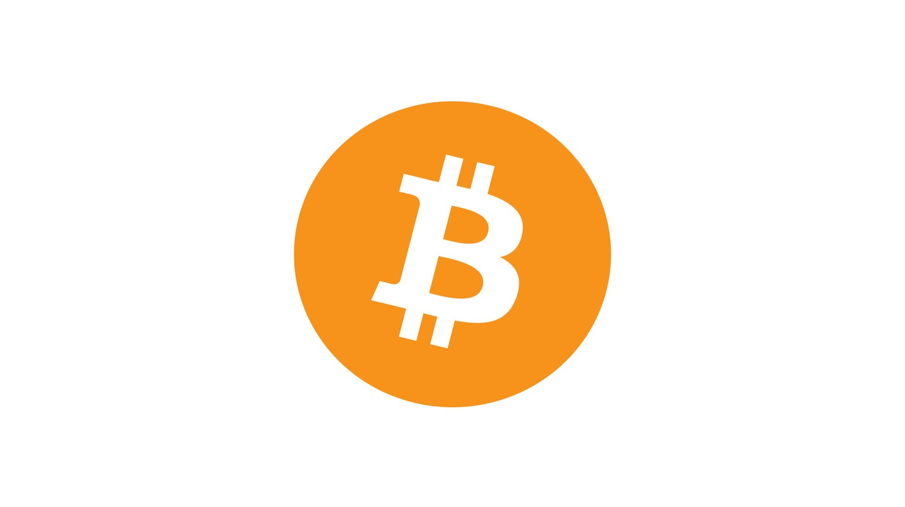
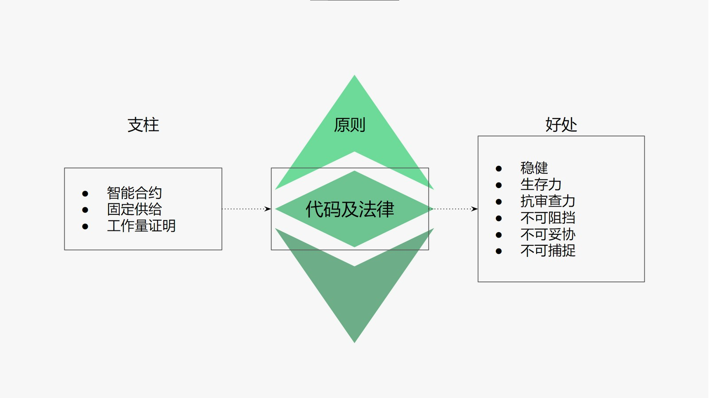

---
**由此收听或观看本期内容:**

<iframe width="560" height="315" src="https://www.youtube.com/embed/3gtE4z3NFaI" title="YouTube video player" frameborder="0" allow="accelerometer; autoplay; clipboard-write; encrypted-media; gyroscope; picture-in-picture" allowfullscreen></iframe>

---

## 中本聪（Satoshi Nakamoto）

中本聪拥有知识并专注于与密码朋克相同的原则，他很可能就是其中之一。

值得注意的是，他使用的假名在密码朋克中非常常见。自从他们在20世纪80年代开始研究密码学并建立隐私、非政府资金和主权系统以来，他们就经常受到当局的调查、限制和监视。

2008年10月，Satoshi发布了比特币白皮书，并于2009年1月推出了比特币网络。

## 比特币

比特币提供的结构和服务非常简单。它是一个有账户和余额的分类账，用户可以发送新的交易，将资金从一个账户转移到另一个账户。

仅此而已，没有更多。

然而，这种简单不能破坏它的伟大成就。只能与互联网或印刷机的发明相比。

在下一节中，我们将解释它是如何工作的，它完成了什么，以及对以太坊经典的影响。

## 全传输和全复制

虽然不是比特币的创新，但该系统的一个主要原则是，所有数据必须在网络的所有节点中完全传输和完全复制。

全传输和全复制提供了正常运行时间和冗余的最大保证。

它的工作方式是，每次发送一个事务时，它被所有节点重新传输到参与网络的所有其他节点，以便它们可以保持一个复制副本。这包括挖矿者，他们接着使用这些交易构建和标记批量数据。

## 工作量证明

比特币数据库中的批量数据称为区块，也是完全传输和复制的:

当矿工接收到交易时，他们每隔十分钟将交易打包成块，然后用一种称为哈希的加密函数戳记它们。

这些散列或戳记需要大量的工作和电力的消耗，以使计算机生成它们。这就是为什么这个过程被称为“挖掘”。

一旦矿工对交易块进行散列，然后将它们发送回网络的其他部分进行验证，并进行完整的传输和复制。

一旦经过验证，这些块将被本地数据库中的所有节点作为下一批事务包含进来，形成一个块链，因此术语为：区块链。

## 固定货币政策

比特币的发行和分发方式是向矿工支付报酬，让他们在消耗大量电力的同时完成所有所需的工作。

当一个区块被验证后，就会创建预设数量的比特币，并记入矿工的账户。

每十分钟每个区块的奖励计划决定了比特币的供应，它以四年为周期进行预设，每个周期每个区块的支付都减少了50%。

所以，从2009年到2012年，每10分钟支付一个区块，也就是50个比特币。四年后是25，然后是12.50,6.25,3.125……

这个时间表保证到2140年只会有2100万个比特币被创造出来，并且不会有更多的比特币存在。

## 安全模型

工作证明提供了前所未有的安全级别，这在计算机科学中从未见过，因为有以下四个特点:

**1.创建区块的成本等于创建货币的成本:** 如上所示，只有矿工做了散列区块所需的工作，奖励才会付给他们，因此创建区块的成本和创建货币的成本是一样的。

**2.使所有计算机之间达成一致:** 因为网络中唯一被所有计算机接受作为下一个块的块将是完成所有工作的块，那么对于所有节点来说，每10分钟决定一个相同的块是非常容易的。任何由冒名顶替者发送的不做工作的区块将总是被消除。

**3.进入，退出，再进入的焦点:** 保证系统中所有机器之间每十分钟完全一致的相同信息、由矿工完成的大量工作，是任何新的进入系统的人可能使用的信息，或任何离开然后想要再次进入的机器通过已完成的验证工作来知道哪一个是正确的区块链。任何冒充者链，没有做的工作将永远被消除。

**4.所有交易历史的保护:** 对于任何已经发送并包含在比特币区块中的交易，要被逆转或删除，必须重新做相同数量的工作。这可以防止任何攻击者逆转过去的事务。而且越早的事务越难以逆转或删除。

## 中本聪共识
中本聪发明的系统被称为中本共识(Nakamoto Consensus)，包括以下内容:

1. 完全传输
2. 完全复制
3. 工作量证明
4. 区块生产
5. 固定供给

这些共同保证了区块链的不变性和安全性。

## 它完成了什么？

如前所述，中本共识在保持去中心化的同时，实现了系统之前从未达到的安全和保障水平。

这使得信任最小化，意味着用户可以通过点对点的方式直接互动，发送和接收金钱，而不需要信任的第三方。因为第三方可能会被特殊利益捕获，限制自由和人类行为。

就像互联网一样，比特币的设计初衷是在核战争中生存下来，最重要的是，它为互联网提供了硬通货。

## 对以太坊经典的影响

以太坊经典使用与比特币相同的共识机制。然而，ETC为比特币的基础技术增加了存储和执行智能合约或去中心化程序的能力。这将ETC中的应用程序变成分散的应用程序，在区块链的高度安全环境中执行它们的代码。

所以，ETC和比特币有相同的两个基础支柱;固定供给和工作证明的协商一致机制;除此之外，它还添加了智能合约。这使得ETC的“代码即法律”原则是一个真实的陈述。因此，ETC赋予金钱和应用程序健全力、生存力、抗审查力、不可阻挡等好处，它们是不可妥协和不可捕捉的。

---

**感谢您阅读本期文章!**

想了解更多有关ETC的内容，请访问： https://ethereumclassic.org
