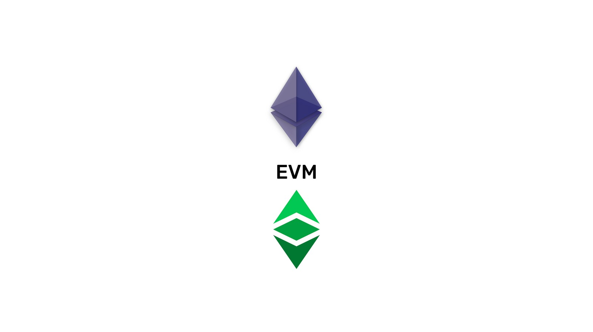
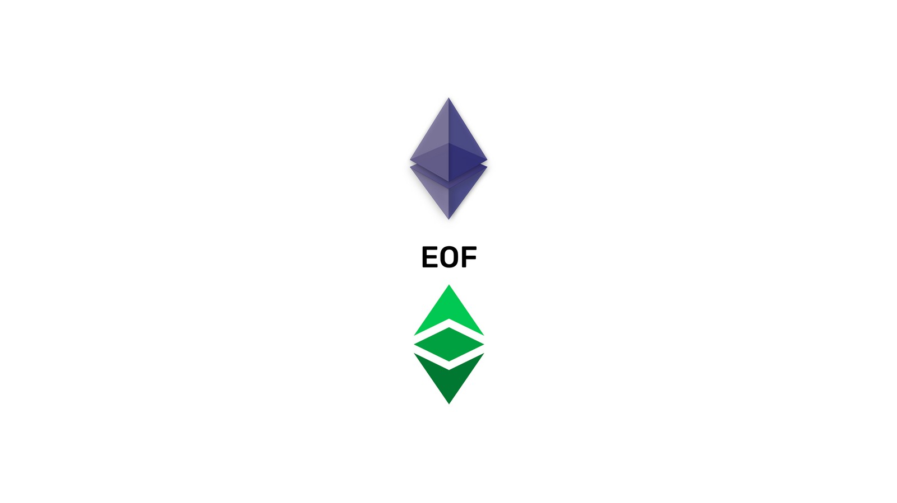
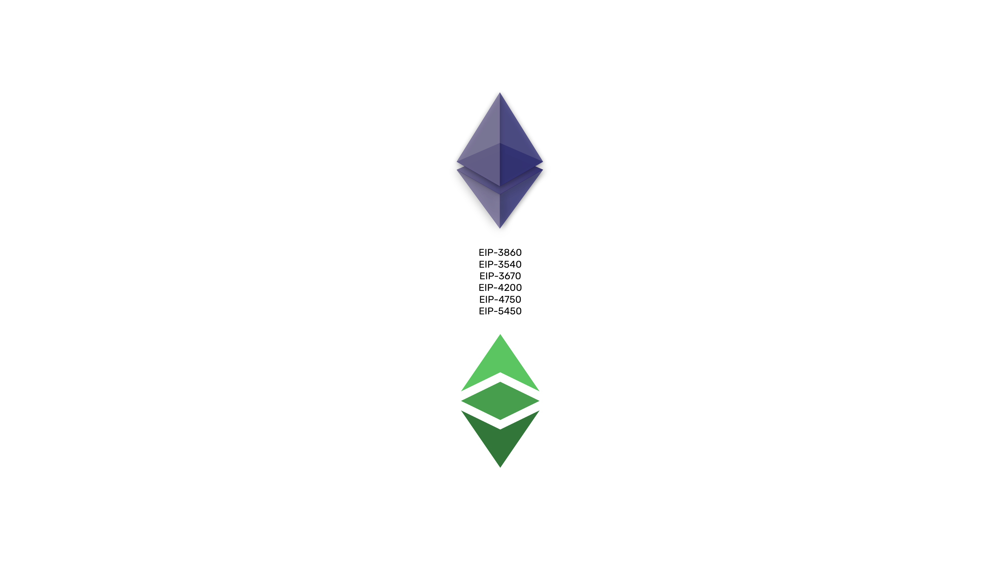
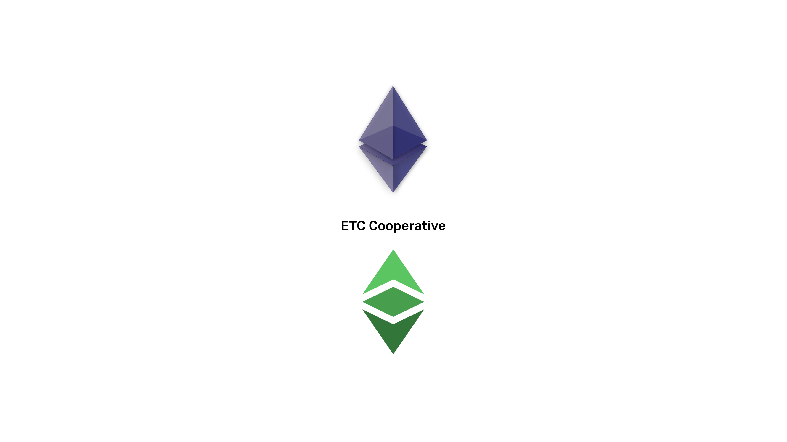

---
**You can listen to or watch this video here:**

<iframe width="560" height="315" src="https://www.youtube.com/embed/3R0KNvEYI9o" title="YouTube video player" frameborder="0" allow="accelerometer; autoplay; clipboard-write; encrypted-media; gyroscope; picture-in-picture; web-share" allowfullscreen></iframe>

---

## The EVM Needs an Upgrade

Ever since the launch of the Ethereum network in 2015, one of its most important components, the Ethereum Virtual Machine (EVM) has hardly ever been upgraded.

The EVM is a software component of all EVM compatible blockchains, including Ethereum Classic (ETC), that contains more than 120 operation codes (opcodes), which provide decentralized programmability to the networks.

Through all these years there have been several improvement proposals to upgrade the EVM, but in general they have always been set aside to prioritize other goals such as the migration of Ethereum to proof of stake.

However, now that the merge to proof of stake has already occurred in that network, the EVM upgrades are being included in the next set of improvements.

## The EVM Object Format (EOF)

The EVM Object Format (EOF) is a group of improvement proposals that have accumulated over the years, but that together form a consistent and logically sound upgrade for the Ethereum Virtual Machine.

Improvement proposals, called “Ethereum Improvement Proposals”, or EIPs for short, are formally structured documents that put forward ideas to the Ethereum ecosystem at large, of which Ethereum Classic is part, to make the system better from different technical standpoints.

These EIPs together will completely change for the better the way the EVM works, and all blockchains who wish to be compatible with the general EVM standard, such as ETC, need to follow these changes.

The motivations for these proposals are to solve some inefficiencies, high execution costs, and security issues in the current design.

## EIPs Included in EOF

The six EIPs included in the EOF upgrade are the following (summaries for each EIP were extracted from the improvement proposals themselves):

- [EIP-3860](https://eips.ethereum.org/EIPS/eip-3860): It limits the maximum size of initcode to 49152 and applies extra gas cost of 2 for every 32-byte chunk of initcode. 

- [EIP-3540](https://eips.ethereum.org/EIPS/eip-3540): An extensible and versioned container format for the EVM with a once-off validation at deploy time. The version described here brings the tangible benefit of code and data separation, and allows for easy introduction of a variety of changes in the future.

- [EIP-3670](https://eips.ethereum.org/EIPS/eip-3670): Introduces code validation at contract creation time for EOF formatted (EIP-3540) contracts. Rejects contracts which contain truncated PUSH-data or undefined instructions. Legacy bytecode (code which is not EOF formatted) is unaffected by this change.

- [EIP-4200](https://eips.ethereum.org/EIPS/eip-4200): Three new EVM jump instructions are introduced (RJUMP, RJUMPI and RJUMPV) which encode destinations as signed immediate values. These can be useful in the majority of (but not all) use cases and offer a cost reduction.

- [EIP-4750](https://eips.ethereum.org/EIPS/eip-4750): Introduces the ability to have several code sections in EOF-formatted (EIP-3540) bytecode, each one representing a separate subroutine/function. Two new opcodes, CALLF and RETF, are introduced to call and return from such a function. Dynamic jump instructions are disallowed.

- [EIP-5450](https://eips.ethereum.org/EIPS/eip-5450): Introduces extended validation of code sections to guarantee that neither stack underflow nor overflow can happen during execution of validated contracts.

## When Are the EOF Upgrades Expected to Happen?

The Ethereum mainnet ecosystem has two upgrades, also called hard forks, programmed for 2023 and the EIPs for EOF will be included in the first one, called Shanghai, which is aimed to be performed in March of 2023.

Again, the EIPs included in this hard fork include:

- EIP-3860 “Limit and meter initcode”
- EIP-3540 “EVM Object Format v1”
- EIP-3670 “Code Validation”
- EIP-4200 “Static relative jumps”
- EIP-4750 “Functions”
- EIP-5450 “Stack Validation”

This means that, if everything goes according to plan, the Ethereum network EVM will be fully upgraded by the first half of 2023 and that the Ethereum Classic blockchain will be totally compatible with the new EVM standard specifications by the second half of 2023, as it usually waits from 3 to 6 months to follow new upgrades for security reasons and because it is a more conservative blockchain. 

## ETC Cooperative’s Contribution to EOF

The ETC Cooperative is a non-profit organization that is dedicated to supporting the Ethereum Classic network. One of its functions is to maintain and upgrade the protocol and software clients of ETC: Core Geth, Hyperledger Besu, and Erigon for ETC.

The core developers who perform these tasks are Isaac Ardis and Chris Ziogas (Core Geth and Erigon for ETC), and Diego López León (Hyperledger Besu).

The contribution of the ETC Cooperative to the EOF project is that core developers Isaac Ardis and Chris Ziogas will help in the upgrade process of the Erigon software client, the upstream master branch of the Erigon for ETC client, and Diego López León will help in the upgrade of Hyperledger Besu, the master branch of the client that works with ETC.

The benefit to Ethereum Classic is that it will necessarily inherit the EOF upgrades as Erigon for ETC is a downstream client to Erigon that will stay compatible with the EVM standard, and Hyperledger Besu supports the ETC network in its master branch.

An additional contribution of the ETC Cooperative to the EOF upgrade is that it will be helping the Vyper team through contracts with engineers Charles Cooper and Harry Kalogirou. 

Vyper is an alternative smart contract language, so this is another path for testing EOF.

## Expected Results of the EOF Upgrade

According to Bob Summerwill, ETC Cooperative’s executive director, EOF is basically adding structure and versioning around the bytecode which was missing in the EVM before. 

EOF helps in implementing future upgrades without breaking backwards compatibility, and also adds better up-front analysis at compile time.

In other words, it will make the system cheaper, faster, and safer.

Smart contract authors will see no difference in their work - just that the compiler output will get better and will cost less gas.

It is one of the very few EVM changes which Summerwill thinks is a “must have” prior to considering progress ossification of the ETC protocol.

## Conclusion

The original design goals of the EVM were simplicity, reduction of ambiguity in the specification, space saving, specialization to expected use cases, high security, and optimization friendliness.

It has been amazing that to a great degree all these goals have been met. However, some problems have emerged and been identified over the years, and several proposals had been put forward, but delayed in time.

The solution are the EOF upgrades and their accumulated EIPs.

This upgrade is certainly a major project and change in the industry.

---

**Thank you for reading this article!**

To learn more about the EOF upgrade please go to: https://notes.ethereum.org/@ipsilon/eof1-checklist

To learn more about ETC please go to: https://ethereumclassic.org
