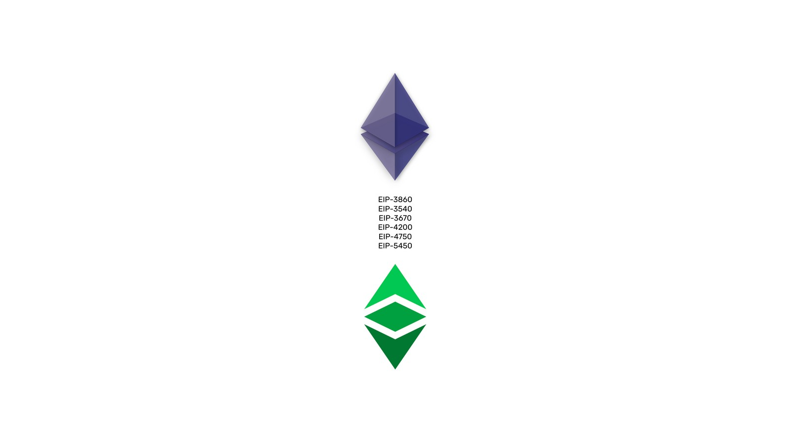

---
**欢迎由此收听或观看本期内容:**

<iframe width="560" height="315" src="https://www.youtube.com/embed/L3--VZDjRkY" title="YouTube video player" frameborder="0" allow="accelerometer; autoplay; clipboard-write; encrypted-media; gyroscope; picture-in-picture; web-share" allowfullscreen></iframe>

---

## 需升级的以太坊虚拟机EVM

自2015年以太坊网络推出以来，其最重要的组件之一以太坊虚拟机(EVM)几乎从未升级过。

EVM是所有兼容EVM的区块链的软件组件，包括以太坊经典(ETC)，包含超过120个操作代码(操作代码)，为网络提供去中心化的可编程性。

这些年来，已经有一些改进建议来升级EVM，但总的来说，它们总是被搁置在一边，优先考虑其他目标，比如将以太坊迁移到权益证明。

然而，现在在该网络中已经发生了对权益证明的合并，EVM升级将包含在下一组改进中。

## EVM对象格式(EOF)

EVM对象格式(EOF)是一组多年积累的改进建议，但它们共同构成了以太坊虚拟机一致且逻辑合理的升级。

改进建议，称为“以太坊改进建议”，或简称为EIP，是正式的结构化文件。为从不同技术角度完善系统，它向以太坊生态系统提出想法，以太坊经典是其中的一部分。

这些EIP一起将完全改变EVM的工作方式，所有希望与一般EVM标准兼容的区块链，如ETC，都需要遵循这些变化。

这些建议的动机是解决当前设计中的一些低效率、高执行成本和安全问题。

## EIP包含在EOF中

六个EIP被认为是EOF升级的一部分，如下所示(每个EIP的摘要摘自改进建议本身):

- [EIP-3860](https://eips.ethereum.org/EIPS/eip-3860):它将initcode最大的大小限制为49152，并为每个32字节的initcode块应用额外增加2的矿工成本。

- [EIP-3540](https://eips.ethereum.org/EIPS/eip-3540):用于EVM的可扩展和版本控制的容器格式，在部署时进行一次性验证。这里描述的版本带来了代码和数据分离的实际好处，并允许在未来轻松引入各种更改。

- [EIP-3670](https://eips.ethereum.org/EIPS/eip-3670):引入EOF格式(EIP-3540)合约创建时的代码验证。拒绝包含截断的PUSH-数据或未定义指令的契约。遗留字节码(非EOF格式的代码)不受此更改的影响。

- [EIP-4200](https://eips.ethereum.org/EIPS/eip-4200):引入了三个新的EVM跳转指令(RJUMP、RJUMPI和RJUMPV)，它们将目的地编码为带符号的即时值。这些在大多数(但不是所有)用例中都有用，并且可以降低成本。

- [EIP-4750](https://eips.ethereum.org/EIPS/eip-4750):引入了在EOF格式(EIP-3540)字节码中拥有多个代码段的能力，每个代码段表示一个单独的子例程/函数。引入了CALLF和RETF两个新的操作码来调用和返回这样的函数。不允许动态跳转指令。

- [EIP-5450](https://eips.ethereum.org/EIPS/eip-5450): 引入了代码段的扩展验证，以保证在执行经过验证的契约期间不会发生堆栈下溢或溢出。

## EOF升级会在什么时候开始？

以太坊主网生态系统有两个升级，也称为硬分叉，为2023年在上海和坎昆的编程。EOF的EIP可能会包括在第二个在坎昆的升级中，其目标是在2023年下半年执行。

同样，可能包含在这个硬分叉中的EIP是:

- EIP-3860“限制和仪表初始化代码”
- EIP-3540“EVM对象格式v1”
- EIP-3670“代码验证”
- EIP-4200“静态相对跳跃”
- EIP-4750“功能”
- EIP-5450“堆栈验证”

这意味着，如果一切按计划进行，以太坊网络EVM将在2023年底全面升级，以太坊经典区块链将在2024年上半年与新的EVM标准规范完全兼容，因为出于安全原因，它通常需要等待3到6个月才能进行新的升级，而且因为它是一个更保守的区块链。

## ETC合作社对EOF的贡献

ETC合作社是一个非营利性组织，致力于支持以太坊经典网络。其功能之一是维护和升级ETC的协议和软件客户端:Core Geth, 超级账本Hyperledger Besu和Erigon ETC。

执行这些任务的核心开发人员是Isaac Ardis和Chris Ziogas(ETC的Core Geth和Erigon)，以及Diego López León (超级账本Hyperledger Besu)。

ETC合作对EOF项目的贡献在于，核心开发人员Isaac Ardis和Chris Ziogas将帮助Erigon软件客户端(Erigon for ETC客户端的上游主分支)的升级过程，Diego López León将帮助与ETC合作的客户端主分支Hyperledger Besu的升级。

以太坊经典的好处是，它将必然继承EOF升级，因为Erigon for ETC是Erigon的下游客户端，将与EVM标准保持兼容，Hyperledger Besu在其主分支中支持ETC网络。

ETC合作公司对EOF升级的另一个贡献是，它将通过与工程师Charles Cooper和Harry Kalogirou的合同帮助Vyper团队。

Vyper是另一种智能合约语言，因此这是测试EOF的另一种途径。

## EOF升级后的可见改变

根据ETC合作社的执行董事Bob Summerwill的说法，EOF基本上是在字节码周围添加结构和版本，这是以前EVM中所缺少的。

EOF有助于在不破坏向后兼容性的情况下实现未来的升级，还在编译时增加了更好的预先分析。

换句话说，它将使系统更便宜、更快、更安全。

智能合约作者在他们的工作中不会看到任何不同——只是编译器的输出将变得更好，将花费更少的矿工费。

这是极少数的EVM变化之一，Summerwill认为在考虑ETC协议的进展僵化之前，这是“必须的”升级。

## 总结

EVM最初的设计目标是简单、减少规范中的歧义、节省空间，对预期用例专门化，并有高安全性和优化友好性。

令人惊讶的是，所有这些目标在很大程度上都得到了实现。但是，多年来出现和确定了一些问题。有几项建议被提出，但被及时推迟。

解决方案是EOF升级及其累积的EIP。

这次升级无疑是行业的重大项目和变革。

---

**感谢您阅读本期文章!**

了解有关EOF升级的更多内容，请访问: https://notes.ethereum.org/@ipsilon/eof1-checklist

了解有关以太坊经典的更多内容，请访问: https://ethereumclassic.org
