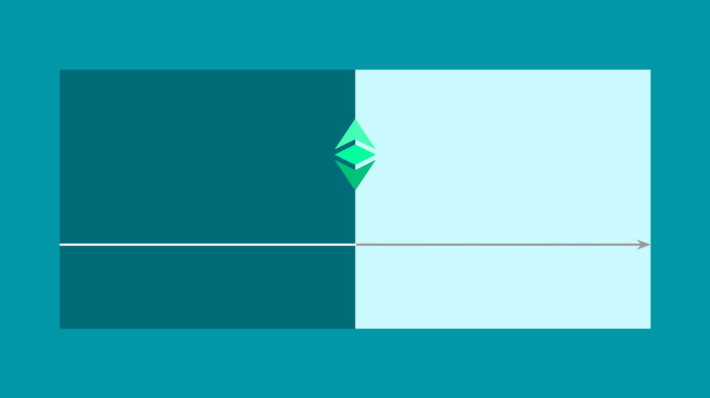

---
**You can listen to or watch this video here:**

<iframe width="560" height="315" src="https://www.youtube.com/embed/7D613eZK3s4" title="YouTube video player" frameborder="0" allow="accelerometer; autoplay; clipboard-write; encrypted-media; gyroscope; picture-in-picture" allowfullscreen></iframe>

---

Before the existence of Ethereum Classic, applications were stoppable. After the existence of Ethereum Classic, applications hosted inside it became unstoppable.

The reason for this is that the invention brought by Bitcoin, Nakamoto Consensus, solved the problem of peer-to-peer networks. The problem was that they could be disrupted with just one third of the participating nodes colluding to attack it. 

Nakamoto Consensus raised this threshold to one half.

Not only that, but the proof of work in Nakamoto Consensus added even more barriers to just collusion. Proof of work meant that the colluding participants needed have the necessary computing power to create blocks faster than the rest of the computing base in the system.

Another barrier to attacking the network imposed by proof of work based Nakamoto Consensus was that the colluding attackers would have to consume enormous amounts electricity.

Before Nakamoto Consensus attackers only needed 33% of participating nodes to disrupt a network, and there was no need to have powerful computers nor to use any significant amount of electricity. 

After Nakamoto Consensus, not only did they need to convince 51% of participants, but also needed to have an enormous computing base and burn enormous amounts of electricity to do it.

However, because of technical difficulties, Bitcoin does not host applications inside its highly secure environment. But, Ethereum Classic does. 

This is what makes ETC so different and powerful.

Ethereum Classic has the technologies and systems that existed before; full transmission of the data and full replication of the database in all nodes of the peer-to-peer network; and it uses the first key innovation of Bitcoin; proof of work based Nakamoto Consensus; to keep the system coordinated and secure.

On top of this, ETC adds the second and only other major innovation that existed in the industry: Smart contracts.

In other words, Nakamoto Consensus and smart contracts are the only two innovations of the industry and Ethereum Classic has both.

The key to making applications in Ethereum Classic unstoppable is precisely that they are hosted inside its highly secure environment.

Smart contracts are software programs that power applications, and when they are sent to ETC they are retransmitted and replicated in all the nodes of the system. This makes these applications decentralized, hence their name “decentralized applications” or “dapps”.

The unstoppability of dapps is accomplished by this decentralization, because it produces resistance to censorship, permissionlessness, and immutability.

Decentralization is accomplished by the proof of work component of the system. Proof of work makes it very easy for all nodes in the network to know which is the correct chain of blocks just by checking whether the work was done.

This is because if imposters were to send alternative blocks without such work done, then it would be very easy to discard them. And, to build such large computing base to compete with the existing one is extremely difficult.

The same information of the proof of work that serves to reach consensus on the correct chain is also used to exit and re enter the chain, or to join the network for the first time. When any nodes want to join or re enter they only have to check which chain has the most work done to know, in their complete isolation, without checking with any other source in the universe, that that is the correct blockchain to join.

This ability to run Ethereum Classic nodes or miners, and to send transactions without any need to check with others, without any supervision, is what makes it censorship resistant and permissionless.

Immutability is accomplished by the sheer amounts of work and electricity needed to change or alter the blockchain. 

Proof of work not only protects the data of the current block being processed, but also the whole history of the database. 

In fact, the older a transaction or a dapp gets, the more difficult it is to alter it. 

This is because any attacker would not only need to change the current block but the whole history of blocks, re doing all the work again and burning all the needed electricity again, to be able to make any changes to past transactions or dapps.

The only new inventions of the blockchain industry are Nakamoto Consensus and smart contracts, and both combined in Ethereum Classic produce unstoppable applications.

This is the revolutionary paradigm change in the world. Nothing more.

All the other gimmicks such as proof of stake, scalability, sharding of the database, and channels, which are hot buzzwords in the industry that only serve to suck the money of gullible investors and traders, already existed before and are widely used in centralized traditional industries.

The banking industry, for example, is a proof of stake system: There is a central authority that creates a protocol which says that to participate, banks need to make a deposit in the form of minimum capital. 

Computational scalability already exists in the world with cloud services and large data centers that enable companies like Visa to process billions of transactions per day.

All this scalability in traditional systems is only accomplished with centralization: They all use sharding to break up the database so they can produce inputs and outputs faster and in parallel. They all use channels as all systems are layered, where the top layers handle large numbers of transactions and then accumulate and net out the results to send them to the lower layers.

This was all invented before and are hallmarks of centralized systems as they depend on trusted third parties to run them.

The only true innovation is the unstoppability of applications, and the only system that possesses that is Ethereum Classic.

---

**Thank you for reading this article!**

To learn more about ETC please go to: https://ethereumclassic.org
