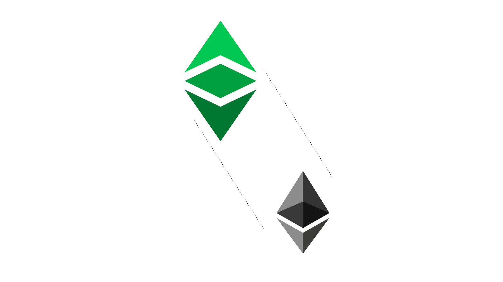
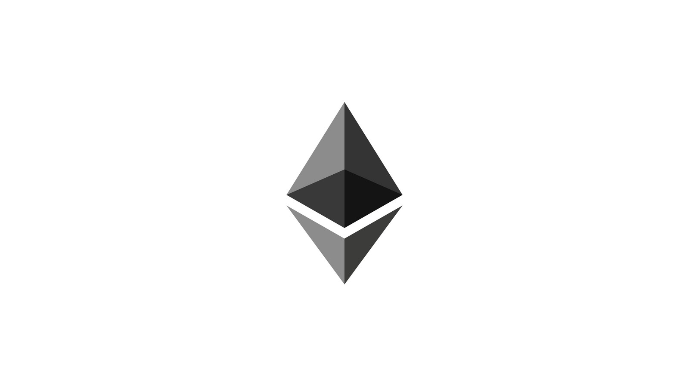

---
**You can listen to or watch this video here:**

<iframe width="560" height="315" src="https://www.youtube.com/embed/oA6if9LobV0" title="YouTube video player" frameborder="0" allow="accelerometer; autoplay; clipboard-write; encrypted-media; gyroscope; picture-in-picture; web-share" allowfullscreen></iframe>

---

## Vitalik Buterin Is the Founder of Ethereum Classic

Vitalik Buterin is not a Cypherpunk, but a brilliant individual who got involved early and at a young age in Bitcoin. Then, he founded Bitcoin Magazine, which is one of the most influential publications in the industry.

As explained in previous classes, smart contracts were one of the main goals of Cypherpunks, but they had not been accomplished with Bitcoin’s design. 

In late 2013, Mr. Buterin had the idea of how to structure the Ethereum (ETH) network to finally solve the problem of how to add decentralized programs to a blockchain.

It may sound counterintuitive because the industry has been misinformed for a long time, but Ethereum Classic (ETC) is actually the original and real Ethereum network founded by Mr. Buterin.

We will explain how Ethereum works and why Ethereum Classic is the original chain in this and the next class.

## Ethereum

Ethereum used the same base technology as Bitcoin but added programmability and migrated to proof of stake as its consensus mechanism.

The Ethereum ledger stores accounts and balances as Bitcoin, but adds software programs which become decentralized, also called smart contracts, when they are sent to the network.

To accomplish this it has 4 major components:

- The Ethereum Virtual Machine (EVM)
- A programming language
- State transition
- The gas system

## The Ethereum Virtual Machine (EVM)

The EVM is a software component that behaves like a computing machine. As part of the node software, it is replicated in all machines in the network, therefore it’s a decentralized virtual machine.

The way it works is that it has over 120 computing operation codes, or opcodes for short, that together provide near full computability.

Because node software clients may be installed in many kinds of computers with diverse operating systems, the EVM enables nodes to operate in their local environments with their local machines, and at the same time interact with the global network of blockchain nodes with a single and compatible computing standard.

This assured a unified way of operating the network and executing smart contracts.

## A Programming Language

For software programs to be sent and stored in the network, and executed by the EVM, there had to be some programming languages that would be compatible and adapted for a blockchain environment.

Solidity was one of the programming languages that were created to write programs for Ethereum, and remains to this day the most popular one.

It is syntactically similar to JavaScript, which is widely used by many developers around the world, but it is adapted so it may work on a decentralized peer-to-peer setting.

## State Transition

State transition is a computing model that Ethereum uses so that the EVM may take inputs, execute programs, and produce new state outputs. This is done on a per block basis.

Bitcoin, in contrast, does not have state transition as account balances are calculated by netting out all the history of transactions that point to each account.

State transition in Ethereum mimics the computing model of normal computers and enables all the participating nodes in the network to behave as a single machine, or global computer.

## The Gas System

Basically, the 120 plus opcodes that work with the EVM have a specific cost in a unit called gas to be executed. When users send their transactions, they need to pay for the corresponding gas for miners to execute them.

This payment serves as compensation to miners and imposes a cost per transaction, which reduces spam significantly.

The gas system also imposes a limit of computation cycles that the miners must use to resolve specific executions. If this limit is reached without results, then miners must stop and return the money to users. This solves what is called the halting problem, which is when machines get stuck when trying to resolve a computation.

## What Does Ethereum Accomplish?

As said before, smart contracts were a major goal for Cypherpunks.

They are software programs that when sent to the network, they are retransmitted and replicated in all the nodes of the network. This makes them decentralized software programs.

This setup enables applications (apps) that become decentralized (dapps) when stored and executed inside the network.

Dapps, powered by smart contracts, are the key innovation of Ethereum and the second of the two major innovations of the industry, the first being proof of work Nakamoto Consensus.

## The Migration to Proof of Stake

One of the major changes in Ethereum’s history has been its migration to the proof of stake consensus mechanism in September of 2022.

Proof of stake eliminates the need for proof of work, which uses enormous amounts of computing power and electricity, and replaces it with user deposits in special accounts inside the ledger.

These deposits are called stakes and give their stakers the right to produce blocks, vote on them, and then include them in the blockchain. For this role, they get paid a reward per block.

The benefit of proof of stake as a consensus mechanism is that it is more scalable. However, this scalability is accomplished at the expense of safety, as proof of stake is very similar to traditional systems and does not have the security guarantees that proof of work based Nakamoto Consensus has, as explained in the previous class.

## Ethereum Classic Is the Original Ethereum

Ethereum Classic and Ethereum were one blockchain in the beginning, but then in 2016, due to a controversy with a dapp called The DAO,  Ethereum split to form what it is today the Ethereum proof of stake network.

Ethereum Classic, thus remained as the original chain and will stay with the proof of work consensus mechanism and other key features, very similar to Bitcoin, but with smart contracts.

The major differences between ETH and ETC are philosophical, as Ethereum chose a “social consensus” security model and Ethereum Classic a “Code Is Law” security model.

Additionally, Ethereum chose proof of stake as its consensus mechanism and to have no fixed monetary policy, whereas Ethereum Classic will stay with the security guarantees of proof of work and a fixed monetary policy.

Ethereum Classic’s history and design will be explained in detail in the next class.

---

**Thank you for reading this article!**

To learn more about Ethereum please go to: https://ethereum.org

To learn more about ETC please go to: https://ethereumclassic.org
