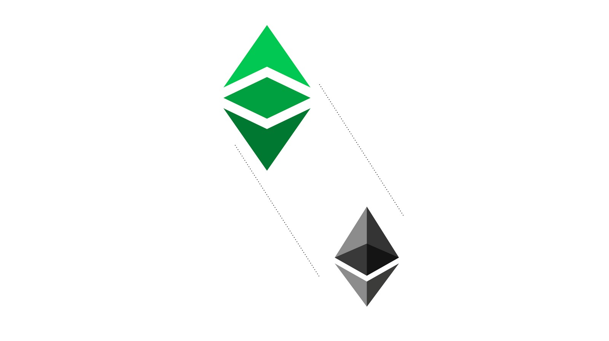
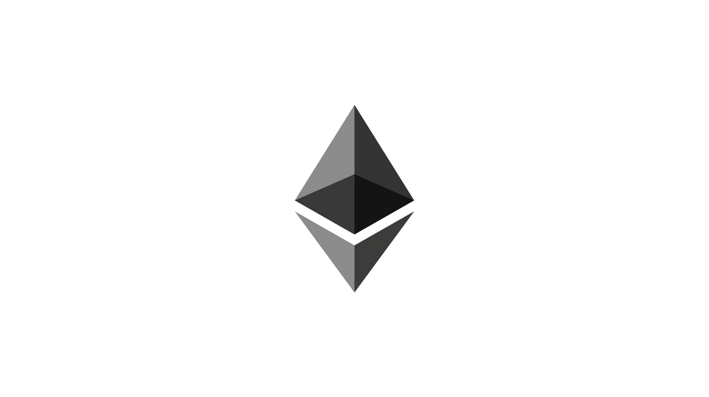
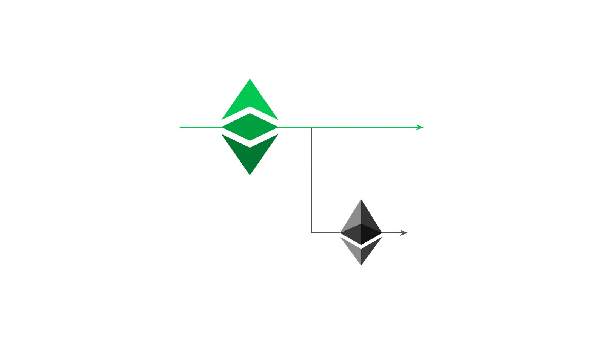

---
**You can listen to or watch this video here:**

<iframe width="560" height="315" src="https://www.youtube.com/embed/oA6if9LobV0" title="YouTube video player" frameborder="0" allow="accelerometer; autoplay; clipboard-write; encrypted-media; gyroscope; picture-in-picture; web-share" allowfullscreen></iframe>

---

## Vitalik Buterin是以太坊经典的创始人

Vitalik Buterin不是一个密码朋克，而是一个很早就参与比特币的聪明的人。随后，他创办了《比特币杂志》，这是业内最具影响力的出版物之一。

正如在之前的课程中所解释的，智能合约是密码朋克的主要目标之一，但在比特币的设计中还没有实现。

2013年底，Buterin先生有了如何构建以太坊(ETH)网络的想法，最终解决了如何将去中心化程序添加到区块链的问题。

这听起来可能违反直觉，因为业界长期以来一直被误导，但以太坊经典(ETC)实际上是由Buterin创建的原始和真实的以太坊网络。

我们将解释以太坊是如何工作的，以及为什么以太坊经典是这节课和下节课的原始链。

## 以太坊

以太坊使用了与比特币相同的基础技术，但增加了可编程性，并迁移到权益证明作为其共识机制。

以太坊账本以比特币的形式存储账户和余额，但添加了软件程序，当它们被发送到网络时，这些软件程序就会变得去中心化，也被称为智能合约。

要做到这一点，它有4个主要组成部分:

-以太坊虚拟机(EVM)
-一种名为Solidity的编程语言
-状态转换
-Gas(矿工费)系统

## 以太坊虚拟机(EVM)

EVM是一个像计算机一样工作的软件组件。作为节点软件的一部分，它被复制到网络中的所有机器中，因此它是一个去中心化的虚拟机。

它的工作方式是，它有超过120个计算操作代码，或简称操作码，一起提供了接近完全的可计算性。

由于节点软件客户端可能安装在具有不同操作系统的多种计算机中，因此EVM使节点能够在其本地环境中使用其本地机器进行操作，同时使用单一且兼容的计算标准与区块链节点的全球网络进行交互。

这确保了统一的网络操作和执行智能合约的方式。

## 一种编程语言

为了在网络中发送和存储软件程序，并由EVM执行，该软件程序必须有一种通用的和兼容的编程语言。

Solidity是为以太坊编写程序而创建的编程语言。

它在语法上类似于JavaScript，被世界各地的许多开发人员广泛使用，但它经过了调整，因此可以在分散的点对点设置上工作。

## 状态转换

状态转换是以太坊使用的一种计算模型，这样EVM就可以获取输入、执行程序并产生新的状态输出。这是在每个区块的基础上完成的。

相比之下，比特币没有状态转换，因为账户余额是通过扣除指向每个账户的所有交易历史来计算的。

以太坊中的状态转换模拟了普通计算机的计算模型，并使网络中的所有参与节点都能像一台机器或全局计算机一样运行。

## Gas(矿工费)系统

基本上，与EVM一起工作的120多个操作码在一个称为Gas的单元中有特定的执行成本。当用户发送他们的交易时，他们需要为矿工支付相应的gas(矿工费)来执行它们。

这笔付款作为对矿工的补偿，并征收每笔交易的成本，这大大减少了垃圾邮件。

Gas系统还限制了矿工必须用来解决特定执行的计算周期。如果达到这一限制而没有结果，那么矿工必须停止并将钱退还给用户。这解决了所谓的“暂停问题”，即机器在试图解决计算时卡住。

## 以太坊成就了什么？

如前所述，智能合约是密码朋克的主要目标。

智能合约是一种软件程序。当它们被发送到网络时，它们会被重传并复制到网络的所有节点中。这使得它们成为去中心化的软件程序。

这种设置使应用程序(Apps)在网络中存储和执行时变得去中心化(Dapps)。

由智能合约支持的Dapps是以太坊的关键创新，也是该行业两大创新中的第二项，第一个是工作证明中本共识。

## 权益证明的迁移

以太坊历史上的一个重大变化是它在2022年9月迁移到权益证明共识机制。

权益证明消除了工作量证明的需要。工作量证明使用了大量的计算能力和电力，取而代之的是用户在账本内的特殊账户中存款。

这些存款被称为股权，并赋予其股东生产区块的权利，对其进行投票，然后将其纳入区块链。对于这个角色，他们每个区块都会获得奖励。

权益证明作为一种共识机制的好处是它更具可延展性。然而，这种可延展性是以牺牲安全性为代价的。因为权益证明与传统系统非常相似，如前一节课所述，它并不具有基于中本共识的工作量证明所具有的安全保证。

## 以太坊经典是原始的以太坊

以太坊经典和以太坊一开始是一个区块链，但在2016年，由于一个名为the DAO的Dapp争议，以太坊分裂形成了今天的以太坊权益证明网络。

自此之后，以太坊经典保留了原始链，并将保留工作量证明共识机制和其他关键功能，非常类似于比特币，但具有智能合约。

ETH和ETC之间的主要区别是工作哲学上的区别。因为，以太坊选择了“社会共识”的安全模型，而以太坊经典选择了“代码即法律”的安全模型。

此外，以太坊选择权益证明作为其共识机制，并且没有固定的货币政策。而以太坊经典将保留工作量证明的安全保证和固定的货币政策。

以太坊经典的历史和设计将在下一节课中进行详细讲解。

---

**感谢您阅读本期文章!**

了解更多有关以太坊，请访问: https://ethereum.org

了解更多有关以太坊经典，请访问: https://ethereumclassic.org
