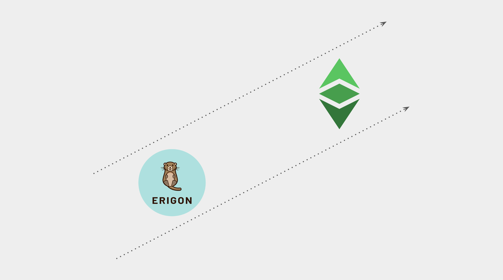
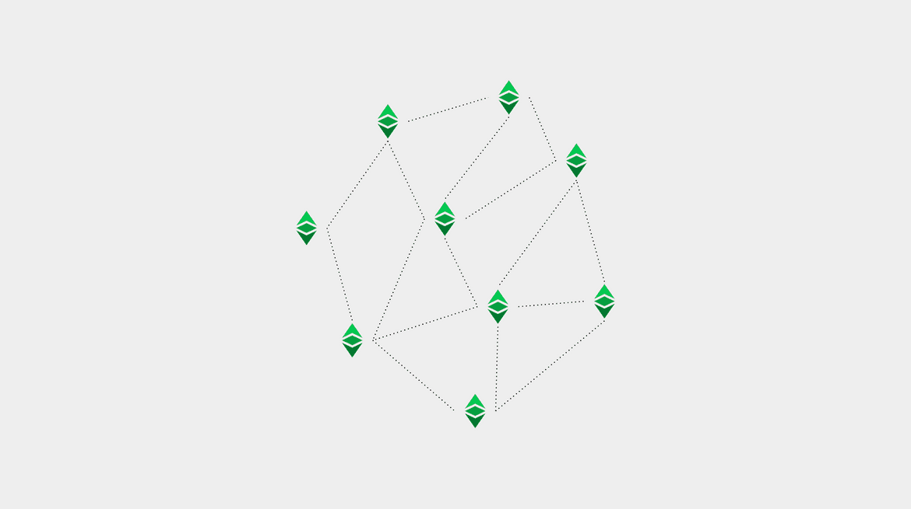
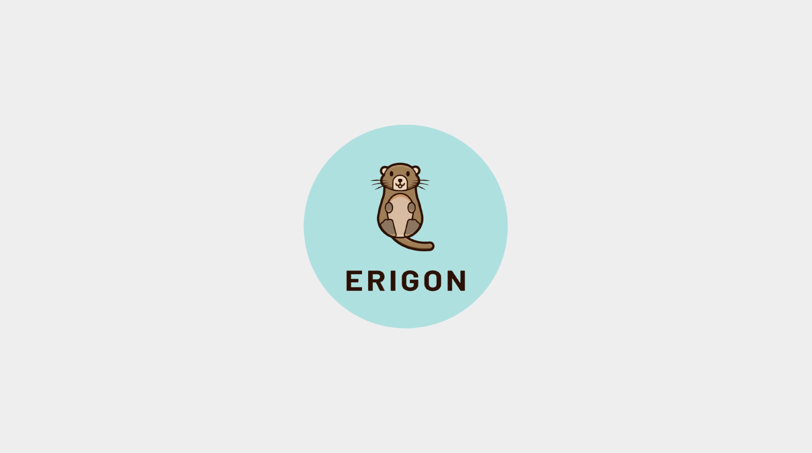

---
**You can listen to or watch this video here:**

[video]

---

**This is the seventh part of a series that will explain the three software clients currently operating or being implemented on Ethereum Classic**

The series will consist of the following topics:

1. The Difference Between a Network, a Blockchain, and a Cryptocurrency 
2. The Difference Between Blockchain Software and Blockchain Protocol
3. Are There Software Clients and Servers in a Blockchain?
4. Ethereum Virtual Machine Blockchains and Ethereum Classic
5. Core Geth Explained
6. Hyperledger Besu Explained
7. Erigon Explained

## Reviewed Concepts in This series



In our first four articles we have explained the basics of what are networks, blockchains, and cryptocurrencies; the differences between blockchain software and blockchain protocols; whether there are software clients and servers in cryptocurrency networks; and what is Ethereum Classic's position in the segment of Ethereum Virtual Machine (EVM) blockchains.

In this article we will apply all this knowledge to explain what is the Erigon software client that will work with Ethereum Classic, and what are its features, types, and functions.

## Ethereum Classic Is a Network, a Blockchain, and a Cryptocurrency



As we explained in the first post of this series:

Ethereum Classic is a network because it is a system of machines, nodes, and a shared database called a blockchain. In particular, it is a public network and its software is open source so that anyone can audit and use it to participate in the system.

Ethereum Classic is a blockchain because its database contains a ledger with accounts and balances, where transactions are fully transmitted and form a fully replicated chain of blocks.

Ethereum Classic is a cryptocurrency because its ledger tracks a coin called ETC that is scarce, durable, costly to create, portable, divisible, fungible, and transferable, so it may be used for payments and as a store of value.

## Erigon Will Be a Node Client that Will Work With Ethereum Classic



Blockchains are peer to peer networks and each participating machine in the system is called a node. 

For a machine to be a node it needs to run a software application that contains the set of rules of the protocol of that particular network.

Erigon is an Ethereum network node software, also called “software client”, and is in the process of being adapted to operate with Ethereum Classic.

Therefore, Erigon for ETC is currently in an experimental stage, but may be downloaded for use and testing. However it is not considered stable yet.

Core developers have expressed that ETC support is going well for now.

## Erigon For ETC Will Be Both a Software Client and a Server

Blockchain networks are not hierarchical systems where some machines have more clout than others or there are permissioned instances or privileges. In ETC all peer nodes are equal and all replicate the same exact state every 15 seconds.

This replication means that all nodes actually have the role of receiving transactions and blocks and retransmitting them to all other nodes. Similarly, when new nodes connect to the network, they consult with existing participating nodes on the state of the network and then download from them all the history in what is called the Initial Block Download (IBD).

Due to this equal status of all nodes in the network and that all send and receive information from all other nodes, then there are no real distinct server and client roles, but they are all really servers and clients. 

## Erigon for ETC Will Be a Full EVM Node Software

Erigon for ETC will be a node server and client that will be compliant with all the EVM standard components in general and compatible with the mining capabilities of Ethereum Classic in particular.

## Origin of Erigon

Erigon is a fork of Go-Ethereum, the most popular software client of the Ethereum network. 

It is a project by a team called “LedgerWatch” and its goal is to make nodes faster to synchronize and to reduce the on disk storage size.

The strategy they are following is to optimize many processes of how the node operates, but the main focus is on changing the synchronization method and modifying the data structure.

## Erigon Unique Features

The synchronization method they use is called staging. 

The method consists of, instead of downloading and verifying each block as they are retrieved from other peers, Erigon first downloads the whole chain and separately processes the verification function offline locally.

For the data structure, they made modifications to the Merkle tree to enable a faster write and faster synchronization.

## Erigon for ETC May Have Different Configurations

When Erigon is fully adapted, it will be a fully featured Ethereum Classic client-server and may be enabled to be used with the following configurations:

**Archival node:** A node that stores the block headers, the tree of hashed transactions (called Merkle Patricia tree), and all the original data of all transactions sent to the blockchain. This is the largest and most heavy to operate and longest to download kind of node.

**Full node:** A node that stores the block headers and the Merkle Patricia tree, but does not store all the original transactions. This is a relatively secure kind of node, much faster to download, and lighter to operate than the archival node.

**Light node:** A node that only stores the block headers and nothing more. This is a very fast to download and the lightest to operate kind of node, but it is much less secure and more dependent as it always needs other nodes in the network to confirm hashed transactions from the Merkle Patricia tree to be able to verify them.

## Erigon for ETC May Have Different Functions

As a node software that is configurable and flexible, when Erigon is fully adapted to ETC, it may be enabled to be used for the following functions:

**Verifying node:** Exchanges, large institutional investors, and crypto custody services need to run nodes able to verify their positions in the network directly. As a fully featured node client, Erigon for ETC may used for this function.

**Miner:** When Erigon for ETC is stable, it will include the full mining algorithm of Ethereum Classic, therefore it may be used by both miners and mining pools to run their operations.

**Node as a Service (NaaS):** Startups and companies who run NaaS services may use Erigon to provide wallet queries to third parties, transaction processing, statistics and charts, and block explorer services.

## How to Run Erigon on Ethereum Classic

To run Erigon as an experimental Ethereum Classic node, node operators and miners must go to the following repository on Github and download the client:

https://github.com/ETCCooperative/erigon

To activate it pointing to the ETC blockchain, the following command must be used to initiated it:

```--erigon –chain classic```

---

**Thank you for reading this article!**

To learn more about Erigon for ETC please go here: https://github.com/ETCCooperative/erigon

To learn more about ETC please go to: https://ethereumclassic.org
